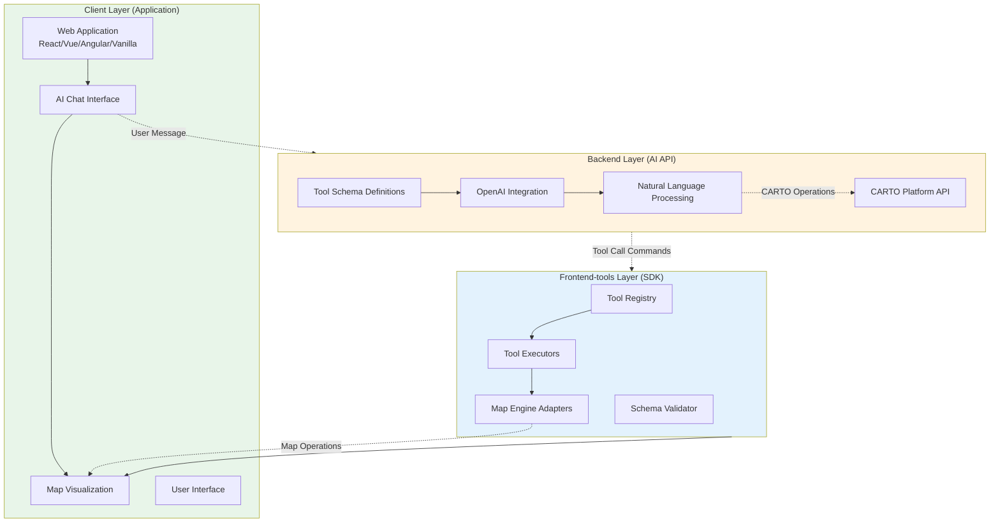
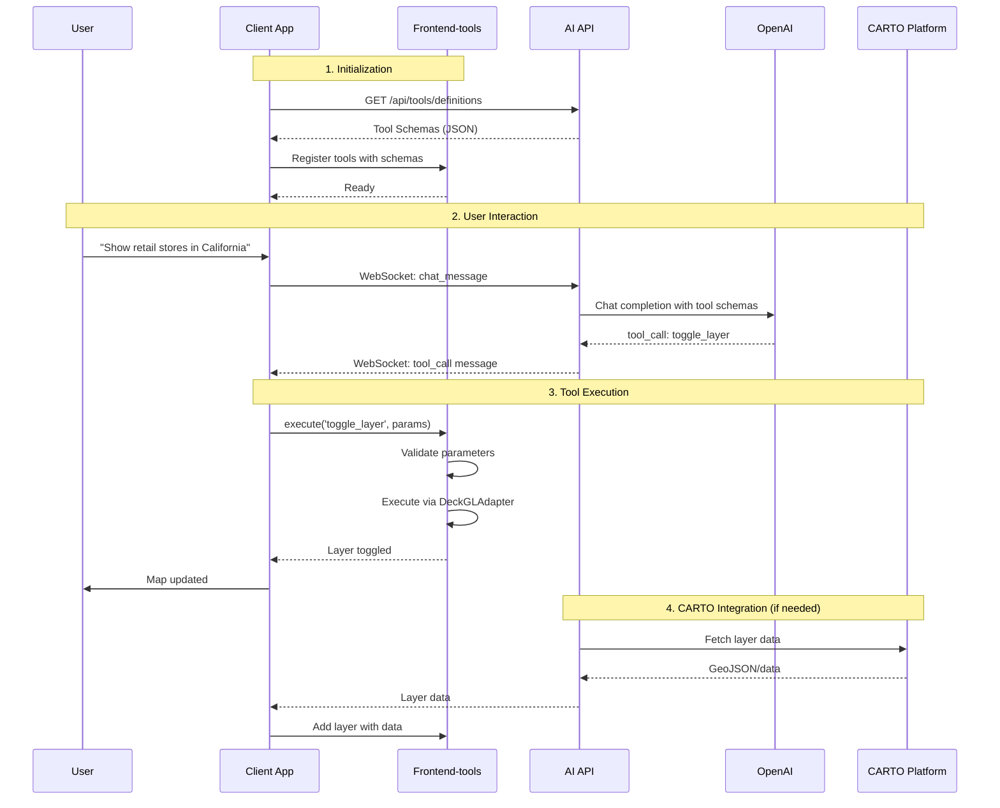
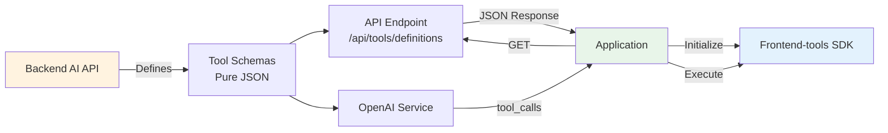
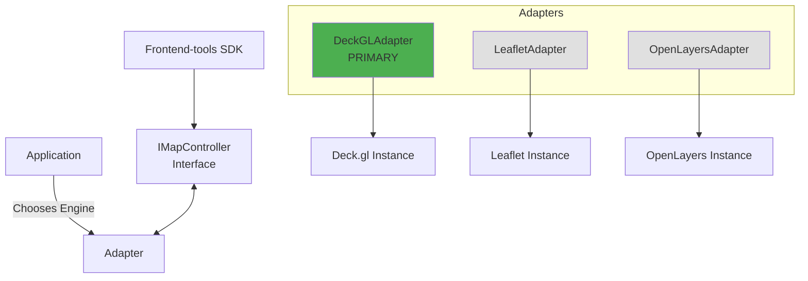

# Frontend Tools Library Architecture

**Status**: Architectural Design Document
**Version**: 2.0
**Last Updated**: 2025-01-21

## Executive Summary

This document defines the architecture for a **framework-agnostic frontend tools library** that enables AI-powered management of CARTO map layers across web applications.

### Purpose

Create an SDK/Registry that allows any frontend application (React, Vue, Angular, VanillaJS) to:
- Integrate AI chat interfaces with map visualizations
- Execute AI-generated commands to control map layers
- Manage CARTO geospatial layers through natural language
- Work with different map engines (default: Deck.gl)

### Three-Layer Architecture

```
┌───────────────────────────────────────────────────┐
│  Client Layer (Application)                       │
│  • React/Vue/Angular/VanillaJS apps               │
│  • AI Chat Interface                              │
│  • Map Visualization                              │
│  • CARTO Layer Display                            │
└───────────────────────────────────────────────────┘
                       ↕
┌───────────────────────────────────────────────────┐
│  Frontend-tools Layer (SDK/Registry)              │
│  • Tool Registry & Executors                      │
│  • Map Engine Adapters (Deck.gl primary)          │
│  • Framework-agnostic API                         │
│  • Tool Schema Validation                         │
└───────────────────────────────────────────────────┘
                       ↕
┌───────────────────────────────────────────────────┐
│  Backend Layer (AI API)                           │
│  • Tool Schema Definitions                        │
│  • OpenAI Integration                             │
│  • CARTO Layer Management API                     │
│  • Natural Language Processing                    │
└───────────────────────────────────────────────────┘
```

### Key Architectural Principles

1. **Backend Independence**: Backend (AI API) does NOT import the frontend-tools library. It only defines and exposes tool schemas as JSON.

2. **Framework Agnostic**: Frontend-tools library works with any JavaScript framework or VanillaJS through a unified API.

3. **Map Engine Flexibility**: Primary support for Deck.gl, with adapter pattern enabling other engines for specific customer needs.

4. **Clean Separation**: Each layer has clear responsibilities and communicates through well-defined interfaces.

### Core Components

- **Tool Schemas**: OpenAI function calling definitions (JSON) exposed by backend
- **Tool Registry**: Frontend-tools component that manages available tools
- **Tool Executors**: Framework-agnostic functions that execute map operations
- **Map Adapters**: Engine-specific implementations (DeckGLAdapter primary)
- **CARTO Integration**: Layer management for CARTO geospatial platform

## Table of Contents

1. [Introduction](#introduction)
2. [High-Level Architecture](#high-level-architecture)
3. [Backend-Library Separation](#backend-library-separation)
4. [Map-Agnostic Architecture](#map-agnostic-architecture)
5. [Core Interfaces](#core-interfaces)
6. [DeckGLAdapter Implementation](#deckgladapter-implementation)
7. [Other Map Engines](#other-map-engines)
8. [Benefits and Recommendations](#benefits-and-recommendations)

## Introduction

This document defines the architecture for `@map-tools/ai-tools` (or `@carto/frontend-tools`), a framework-agnostic SDK that enables AI-powered control of geospatial visualizations.

### Problem Statement

Web applications need to integrate AI chat interfaces with interactive maps to allow users to control CARTO layers through natural language. This requires:

1. **Framework Flexibility**: Support React, Vue, Angular, and VanillaJS applications
2. **Map Engine Flexibility**: Primary support for Deck.gl, but accommodate customers using other engines
3. **Backend Independence**: AI API should not be coupled to frontend map libraries
4. **CARTO Integration**: Seamless management of CARTO geospatial layers

### Solution Overview

The frontend-tools library provides:

- **Tool Registry**: Manages available AI tools (zoom, pan, toggle layers, etc.)
- **Map Adapters**: Engine-specific implementations (Deck.gl primary)
- **Framework-agnostic API**: Works with any JavaScript framework
- **Schema-driven**: Tools defined by backend JSON schemas, executed by frontend

### Target Audience

- **Application Developers**: Building CARTO-powered web apps with AI features
- **CARTO Platform Team**: Managing backend AI API and layer services
- **Solution Engineers**: Implementing customer projects with various tech stacks

## High-Level Architecture

### Three-Layer System

The architecture consists of three distinct layers, each with clear responsibilities and boundaries:



### Layer Responsibilities

#### Client Layer (Application)

**Purpose**: Host application providing UI and map visualization

**Responsibilities**:
- Render AI chat interface
- Display map with CARTO layers
- Initialize frontend-tools SDK
- Handle user interactions
- Communicate with backend AI API

**Technologies**: React, Vue, Angular, VanillaJS (framework-agnostic)

**Key Point**: Application chooses map engine (Deck.gl recommended)

#### Frontend-tools Layer (SDK/Registry)

**Purpose**: Framework-agnostic tool execution engine

**Responsibilities**:
- Fetch tool schemas from backend
- Register tools with executors
- Validate tool parameters against schemas
- Execute map operations via adapters
- Provide framework-agnostic API

**Technologies**: TypeScript, published as npm package

**Key Point**: Does NOT depend on backend; works with any map engine via adapters

#### Backend Layer (AI API)

**Purpose**: AI orchestration and CARTO platform integration

**Responsibilities**:
- Define tool schemas (OpenAI function calling format)
- Expose schemas via API endpoint
- Process natural language through OpenAI
- Send tool_call commands to applications
- Manage CARTO layer operations

**Technologies**: Node.js, OpenAI API, CARTO platform

**Key Point**: Does NOT import frontend-tools library; only defines schemas

### Communication Flow



### Key Architecture Decisions

1. **No Backend Dependency on Frontend-tools**
   - Backend defines schemas as pure JSON
   - Frontend-tools fetches schemas at runtime
   - Independent versioning and deployment

2. **Map Engine Abstraction**
   - Primary: DeckGLAdapter (Deck.gl)
   - Optional: Other adapters for specific customers
   - Adapter pattern isolates engine-specific code

3. **Framework Agnostic**
   - SDK works with React, Vue, Angular, VanillaJS
   - No framework-specific code in SDK
   - Applications integrate via standard JavaScript API

4. **Schema-Driven**
   - Backend is source of truth for tool definitions
   - Frontend validates and executes based on schemas
   - Dynamic tool updates without frontend changes

## Backend-Library Separation

### Principle

**Backend (AI API) does NOT import the frontend-tools library**. This ensures clean separation and independent versioning.

### Architecture



### Backend Responsibilities

**What Backend DOES**:
- Define tool schemas as pure JSON (OpenAI function calling format)
- Expose schemas via REST API endpoint (`GET /api/tools/definitions`)
- Send tool schemas to OpenAI for function calling
- Stream tool_call messages to applications via WebSocket
- Integrate with CARTO platform for layer data

**What Backend DOES NOT DO**:
- Import `@map-tools/ai-tools` or `@carto/frontend-tools`
- Execute tools (no map instance)
- Know about map engines (Deck.gl, Leaflet, etc.)
- Couple to frontend implementation details

### Application Responsibilities

**What Applications DO**:
- Fetch tool schemas from backend API on initialization
- Import and initialize frontend-tools SDK
- Register tools: combine schemas with executors
- Create map instance (Deck.gl recommended)
- Execute tools when receiving tool_call messages from backend
- Update UI based on execution results

### Example: Tool Schema (Backend)

```typescript
// backend/src/definitions/tool-schemas.ts
export const TOOL_SCHEMAS = [
  {
    type: 'function',
    function: {
      name: 'toggle_layer',
      description: 'Show or hide a CARTO map layer',
      parameters: {
        type: 'object',
        properties: {
          layer_id: {
            type: 'string',
            description: 'Unique identifier of the CARTO layer'
          },
          visible: {
            type: 'boolean',
            description: 'Whether layer should be visible'
          }
        },
        required: ['layer_id', 'visible']
      }
    }
  }
];
```

### Example: Application Integration (Frontend)

```javascript
// Application initialization
import { createMapTools, DeckGLAdapter } from '@carto/frontend-tools';

async function initApp() {
  // 1. Fetch schemas from backend
  const response = await fetch('https://api.carto.com/tools/definitions');
  const { tools: schemas } = await response.json();

  // 2. Initialize Deck.gl map
  const deck = new Deck({
    canvas: document.getElementById('map'),
    initialViewState: { longitude: -122.4, latitude: 37.8, zoom: 10 }
  });

  // 3. Create adapter and tools
  const adapter = new DeckGLAdapter(deck);
  const mapTools = createMapTools({
    mapController: adapter,
    schemas: schemas  // External schemas from backend
  });

  // 4. Handle tool calls
  websocket.on('tool_call', async (data) => {
    await mapTools.execute(data.tool, data.parameters);
  });
}
```

### Benefits

1. **Independent Versioning**: Backend and frontend-tools can version separately
2. **Reduced Coupling**: Backend has zero knowledge of map libraries
3. **Dynamic Updates**: Backend can add/modify tools without frontend changes
4. **Multi-Application**: Single backend serves multiple client applications
5. **Smaller Backend**: No map library dependencies reduce bundle size

## Map-Agnostic Architecture

### Principle

Frontend-tools library supports multiple map engines through an **adapter pattern**. **Deck.gl is the primary/default engine**, with other engines supported for specific customer needs.

### Adapter Pattern



### Why Adapter Pattern?

- **Primary Engine**: Deck.gl is recommended and fully supported
- **Customer Flexibility**: Some customers may require other engines
- **Isolation**: Engine-specific code isolated in adapters
- **Testability**: Mock adapters for testing without real map instances

## Core Interfaces

### IMapController

Abstract interface that all map engine adapters must implement:

```typescript
export interface IMapController {
  /**
   * Get current view state (center, zoom, rotation)
   */
  getViewState(): ViewState;

  /**
   * Set view state with optional animation
   */
  setViewState(viewState: Partial<ViewState>, options?: TransitionOptions): void;

  /**
   * Get all layers on the map
   */
  getLayers(): IMapLayer[];

  /**
   * Toggle layer visibility
   */
  setLayerVisibility(layerId: string, visible: boolean): void;

  /**
   * Add a layer to the map
   */
  addLayer(layer: IMapLayer): void;

  /**
   * Remove a layer from the map
   */
  removeLayer(layerId: string): void;

  /**
   * Force map redraw (if needed by engine)
   */
  refresh(): void;

  /**
   * Engine capabilities for feature detection
   */
  readonly capabilities: MapCapabilities;
}
```

### ViewState

```typescript
export interface ViewState {
  longitude: number;
  latitude: number;
  zoom: number;
  pitch?: number;     // 3D tilt (not all engines support)
  bearing?: number;   // Rotation (not all engines support)
}
```

### IMapLayer

```typescript
export interface IMapLayer {
  id: string;
  type: string;
  visible: boolean;
  opacity?: number;
  data?: any;
  properties?: Record<string, any>;
}
```

### MapCapabilities

```typescript
export interface MapCapabilities {
  supports3D: boolean;
  supportsRotation: boolean;
  supportsAnimation: boolean;
  requiresManualRedraw: boolean;
  maxZoom: number;
  minZoom: number;
}
```

## DeckGLAdapter Implementation

**Primary adapter** for Deck.gl engine (recommended for CARTO applications).

### Implementation

```typescript
import { Deck } from '@deck.gl/core';
import type { IMapController, ViewState, IMapLayer, MapCapabilities } from './types';

export class DeckGLAdapter implements IMapController {
  private deck: Deck;

  constructor(deckInstance: Deck) {
    this.deck = deckInstance;
  }

  getViewState(): ViewState {
    const vs = (this.deck as any).viewState ||
               (this.deck as any).props?.initialViewState || {};

    return {
      longitude: vs.longitude || 0,
      latitude: vs.latitude || 0,
      zoom: vs.zoom || 10,
      pitch: vs.pitch,
      bearing: vs.bearing
    };
  }

  setViewState(viewState: Partial<ViewState>, options?: TransitionOptions): void {
    const current = this.getViewState();

    this.deck.setProps({
      initialViewState: {
        ...current,
        ...viewState,
        transitionDuration: options?.duration || 1000,
        transitionInterruption: 1
      }
    });

    // Deck.gl requires multiple redraws for visibility
    this.refresh();
  }

  getLayers(): IMapLayer[] {
    const layers = (this.deck.props as any).layers || [];

    return layers.map((layer: any) => ({
      id: layer.id,
      type: layer.constructor.name,
      visible: layer.props?.visible !== false,
      opacity: layer.props?.opacity,
      data: layer.props?.data,
      properties: { ...layer.props }
    }));
  }

  setLayerVisibility(layerId: string, visible: boolean): void {
    const currentLayers = (this.deck.props as any).layers || [];

    const updatedLayers = currentLayers.map((layer: any) => {
      if (layer && layer.id === layerId) {
        return layer.clone({ visible });
      }
      return layer;
    });

    this.deck.setProps({ layers: updatedLayers });
    this.refresh();
  }

  addLayer(layer: IMapLayer): void {
    const currentLayers = (this.deck.props as any).layers || [];
    this.deck.setProps({ layers: [...currentLayers, layer as any] });
  }

  removeLayer(layerId: string): void {
    const currentLayers = (this.deck.props as any).layers || [];
    const filtered = currentLayers.filter((layer: any) => layer.id !== layerId);
    this.deck.setProps({ layers: filtered });
  }

  refresh(): void {
    // Deck.gl quirk: needs multiple scheduled redraws for visibility
    if (typeof window !== 'undefined') {
      window.requestAnimationFrame(() => this.deck.redraw(true));
      setTimeout(() => this.deck.redraw(true), 50);
      setTimeout(() => this.deck.redraw(true), 1100);
    }
  }

  get capabilities(): MapCapabilities {
    return {
      supports3D: true,
      supportsRotation: true,
      supportsAnimation: true,
      requiresManualRedraw: true,  // Deck.gl quirk
      maxZoom: 24,
      minZoom: 0
    };
  }
}
```

### Usage Example

```typescript
import { Deck } from '@deck.gl/core';
import { DeckGLAdapter, createMapTools } from '@carto/frontend-tools';

// Initialize Deck.gl
const deck = new Deck({
  canvas: document.getElementById('map'),
  initialViewState: { longitude: -74.0, latitude: 40.7, zoom: 11 }
});

// Create adapter
const adapter = new DeckGLAdapter(deck);

// Create tools (with schemas from backend)
const mapTools = createMapTools({
  mapController: adapter,
  schemas: await fetchSchemasFromBackend()
});

// Execute tools
await mapTools.execute('zoom_map', { direction: 'in', levels: 2 });
await mapTools.execute('fly_to_location', {
  coordinates: [-122.4, 37.8],
  zoom: 12
});
```

## Other Map Engines

While **Deck.gl is the primary/recommended engine**, the adapter pattern allows supporting other engines for specific customer requirements.

### Conceptual Adapters

#### LeafletAdapter

For customers using Leaflet (2D map library):

```typescript
export class LeafletAdapter implements IMapController {
  private map: L.Map;

  constructor(leafletMap: L.Map) {
    this.map = leafletMap;
  }

  // Implement IMapController methods
  // Note: Leaflet doesn't support 3D/pitch
  getViewState(): ViewState { /* ... */ }
  setViewState(viewState, options): void { /* ... */ }
  // etc.

  get capabilities(): MapCapabilities {
    return {
      supports3D: false,           // Leaflet is 2D only
      supportsRotation: false,
      supportsAnimation: true,
      requiresManualRedraw: false,
      maxZoom: 18,
      minZoom: 0
    };
  }
}
```

#### OpenLayersAdapter

For customers using OpenLayers:

```typescript
export class OpenLayersAdapter implements IMapController {
  private map: OLMap;

  constructor(olMap: OLMap) {
    this.map = olMap;
  }

  // Implement IMapController methods
  // OpenLayers supports rotation but not pitch

  get capabilities(): MapCapabilities {
    return {
      supports3D: false,
      supportsRotation: true,      // Supports bearing
      supportsAnimation: true,
      requiresManualRedraw: false,
      maxZoom: 28,
      minZoom: 0
    };
  }
}
```

### Engine Comparison

| Feature | Deck.gl (Primary) | Leaflet | OpenLayers |
|---------|-------------------|---------|------------|
| **3D Support** | ✅ Yes | ❌ No | ❌ No |
| **Rotation** | ✅ Yes | ❌ No | ✅ Yes |
| **Animation** | ✅ Yes | ✅ Yes | ✅ Yes |
| **WebGL** | ✅ Yes | ❌ No | ⚠️ Optional |
| **CARTO Integration** | ✅ Excellent | ⚠️ Limited | ⚠️ Limited |
| **Bundle Size** | 500KB | 40KB | 280KB |

**Recommendation**: Use Deck.gl for all CARTO applications unless specific customer requirements necessitate another engine.

## Benefits and Recommendations

### Benefits of This Architecture

1. **Framework Agnostic**
   - Works with React, Vue, Angular, VanillaJS
   - Applications choose their framework
   - SDK has no framework dependencies

2. **Backend Independence**
   - Backend (AI API) doesn't import frontend-tools
   - Independent versioning and deployment
   - Smaller backend bundle

3. **Map Engine Flexibility**
   - Primary: Deck.gl (recommended)
   - Optional: Other engines for specific customers
   - Adapter pattern isolates engine code

4. **Schema-Driven**
   - Backend defines tool schemas (single source of truth)
   - Applications fetch schemas dynamically
   - Tools can be added without frontend changes

5. **Clean Separation**
   - Clear layer boundaries
   - Each layer has defined responsibilities
   - Easy to test and maintain

### Recommendations

#### For New Projects

✅ **Use this architecture:**
- Start with Deck.gl adapter
- Fetch schemas from backend API
- Choose framework based on team expertise
- Leverage CARTO platform integration

#### For Existing Projects

✅ **Adopt gradually:**
- Backend: Expose tool schemas via API
- Frontend: Integrate frontend-tools SDK
- Keep existing map engine, add adapter if needed
- Migrate tools one at a time

#### For Customer Projects

✅ **Default to Deck.gl:**
- Best CARTO integration
- Full 3D and WebGL support
- Most features available

⚠️ **Other engines only if:**
- Customer has existing Leaflet/OpenLayers codebase
- Specific technical constraints require different engine
- Limited features acceptable (no 3D, limited CARTO integration)

### Architecture Principles Summary

1. **Backend exposes schemas, doesn't import library**
2. **Frontend-tools is framework-agnostic**
3. **Deck.gl is primary engine, others optional**
4. **Three clear layers: Client, SDK, Backend**
5. **Schema-driven: Backend is source of truth**

---

**Document Status**: Architectural Design Document
**Maintained By**: CARTO Platform Team
**Last Updated**: 2025-01-21
