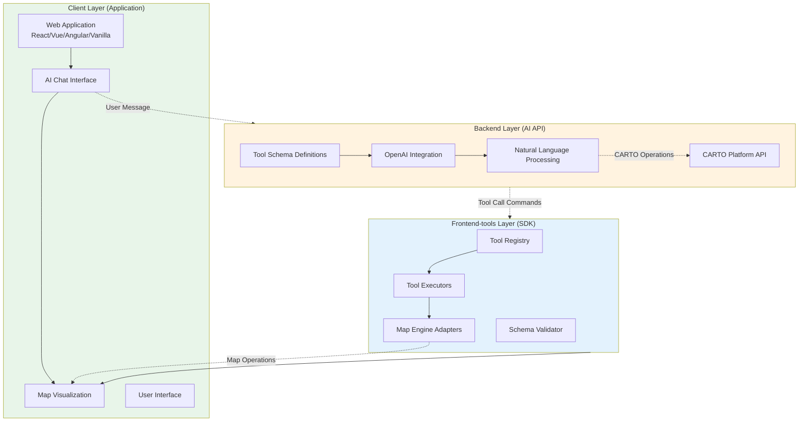
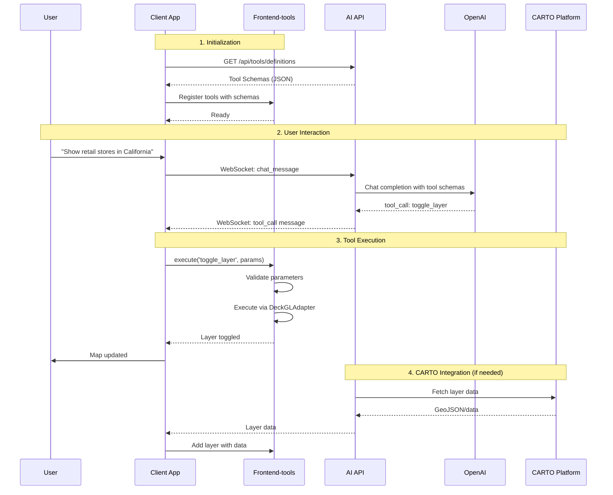
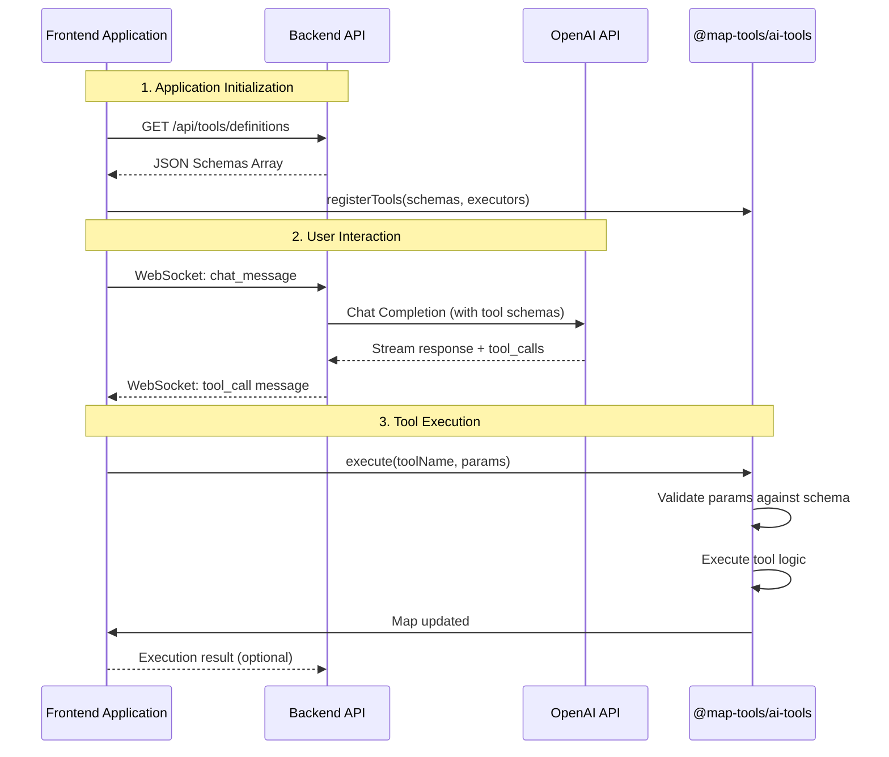
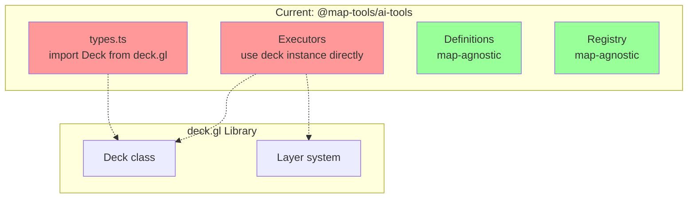
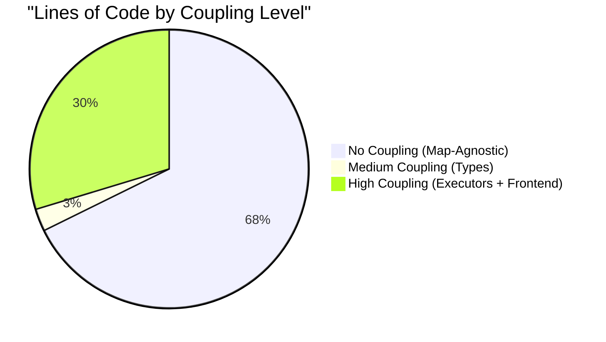
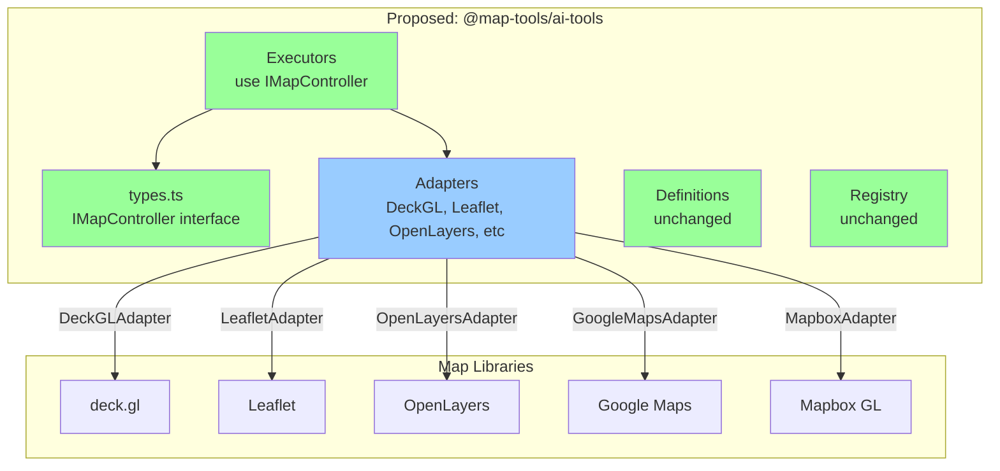
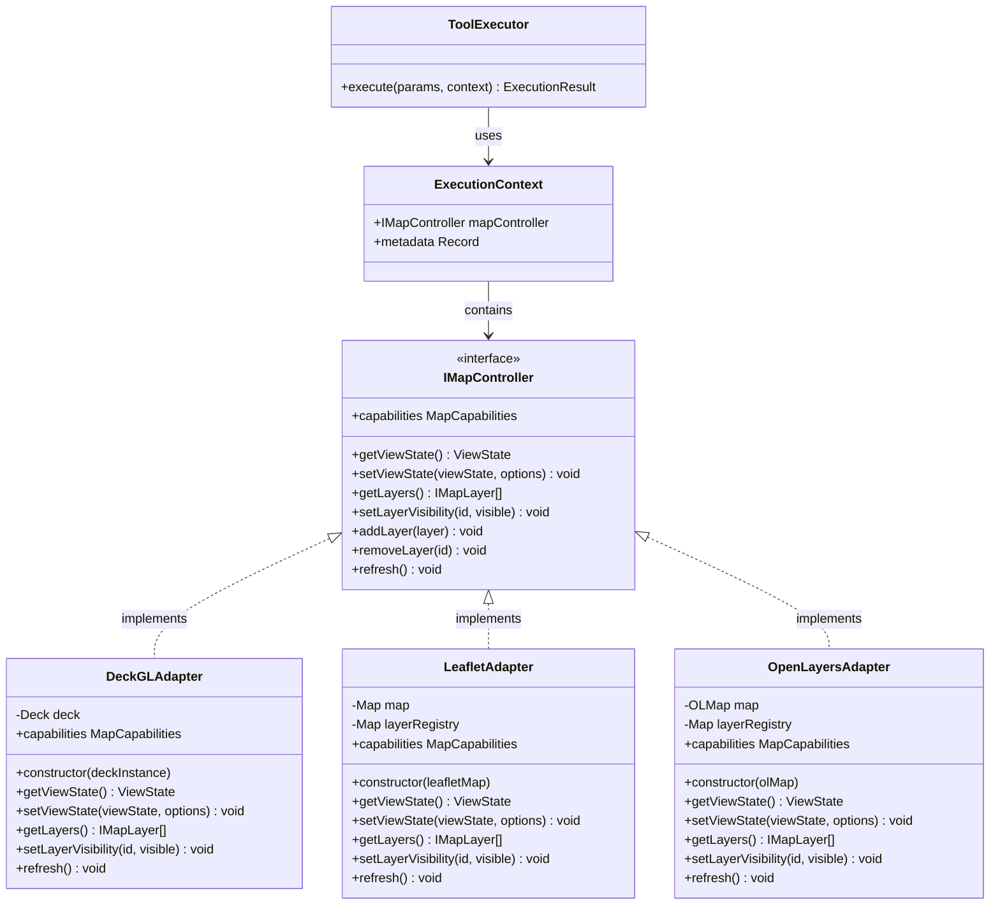
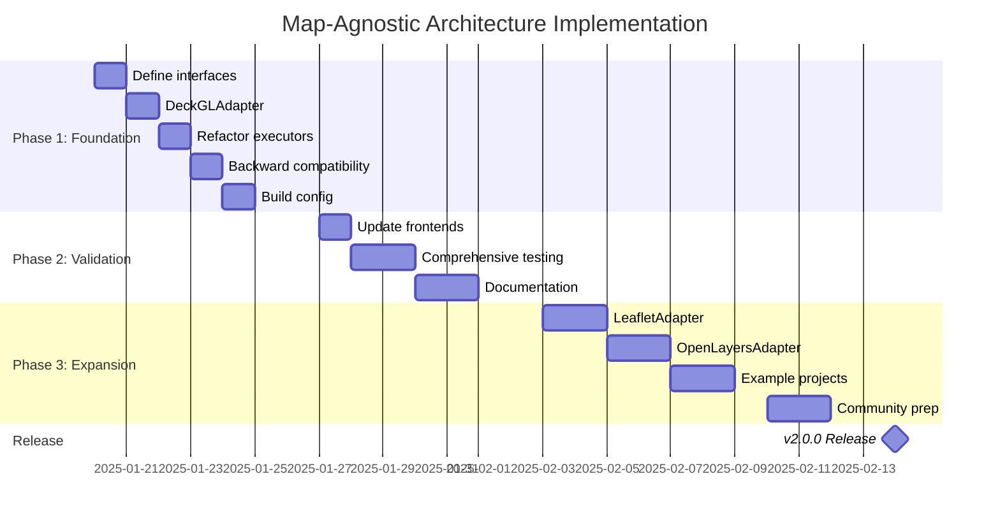

# Frontend Tools Library Architecture

**Status**: Architectural Design Document
**Version**: 2.0
**Last Updated**: 2025-01-21

## Executive Summary

This document defines the architecture for a **framework-agnostic frontend tools library** that enables AI-powered management of CARTO map layers across web applications.

### Purpose

Create an SDK/Registry that allows any frontend application (React, Vue, Angular, VanillaJS) to:
- Integrate AI chat interfaces with map visualizations
- Execute AI-generated commands to control map layers
- Manage CARTO geospatial layers through natural language
- Work with different map engines (default: Deck.gl)

### Three-Layer Architecture

```
┌───────────────────────────────────────────────────┐
│  Client Layer (Application)                       │
│  • React/Vue/Angular/VanillaJS apps               │
│  • AI Chat Interface                              │
│  • Map Visualization                              │
│  • CARTO Layer Display                            │
└───────────────────────────────────────────────────┘
                       ↕
┌───────────────────────────────────────────────────┐
│  Frontend-tools Layer (SDK/Registry)              │
│  • Tool Registry & Executors                      │
│  • Map Engine Adapters (Deck.gl primary)          │
│  • Framework-agnostic API                         │
│  • Tool Schema Validation                         │
└───────────────────────────────────────────────────┘
                       ↕
┌───────────────────────────────────────────────────┐
│  Backend Layer (AI API)                           │
│  • Tool Schema Definitions                        │
│  • OpenAI Integration                             │
│  • CARTO Layer Management API                     │
│  • Natural Language Processing                    │
└───────────────────────────────────────────────────┘
```

### Key Architectural Principles

1. **Backend Independence**: Backend (AI API) does NOT import the frontend-tools library. It only defines and exposes tool schemas as JSON.

2. **Framework Agnostic**: Frontend-tools library works with any JavaScript framework or VanillaJS through a unified API.

3. **Map Engine Flexibility**: Primary support for Deck.gl, with adapter pattern enabling other engines for specific customer needs.

4. **Clean Separation**: Each layer has clear responsibilities and communicates through well-defined interfaces.

### Core Components

- **Tool Schemas**: OpenAI function calling definitions (JSON) exposed by backend
- **Tool Registry**: Frontend-tools component that manages available tools
- **Tool Executors**: Framework-agnostic functions that execute map operations
- **Map Adapters**: Engine-specific implementations (DeckGLAdapter primary)
- **CARTO Integration**: Layer management for CARTO geospatial platform

## Table of Contents

1. [Introduction](#introduction)
2. [High-Level Architecture](#high-level-architecture)
3. [Backend-Library Separation](#backend-library-separation)
4. [Map-Agnostic Architecture](#map-agnostic-architecture)
5. [Core Interfaces](#core-interfaces)
6. [DeckGLAdapter Implementation](#deckgladapter-implementation)
7. [Other Map Engines](#other-map-engines)
8. [Benefits and Recommendations](#benefits-and-recommendations)

## Introduction

This document defines the architecture for `@map-tools/ai-tools` (or `@carto/frontend-tools`), a framework-agnostic SDK that enables AI-powered control of geospatial visualizations.

### Problem Statement

Web applications need to integrate AI chat interfaces with interactive maps to allow users to control CARTO layers through natural language. This requires:

1. **Framework Flexibility**: Support React, Vue, Angular, and VanillaJS applications
2. **Map Engine Flexibility**: Primary support for Deck.gl, but accommodate customers using other engines
3. **Backend Independence**: AI API should not be coupled to frontend map libraries
4. **CARTO Integration**: Seamless management of CARTO geospatial layers

### Solution Overview

The frontend-tools library provides:

- **Tool Registry**: Manages available AI tools (zoom, pan, toggle layers, etc.)
- **Map Adapters**: Engine-specific implementations (Deck.gl primary)
- **Framework-agnostic API**: Works with any JavaScript framework
- **Schema-driven**: Tools defined by backend JSON schemas, executed by frontend

### Target Audience

- **Application Developers**: Building CARTO-powered web apps with AI features
- **CARTO Platform Team**: Managing backend AI API and layer services
- **Solution Engineers**: Implementing customer projects with various tech stacks

## High-Level Architecture

### Three-Layer System

The architecture consists of three distinct layers, each with clear responsibilities and boundaries:



### Layer Responsibilities

#### Client Layer (Application)

**Purpose**: Host application providing UI and map visualization

**Responsibilities**:
- Render AI chat interface
- Display map with CARTO layers
- Initialize frontend-tools SDK
- Handle user interactions
- Communicate with backend AI API

**Technologies**: React, Vue, Angular, VanillaJS (framework-agnostic)

**Key Point**: Application chooses map engine (Deck.gl recommended)

#### Frontend-tools Layer (SDK/Registry)

**Purpose**: Framework-agnostic tool execution engine

**Responsibilities**:
- Fetch tool schemas from backend
- Register tools with executors
- Validate tool parameters against schemas
- Execute map operations via adapters
- Provide framework-agnostic API

**Technologies**: TypeScript, published as npm package

**Key Point**: Does NOT depend on backend; works with any map engine via adapters

#### Backend Layer (AI API)

**Purpose**: AI orchestration and CARTO platform integration

**Responsibilities**:
- Define tool schemas (OpenAI function calling format)
- Expose schemas via API endpoint
- Process natural language through OpenAI
- Send tool_call commands to applications
- Manage CARTO layer operations

**Technologies**: Node.js, OpenAI API, CARTO platform

**Key Point**: Does NOT import frontend-tools library; only defines schemas

### Communication Flow



### Key Architecture Decisions

1. **No Backend Dependency on Frontend-tools**
   - Backend defines schemas as pure JSON
   - Frontend-tools fetches schemas at runtime
   - Independent versioning and deployment

2. **Map Engine Abstraction**
   - Primary: DeckGLAdapter (Deck.gl)
   - Optional: Other adapters for specific customers
   - Adapter pattern isolates engine-specific code

3. **Framework Agnostic**
   - SDK works with React, Vue, Angular, VanillaJS
   - No framework-specific code in SDK
   - Applications integrate via standard JavaScript API

4. **Schema-Driven**
   - Backend is source of truth for tool definitions
   - Frontend validates and executes based on schemas
   - Dynamic tool updates without frontend changes

## Backend-Library Separation

### Overview

This section proposes a **fundamental architectural change** in how the backend and `@map-tools/ai-tools` library interact:

**Current Architecture**: Backend imports the library to access tool definitions
**Proposed Architecture**: Backend exposes tool definitions as pure JSON schemas; applications use the library independently

**Key Change**: The backend should **NOT import** the `@map-tools/ai-tools` library. Instead:
1. Backend defines and exposes OpenAI function calling schemas via API
2. Applications fetch these schemas from the backend
3. Applications use the `@map-tools/ai-tools` library to execute tools
4. Library remains purely client-side/application-level

### Architecture Comparison

#### Current Architecture: Backend Imports Library

```mermaid
graph TB
    subgraph Backend["Backend (Node.js)"]
        LIB_BACKEND[Import @map-tools/ai-tools]
        DEFS[getToolDefinitions]
        OPENAI[OpenAI Service]
        WS[WebSocket Server]
    end

    subgraph Frontend["Frontend Application"]
        LIB_FRONTEND[@map-tools/ai-tools Library]
        EXEC[MapToolsExecutor]
        MAP[Map Instance<br/>deck.gl/Leaflet/etc]
    end

    LIB_BACKEND --> DEFS
    DEFS --> OPENAI
    OPENAI --> WS
    WS -.->|tool_call messages| LIB_FRONTEND
    LIB_FRONTEND --> EXEC
    EXEC --> MAP

    style LIB_BACKEND fill:#ffcccc
    style LIB_FRONTEND fill:#ccffcc
```

**Issues**:
- ⚠️ Backend has dependency on map library (unnecessary coupling)
- ⚠️ Backend must be updated when library changes
- ⚠️ Two copies of library (backend + frontend)
- ⚠️ Backend doesn't execute tools but imports execution code

#### Proposed Architecture: Backend Exposes JSON Schemas

```mermaid
graph TB
    subgraph Backend["Backend (Node.js)"]
        SCHEMA_DEF[Tool Schema Definitions<br/>Pure JSON]
        API[API Endpoint<br/>GET /api/tools/definitions]
        OPENAI[OpenAI Service]
        WS[WebSocket Server]
    end

    subgraph Frontend["Frontend Application"]
        FETCH[Fetch Schemas from API]
        LIB[@map-tools/ai-tools Library]
        REGISTRY[Register Tools with Schemas]
        EXEC[MapToolsExecutor]
        MAP[Map Instance<br/>deck.gl/Leaflet/etc]
    end

    SCHEMA_DEF --> API
    SCHEMA_DEF --> OPENAI
    API --> FETCH
    OPENAI --> WS
    FETCH --> REGISTRY
    REGISTRY --> LIB
    WS -.->|tool_call messages| LIB
    LIB --> EXEC
    EXEC --> MAP

    style SCHEMA_DEF fill:#99ccff
    style LIB fill:#ccffcc
    style API fill:#ffff99
```

**Benefits**:
- ✅ Backend has NO dependency on map library
- ✅ Backend and library can version independently
- ✅ Single source of truth for tool schemas (backend)
- ✅ Applications fetch latest schemas dynamically
- ✅ Clean separation: Backend = AI orchestration, Library = tool execution

### Communication Flow



### Backend Responsibilities

**What the Backend DOES**:
1. **Define Tool Schemas**: Maintain OpenAI function calling schemas as JSON
2. **Expose API Endpoint**: Serve schemas via REST/GraphQL endpoint
3. **OpenAI Integration**: Send schemas to OpenAI for function calling
4. **Stream Responses**: Forward tool_call messages to applications
5. **Version Management**: Track schema versions for compatibility

**What the Backend DOES NOT DO**:
- ❌ Import `@map-tools/ai-tools` library
- ❌ Execute tools (no map instance access)
- ❌ Know about map libraries (deck.gl, Leaflet, etc.)
- ❌ Couple to frontend implementation details

### Application Responsibilities

**What Applications DO**:
1. **Fetch Schemas**: GET tool definitions from backend API
2. **Import Library**: Use `@map-tools/ai-tools` for execution
3. **Register Tools**: Combine schemas with executors
4. **Initialize Map**: Create map instance (deck.gl, Leaflet, etc.)
5. **Execute Tools**: Handle tool_call messages from backend
6. **Update UI**: Reflect tool execution results

### Implementation Guide

#### Backend: Tool Schema Definitions

**File**: `backend/src/definitions/tool-schemas.ts`

```typescript
/**
 * Tool schema definitions for OpenAI function calling
 * These are pure JSON schemas with NO dependency on @map-tools/ai-tools
 */

export interface ToolSchema {
  type: 'function';
  function: {
    name: string;
    description: string;
    parameters: {
      type: 'object';
      properties: Record<string, any>;
      required?: string[];
    };
  };
}

export const TOOL_SCHEMAS: ToolSchema[] = [
  {
    type: 'function',
    function: {
      name: 'zoom_map',
      description: 'Zoom the map in or out by a specified number of levels',
      parameters: {
        type: 'object',
        properties: {
          direction: {
            type: 'string',
            enum: ['in', 'out'],
            description: 'Direction to zoom: "in" to zoom closer, "out" to zoom further'
          },
          levels: {
            type: 'integer',
            minimum: 1,
            maximum: 10,
            default: 1,
            description: 'Number of zoom levels to change (1-10)'
          }
        },
        required: ['direction']
      }
    }
  },
  {
    type: 'function',
    function: {
      name: 'fly_to_location',
      description: 'Smoothly fly the map to a specific geographic location',
      parameters: {
        type: 'object',
        properties: {
          coordinates: {
            type: 'array',
            items: { type: 'number' },
            minItems: 2,
            maxItems: 2,
            description: 'Geographic coordinates [longitude, latitude] in decimal degrees'
          },
          zoom: {
            type: 'number',
            minimum: 0,
            maximum: 20,
            default: 10,
            description: 'Target zoom level (0-20)'
          },
          duration: {
            type: 'integer',
            minimum: 0,
            maximum: 10000,
            default: 2000,
            description: 'Animation duration in milliseconds'
          }
        },
        required: ['coordinates']
      }
    }
  },
  {
    type: 'function',
    function: {
      name: 'toggle_layer',
      description: 'Show or hide a specific map layer',
      parameters: {
        type: 'object',
        properties: {
          layer_id: {
            type: 'string',
            description: 'Unique identifier of the layer to toggle'
          },
          visible: {
            type: 'boolean',
            description: 'Whether the layer should be visible (true) or hidden (false)'
          }
        },
        required: ['layer_id', 'visible']
      }
    }
  }
];

/**
 * Get all tool schemas
 */
export function getToolSchemas(): ToolSchema[] {
  return TOOL_SCHEMAS;
}

/**
 * Get a specific tool schema by name
 */
export function getToolSchema(name: string): ToolSchema | undefined {
  return TOOL_SCHEMAS.find(schema => schema.function.name === name);
}
```

#### Backend: API Endpoint

**File**: `backend/src/routes/tools.ts`

```typescript
import express from 'express';
import { getToolSchemas } from '../definitions/tool-schemas';

const router = express.Router();

/**
 * GET /api/tools/definitions
 * Returns OpenAI function calling schemas for available tools
 */
router.get('/definitions', (req, res) => {
  try {
    const schemas = getToolSchemas();

    res.json({
      success: true,
      version: '1.0.0',  // Schema version for compatibility tracking
      tools: schemas,
      timestamp: new Date().toISOString()
    });
  } catch (error) {
    res.status(500).json({
      success: false,
      error: 'Failed to retrieve tool definitions',
      message: error.message
    });
  }
});

/**
 * GET /api/tools/definitions/:name
 * Returns a specific tool schema by name
 */
router.get('/definitions/:name', (req, res) => {
  try {
    const { name } = req.params;
    const schema = getToolSchema(name);

    if (!schema) {
      return res.status(404).json({
        success: false,
        error: 'Tool not found',
        message: `No tool found with name: ${name}`
      });
    }

    res.json({
      success: true,
      tool: schema,
      timestamp: new Date().toISOString()
    });
  } catch (error) {
    res.status(500).json({
      success: false,
      error: 'Failed to retrieve tool definition',
      message: error.message
    });
  }
});

export default router;
```

#### Backend: Updated OpenAI Service

**File**: `backend/src/services/openai-service.ts`

```typescript
import OpenAI from 'openai';
import { getToolSchemas } from '../definitions/tool-schemas';

export class OpenAIService {
  private openai: OpenAI;
  private tools: any[];

  constructor() {
    this.openai = new OpenAI({ apiKey: process.env.OPENAI_API_KEY });

    // Load tool schemas from local definitions (not from library)
    this.tools = getToolSchemas();
  }

  async streamChatCompletion(messages: any[], ws: WebSocket) {
    const stream = await this.openai.chat.completions.create({
      model: 'gpt-4o',
      messages,
      tools: this.tools,  // Send schemas to OpenAI
      stream: true
    });

    // Handle streaming and tool calls...
    // (rest of implementation unchanged)
  }
}
```

#### Frontend: Fetch and Register Tools

**File**: `frontend/src/tools/tool-manager.js`

```javascript
import { createMapTools } from '@map-tools/ai-tools';

/**
 * Fetch tool schemas from backend
 */
async function fetchToolSchemas() {
  try {
    const response = await fetch('http://localhost:3000/api/tools/definitions');
    const data = await response.json();

    if (!data.success) {
      throw new Error(data.error);
    }

    console.log(`Loaded ${data.tools.length} tool schemas (v${data.version})`);
    return data.tools;
  } catch (error) {
    console.error('Failed to fetch tool schemas:', error);
    throw error;
  }
}

/**
 * Initialize map tools with schemas from backend
 */
export async function initializeMapTools(mapInstance) {
  // 1. Fetch schemas from backend
  const schemas = await fetchToolSchemas();

  // 2. Create map tools executor with map instance
  const mapTools = createMapTools({
    mapController: mapInstance,  // Adapter wrapping deck.gl/Leaflet/etc
    schemas: schemas,             // Override with backend schemas
    metadata: {
      schemaSource: 'backend-api',
      fetchedAt: new Date().toISOString()
    }
  });

  return mapTools;
}

/**
 * Handle tool execution from backend messages
 */
export async function handleToolCall(mapTools, toolCall) {
  try {
    const result = await mapTools.execute(
      toolCall.tool,
      toolCall.parameters
    );

    console.log('Tool executed:', result);
    return result;
  } catch (error) {
    console.error('Tool execution failed:', error);
    throw error;
  }
}
```

#### Frontend: Application Integration

**File**: `frontend/src/main.js`

```javascript
import { DeckGLAdapter } from '@map-tools/ai-tools';
import { initializeMapTools, handleToolCall } from './tools/tool-manager';
import { WebSocketClient } from './chat/websocket-client';

async function initializeApplication() {
  // 1. Initialize map (deck.gl example)
  const deck = new Deck({
    canvas: document.getElementById('map-canvas'),
    initialViewState: {
      longitude: -122.4,
      latitude: 37.8,
      zoom: 10
    }
  });

  // 2. Wrap map in adapter
  const adapter = new DeckGLAdapter(deck);

  // 3. Initialize map tools with schemas from backend
  const mapTools = await initializeMapTools(adapter);
  console.log('Map tools initialized');

  // 4. Connect WebSocket
  const ws = new WebSocketClient('ws://localhost:3000');

  // 5. Handle tool calls from backend
  ws.on('tool_call', async (data) => {
    try {
      const result = await handleToolCall(mapTools, data);

      // Optionally send result back to backend
      ws.send({
        type: 'tool_result',
        callId: data.callId,
        result: result
      });
    } catch (error) {
      ws.send({
        type: 'tool_error',
        callId: data.callId,
        error: error.message
      });
    }
  });

  // 6. Handle user messages
  ws.on('open', () => {
    console.log('Connected to backend');
  });
}

// Start application
initializeApplication().catch(console.error);
```

### Library Integration

The `@map-tools/ai-tools` library should support external schema registration:

**File**: `map-ai-tools/src/core/executor-factory.ts`

```typescript
export interface MapToolsConfig {
  mapController: IMapController;
  schemas?: ToolDefinition[];  // NEW: Accept external schemas
  executors?: Record<string, ToolExecutor<any>>;
  metadata?: Record<string, any>;
}

export function createMapTools(config: MapToolsConfig): MapToolsExecutor {
  const registry = new ToolRegistry();

  // If external schemas provided, use them
  if (config.schemas) {
    config.schemas.forEach(schema => {
      // Register schema with executor
      const executorName = schema.function.name;
      const executor = config.executors?.[executorName] ||
                      BUILTIN_EXECUTORS[executorName];

      if (executor) {
        registry.register(schema, executor);
      } else {
        console.warn(`No executor found for tool: ${executorName}`);
      }
    });
  } else {
    // Fallback to built-in tools
    registerBuiltinTools(registry);
  }

  return new MapToolsExecutor(config.mapController, registry, config.metadata);
}
```

### Migration Path from Current Architecture

#### Step 1: Create Backend Tool Schemas

```bash
# Create new file for pure JSON schemas
mkdir -p backend/src/definitions
touch backend/src/definitions/tool-schemas.ts
```

Copy tool definitions from library, but as pure JSON (no imports):

```typescript
// backend/src/definitions/tool-schemas.ts
export const TOOL_SCHEMAS = [
  // Copy schemas from @map-tools/ai-tools but as plain objects
  { type: 'function', function: { name: 'zoom_map', ... } },
  { type: 'function', function: { name: 'fly_to_location', ... } },
  { type: 'function', function: { name: 'toggle_layer', ... } }
];
```

#### Step 2: Create API Endpoint

```bash
# Create tools route
mkdir -p backend/src/routes
touch backend/src/routes/tools.ts
```

Add route handler (see implementation above)

#### Step 3: Update Backend Service

```typescript
// backend/src/services/openai-service.ts

// BEFORE:
import { getToolDefinitions } from '@map-tools/ai-tools';
this.tools = getToolDefinitions();

// AFTER:
import { getToolSchemas } from '../definitions/tool-schemas';
this.tools = getToolSchemas();
```

#### Step 4: Update Frontend to Fetch Schemas

```javascript
// frontend/src/main.js

// BEFORE:
import { createMapTools } from '@map-tools/ai-tools';
const mapTools = createMapTools({ deck });

// AFTER:
import { createMapTools, DeckGLAdapter } from '@map-tools/ai-tools';

// Fetch schemas from backend
const response = await fetch('/api/tools/definitions');
const { tools: schemas } = await response.json();

// Create tools with external schemas
const adapter = new DeckGLAdapter(deck);
const mapTools = createMapTools({
  mapController: adapter,
  schemas: schemas  // Use backend schemas
});
```

#### Step 5: Remove Backend Library Dependency

```bash
# In backend/package.json, remove:
npm uninstall @map-tools/ai-tools

# Verify backend still builds
cd backend
npm run build
```

#### Step 6: Update Library to Support External Schemas

Ensure `createMapTools()` accepts `schemas` parameter (see Library Integration section above)

#### Step 7: Testing

```bash
# Test backend serves schemas
curl http://localhost:3000/api/tools/definitions

# Test frontend fetches and uses schemas
npm run dev

# Verify tools still execute correctly
# Test zoom, fly-to, toggle-layer
```

### Benefits of Backend-Library Separation

#### 1. Independent Versioning ⭐⭐⭐⭐⭐

**Before**: Backend and frontend must use same library version

**After**:
- Backend schemas can be v2.0
- Frontend can use library v1.5
- Applications upgrade independently
- Backward compatibility easier

#### 2. Reduced Coupling ⭐⭐⭐⭐⭐

**Before**: Backend imports map library code (unnecessary)

**After**:
- Backend has zero knowledge of maps
- Backend only deals with JSON schemas
- True separation of concerns
- Easier to maintain

#### 3. Dynamic Schema Updates ⭐⭐⭐⭐

**Before**: New tools require backend redeployment

**After**:
- Backend exposes new schemas via API
- Applications fetch latest schemas on startup
- No frontend code changes needed
- Faster iteration

#### 4. Multiple Applications ⭐⭐⭐⭐

**Before**: Each application imports library separately

**After**:
- Single backend schema source
- Multiple applications (web, mobile, desktop) fetch same schemas
- Consistent tool definitions across platforms
- Centralized management

#### 5. Simplified Backend ⭐⭐⭐⭐

**Before**: Backend has map library dependency

**After**:
- Smaller backend bundle size
- Faster backend startup
- Fewer security concerns
- Easier backend testing (no map dependencies)

### Trade-offs and Considerations

#### Network Dependency ⚠️

**Trade-off**: Applications must fetch schemas on startup

**Mitigation**:
- Cache schemas in localStorage
- Fallback to built-in schemas if fetch fails
- Schema versioning for cache invalidation

```javascript
// Frontend with caching
async function fetchToolSchemas() {
  const cached = localStorage.getItem('tool-schemas');
  const cacheVersion = localStorage.getItem('schema-version');

  try {
    const response = await fetch('/api/tools/definitions');
    const data = await response.json();

    // Update cache if version changed
    if (data.version !== cacheVersion) {
      localStorage.setItem('tool-schemas', JSON.stringify(data.tools));
      localStorage.setItem('schema-version', data.version);
    }

    return data.tools;
  } catch (error) {
    // Fallback to cached schemas
    if (cached) {
      console.warn('Using cached tool schemas');
      return JSON.parse(cached);
    }

    // Final fallback to built-in
    return getBuiltinSchemas();
  }
}
```

#### Schema Synchronization ⚠️

**Trade-off**: Schemas and executors must stay in sync

**Mitigation**:
- Schema versioning in API response
- Library validates schema format
- Clear error messages for missing executors

```typescript
// Library validates schemas
export function createMapTools(config: MapToolsConfig): MapToolsExecutor {
  if (config.schemas) {
    // Validate each schema
    config.schemas.forEach(schema => {
      if (!isValidSchema(schema)) {
        throw new Error(`Invalid schema: ${schema.function.name}`);
      }

      // Check executor exists
      const executorName = schema.function.name;
      if (!config.executors?.[executorName] && !BUILTIN_EXECUTORS[executorName]) {
        console.warn(`No executor for tool: ${executorName}`);
      }
    });
  }

  // Continue initialization...
}
```

#### Backend Schema Maintenance ⚠️

**Trade-off**: Backend team maintains schemas separately

**Mitigation**:
- Schema validation in backend
- TypeScript types for schemas
- Automated tests for schema correctness
- Documentation generation from schemas

### Recommendations

#### When to Use Backend-Library Separation

**✅ USE THIS APPROACH IF**:
- Multiple applications use the same backend
- Backend and frontend teams are separate
- You want independent versioning
- Backend should be map-agnostic
- You need dynamic tool updates
- Reducing backend dependencies is important

**❌ USE CURRENT APPROACH IF**:
- Single monolithic application
- Backend and frontend tightly coupled
- Simplicity is paramount
- No need for dynamic schemas
- Small development team

#### Best Practices

1. **Schema Versioning**: Include version in API response
2. **Caching**: Cache schemas in frontend for offline support
3. **Validation**: Validate schemas on both backend and frontend
4. **Documentation**: Auto-generate docs from schemas
5. **Testing**: Test schema-executor compatibility
6. **Fallbacks**: Provide fallback to built-in schemas
7. **Monitoring**: Track schema fetch failures
8. **Migration**: Support both approaches during transition

## Current Architecture Analysis

### Dependency Structure



### Package Dependencies

**map-ai-tools/package.json**:
```json
{
  "dependencies": {
    "@deck.gl/core": "^9.2.2",
    "tslib": "^2.8.1"
  }
}
```

**Frontend applications** also depend on:
- `maplibre-gl` for basemap tiles
- `@deck.gl/layers` for specific layer types
- `@deck.gl/react` (React implementation only)

### Type Coupling

**Current ExecutionContext** (`map-ai-tools/src/core/types.ts`):
```typescript
import type { Deck } from '@deck.gl/core';

export interface ExecutionContext {
  deck: Deck;  // ⚠️ TIGHT COUPLING
  metadata?: Record<string, any>;
}
```

This type definition creates a **compile-time dependency** on deck.gl that prevents using the library with other map engines.

## Coupling Assessment

### Coupling Severity Matrix

| Component | deck.gl Coupling | MapLibre Coupling | Lines of Code | Refactor Difficulty |
|-----------|------------------|-------------------|---------------|---------------------|
| **Tool Executors** | HIGH | None | ~170 | Medium |
| **Type Definitions** | MEDIUM | None | ~50 | Easy |
| **Tool Registry** | None | None | ~150 | None |
| **Tool Definitions** | None | None | ~200 | None |
| **Prompt System** | None | None | ~150 | None |
| **Frontend Map Init** | HIGH | HIGH | ~400 | Medium-High |
| **Backend Services** | None | None | ~800 | None |

### Coupling Concentration



**Key Insight**: 67% of the codebase is already map-agnostic. Only 30% requires refactoring, and most of that is in frontend implementations that already need customization per project.

### Detailed Coupling Analysis

#### 1. Zoom Executor (`zoom-executor.ts`)

```typescript
// Current implementation - COUPLED
export const executeZoom: ToolExecutor<ZoomParams> = (params, context) => {
  const { deck } = context;  // ⚠️ deck.gl specific

  // Reading view state - deck.gl API
  const viewState: any = (deck as any).viewState ||
                         (deck as any).props.initialViewState;

  // Setting view state - deck.gl API
  deck.setProps({
    initialViewState: {
      ...viewState,
      zoom: newZoom,
      transitionDuration: 1000,
      transitionInterruption: 1
    }
  });

  // Force redraw - deck.gl quirk
  deck.redraw();
};
```

**Coupling Points**:
- Direct `deck` instance access
- `viewState` or `props.initialViewState` property access
- `setProps()` method call
- `redraw()` method call
- Transition parameters (deck.gl specific)

#### 2. Fly-To Executor (`fly-executor.ts`)

```typescript
// Current implementation - COUPLED
export const executeFlyTo: ToolExecutor<FlyToParams> = (params, context) => {
  const { deck } = context;  // ⚠️ deck.gl specific

  // Similar pattern to zoom executor
  const viewState = deck.viewState || deck.props.initialViewState;

  deck.setProps({
    initialViewState: {
      ...viewState,
      longitude: params.longitude,
      latitude: params.latitude,
      zoom: params.zoom || viewState.zoom,
      transitionDuration: params.duration || 2000
    }
  });

  // Multiple redraw calls - deck.gl quirk
  requestAnimationFrame(() => deck.redraw());
  setTimeout(() => deck.redraw(), 50);
  setTimeout(() => deck.redraw(), 1100);
};
```

**Coupling Points**:
- Same view state access pattern
- Same `setProps()` API
- **Unique quirk**: Multiple scheduled redraws needed for visibility

#### 3. Toggle Layer Executor (`toggle-executor.ts`)

```typescript
// Current implementation - COUPLED
export const executeToggleLayer: ToolExecutor<ToggleLayerParams> = (params, context) => {
  const { deck } = context;  // ⚠️ deck.gl specific

  // Accessing layers - deck.gl API
  const currentLayers: any = deck.props.layers;

  // Layer cloning - deck.gl pattern
  const updatedLayers = currentLayers.map((layer: any) => {
    if (layer && layer.id === params.layer) {
      return layer.clone({ visible: params.visible });  // ⚠️ deck.gl specific
    }
    return layer;
  });

  deck.setProps({ layers: updatedLayers });
};
```

**Coupling Points**:
- `deck.props.layers` array access
- Immutable layer updates via `layer.clone()`
- Layer ID matching

### Map Operations Across Libraries

| Operation | deck.gl | Leaflet | OpenLayers | Google Maps | Universal? |
|-----------|---------|---------|------------|-------------|------------|
| Get zoom level | `deck.viewState.zoom` | `map.getZoom()` | `view.getZoom()` | `map.getZoom()` | ✅ YES |
| Set zoom | `deck.setProps({initialViewState})` | `map.setZoom(z)` | `view.setZoom(z)` | `map.setZoom(z)` | ✅ YES |
| Get center | `viewState.longitude/latitude` | `map.getCenter()` | `view.getCenter()` | `map.getCenter()` | ✅ YES |
| Fly to location | `setProps` + `transitionDuration` | `map.flyTo()` | `view.animate()` | `map.panTo()` + animation | ✅ YES |
| Get layers | `deck.props.layers` | `map.eachLayer()` | `map.getLayers()` | `map.overlayMapTypes` | ✅ YES |
| Toggle layer | `layer.clone({visible})` | `map.addLayer()/removeLayer()` | `layer.setVisible()` | `overlay.setMap()` | ⚠️ PARTIAL |
| Force redraw | `deck.redraw()` | `map.invalidateSize()` | `map.renderSync()` | Auto | ⚠️ PARTIAL |
| 3D pitch | `viewState.pitch` | ❌ Not supported | `view.setRotation()` | `map.setTilt()` | ❌ NO |

**Conclusion**: Core operations (zoom, pan, layer visibility) are universal. Advanced features (3D, bearing) require capability detection.

## Feasibility Analysis

### Overall Assessment

**Feasibility Rating: 7/10 (MEDIUM-HIGH)**

**Factors Supporting High Feasibility**:
1. ✅ Coupling is concentrated in just 3 files (~170 lines)
2. ✅ Core map operations are universal across libraries
3. ✅ Existing architecture has good separation (registry, definitions already agnostic)
4. ✅ TypeScript enables safe refactoring
5. ✅ All 4 frontend frameworks follow same integration pattern
6. ✅ Tool definitions are already map-agnostic (OpenAI schemas)
7. ✅ Backend is completely decoupled from map libraries

**Factors Reducing Feasibility**:
1. ⚠️ deck.gl has unique quirks (multiple redraw calls)
2. ⚠️ Layer management patterns differ significantly
3. ⚠️ Feature parity challenges (not all libraries support 3D)
4. ⚠️ Transition/animation APIs vary
5. ⚠️ Breaking changes required (major version bump)

### Risk Assessment

| Risk | Severity | Likelihood | Mitigation |
|------|----------|------------|------------|
| Feature parity issues | Medium | High | Capability flags + graceful degradation |
| Breaking changes impact users | High | Certain | Backward compatibility layer for 6 months |
| Increased maintenance burden | Medium | High | Community adapter contributions, clear templates |
| Performance regression | Low | Low | Adapter layer is thin, minimal overhead |
| Testing complexity | Medium | Medium | Mock interfaces, adapter-specific test suites |
| Documentation burden | Medium | Certain | Auto-generate from types, clear examples |

## Proposed Abstraction Layer

### Interface Design

#### IMapController Interface

```typescript
/**
 * Abstract interface for map control operations.
 * All map libraries must implement this interface via adapters.
 */
export interface IMapController {
  // ========== View State Operations ==========

  /**
   * Get the current view state (position, zoom, rotation)
   */
  getViewState(): ViewState;

  /**
   * Set the view state with optional animation
   * @param viewState - Partial view state to update
   * @param options - Transition/animation options
   */
  setViewState(
    viewState: Partial<ViewState>,
    options?: TransitionOptions
  ): void;

  // ========== Layer Operations ==========

  /**
   * Get all layers currently on the map
   */
  getLayers(): IMapLayer[];

  /**
   * Toggle visibility of a specific layer
   * @param layerId - Unique identifier for the layer
   * @param visible - Whether the layer should be visible
   */
  setLayerVisibility(layerId: string, visible: boolean): void;

  /**
   * Add a new layer to the map
   * @param layer - Layer configuration
   */
  addLayer(layer: IMapLayer): void;

  /**
   * Remove a layer from the map
   * @param layerId - Unique identifier for the layer
   */
  removeLayer(layerId: string): void;

  // ========== Utility Methods ==========

  /**
   * Force the map to redraw/refresh
   * Some libraries need this after state changes
   */
  refresh(): void;

  /**
   * Get the capabilities of this map implementation
   * Useful for feature detection
   */
  readonly capabilities: MapCapabilities;
}
```

#### IMapLayer Interface

```typescript
/**
 * Abstract layer representation
 * Maps to different layer types in each library
 */
export interface IMapLayer {
  /**
   * Unique identifier for this layer
   */
  id: string;

  /**
   * Layer type (e.g., 'scatter', 'line', 'polygon', 'tile')
   */
  type: string;

  /**
   * Whether the layer is currently visible
   */
  visible: boolean;

  /**
   * Layer opacity (0-1)
   */
  opacity?: number;

  /**
   * Layer data (format depends on library)
   */
  data?: any;

  /**
   * Additional layer-specific properties
   */
  properties?: Record<string, any>;
}
```

#### ViewState Type

```typescript
/**
 * Standardized view state representation
 * Compatible with GeoJSON coordinate order [lng, lat]
 */
export interface ViewState {
  /**
   * Center longitude (degrees, -180 to 180)
   */
  longitude: number;

  /**
   * Center latitude (degrees, -90 to 90)
   */
  latitude: number;

  /**
   * Zoom level (typically 0-24, but library-specific)
   */
  zoom: number;

  /**
   * Pitch angle in degrees (0-60, optional)
   * Not all libraries support pitch
   */
  pitch?: number;

  /**
   * Bearing/rotation in degrees (0-360, optional)
   * Not all libraries support bearing
   */
  bearing?: number;
}
```

#### TransitionOptions Type

```typescript
/**
 * Animation/transition configuration
 */
export interface TransitionOptions {
  /**
   * Duration in milliseconds
   * @default 1000
   */
  duration?: number;

  /**
   * Easing function for animation
   * Takes value from 0-1, returns 0-1
   * @default linear
   */
  easing?: (t: number) => number;

  /**
   * Callback when transition completes
   */
  onComplete?: () => void;
}
```

#### MapCapabilities Type

```typescript
/**
 * Feature detection for map implementations
 * Allows graceful degradation
 */
export interface MapCapabilities {
  /**
   * Whether the map supports 3D views (pitch)
   */
  supports3D: boolean;

  /**
   * Whether the map supports rotation (bearing)
   */
  supportsRotation: boolean;

  /**
   * Whether the map supports smooth animations
   */
  supportsAnimation: boolean;

  /**
   * Whether the map supports vector layers
   */
  supportsVectorLayers: boolean;

  /**
   * Whether the map requires manual redraws
   */
  requiresManualRedraw: boolean;

  /**
   * Maximum supported zoom level
   */
  maxZoom: number;

  /**
   * Minimum supported zoom level
   */
  minZoom: number;
}
```

#### Updated ExecutionContext

```typescript
/**
 * Context passed to tool executors
 * Now map-agnostic!
 */
export interface ExecutionContext {
  /**
   * Map controller instance (adapter)
   */
  mapController: IMapController;

  /**
   * Optional metadata
   */
  metadata?: Record<string, any>;
}
```

### Architecture Diagram



## Adapter Pattern Implementation

### DeckGLAdapter

```typescript
import { Deck } from '@deck.gl/core';
import type { IMapController, ViewState, TransitionOptions, IMapLayer, MapCapabilities } from '../core/types';

/**
 * Adapter for deck.gl library
 * Wraps deck.gl-specific APIs with standard interface
 */
export class DeckGLAdapter implements IMapController {
  private deck: Deck;

  constructor(deckInstance: Deck) {
    this.deck = deckInstance;
  }

  // ========== View State Operations ==========

  getViewState(): ViewState {
    // Handle deck.gl's multiple view state locations
    const vs = (this.deck as any).viewState ||
               (this.deck as any).props?.initialViewState ||
               {};

    return {
      longitude: vs.longitude || 0,
      latitude: vs.latitude || 0,
      zoom: vs.zoom || 10,
      pitch: vs.pitch,
      bearing: vs.bearing
    };
  }

  setViewState(viewState: Partial<ViewState>, options?: TransitionOptions): void {
    const current = this.getViewState();

    // deck.gl uses initialViewState for updates
    this.deck.setProps({
      initialViewState: {
        ...current,
        ...viewState,
        transitionDuration: options?.duration || 1000,
        transitionInterruption: 1  // Allow interrupting transitions
      }
    });

    // deck.gl quirk: needs multiple redraws for visibility
    this.refresh();

    // Call completion callback if provided
    if (options?.onComplete) {
      setTimeout(options.onComplete, options.duration || 1000);
    }
  }

  // ========== Layer Operations ==========

  getLayers(): IMapLayer[] {
    const layers = (this.deck.props as any).layers || [];

    return layers.map((layer: any) => ({
      id: layer.id,
      type: layer.constructor.name,
      visible: layer.props?.visible !== false,
      opacity: layer.props?.opacity,
      data: layer.props?.data,
      properties: { ...layer.props }
    }));
  }

  setLayerVisibility(layerId: string, visible: boolean): void {
    const currentLayers = (this.deck.props as any).layers || [];

    // deck.gl uses immutable layer updates
    const updatedLayers = currentLayers.map((layer: any) => {
      if (layer && layer.id === layerId) {
        return layer.clone({ visible });
      }
      return layer;
    });

    this.deck.setProps({ layers: updatedLayers });
    this.refresh();
  }

  addLayer(layer: IMapLayer): void {
    // Note: Adding layers requires deck.gl layer class instantiation
    // This is simplified - real implementation would need layer factory
    const currentLayers = (this.deck.props as any).layers || [];
    this.deck.setProps({
      layers: [...currentLayers, layer as any]
    });
  }

  removeLayer(layerId: string): void {
    const currentLayers = (this.deck.props as any).layers || [];
    const filtered = currentLayers.filter((layer: any) => layer.id !== layerId);
    this.deck.setProps({ layers: filtered });
  }

  // ========== Utility Methods ==========

  refresh(): void {
    // deck.gl-specific quirk: needs multiple scheduled redraws
    if (typeof window !== 'undefined' && window.requestAnimationFrame) {
      window.requestAnimationFrame(() => {
        this.deck.redraw(true);
      });
      setTimeout(() => this.deck.redraw(true), 50);
      setTimeout(() => this.deck.redraw(true), 1100);
    }
  }

  // ========== Capabilities ==========

  get capabilities(): MapCapabilities {
    return {
      supports3D: true,
      supportsRotation: true,
      supportsAnimation: true,
      supportsVectorLayers: true,
      requiresManualRedraw: true,  // deck.gl quirk
      maxZoom: 24,
      minZoom: 0
    };
  }
}
```

### LeafletAdapter

```typescript
import L from 'leaflet';
import type { IMapController, ViewState, TransitionOptions, IMapLayer, MapCapabilities } from '../core/types';

/**
 * Adapter for Leaflet library
 * Wraps Leaflet-specific APIs with standard interface
 */
export class LeafletAdapter implements IMapController {
  private map: L.Map;
  private layerRegistry: Map<string, L.Layer>;

  constructor(leafletMap: L.Map) {
    this.map = leafletMap;
    this.layerRegistry = new Map();
  }

  // ========== View State Operations ==========

  getViewState(): ViewState {
    const center = this.map.getCenter();

    return {
      longitude: center.lng,
      latitude: center.lat,
      zoom: this.map.getZoom(),
      pitch: 0,      // Leaflet doesn't support pitch
      bearing: 0     // Leaflet doesn't support bearing
    };
  }

  setViewState(viewState: Partial<ViewState>, options?: TransitionOptions): void {
    const current = this.getViewState();

    const lng = viewState.longitude ?? current.longitude;
    const lat = viewState.latitude ?? current.latitude;
    const zoom = viewState.zoom ?? current.zoom;

    if (options?.duration) {
      // Leaflet uses flyTo for animated transitions
      // Duration is in seconds, not milliseconds
      this.map.flyTo(
        [lat, lng],  // Leaflet uses [lat, lng] order (not GeoJSON)
        zoom,
        {
          duration: options.duration / 1000,  // Convert ms to seconds
          easeLinearity: 0.25
        }
      );

      if (options.onComplete) {
        this.map.once('moveend', options.onComplete);
      }
    } else {
      // Instant move without animation
      this.map.setView([lat, lng], zoom);
      options?.onComplete?.();
    }
  }

  // ========== Layer Operations ==========

  getLayers(): IMapLayer[] {
    const layers: IMapLayer[] = [];

    this.layerRegistry.forEach((layer, id) => {
      layers.push({
        id,
        type: this.getLayerType(layer),
        visible: this.map.hasLayer(layer),
        opacity: (layer as any).options?.opacity || 1,
        data: (layer as any).options?.data,
        properties: (layer as any).options || {}
      });
    });

    return layers;
  }

  setLayerVisibility(layerId: string, visible: boolean): void {
    const layer = this.layerRegistry.get(layerId);

    if (layer) {
      if (visible) {
        this.map.addLayer(layer);
      } else {
        this.map.removeLayer(layer);
      }
    }
  }

  addLayer(layer: IMapLayer): void {
    // Note: Simplified - real implementation would convert IMapLayer to L.Layer
    const leafletLayer = this.createLeafletLayer(layer);
    this.layerRegistry.set(layer.id, leafletLayer);

    if (layer.visible) {
      this.map.addLayer(leafletLayer);
    }
  }

  removeLayer(layerId: string): void {
    const layer = this.layerRegistry.get(layerId);

    if (layer) {
      this.map.removeLayer(layer);
      this.layerRegistry.delete(layerId);
    }
  }

  // ========== Utility Methods ==========

  refresh(): void {
    // Leaflet recalculates size and redraws
    this.map.invalidateSize();
  }

  get capabilities(): MapCapabilities {
    return {
      supports3D: false,           // Leaflet is 2D only
      supportsRotation: false,     // No bearing support
      supportsAnimation: true,
      supportsVectorLayers: true,
      requiresManualRedraw: false,
      maxZoom: 18,
      minZoom: 0
    };
  }

  // ========== Helper Methods ==========

  private getLayerType(layer: L.Layer): string {
    if (layer instanceof L.Marker) return 'marker';
    if (layer instanceof L.CircleMarker) return 'circle';
    if (layer instanceof L.Polyline) return 'line';
    if (layer instanceof L.Polygon) return 'polygon';
    if ((layer as any) instanceof L.GeoJSON) return 'geojson';
    return 'unknown';
  }

  private createLeafletLayer(layer: IMapLayer): L.Layer {
    // Simplified factory - real implementation would be more complex
    throw new Error('Layer conversion not implemented in this example');
  }
}
```

### OpenLayersAdapter

```typescript
import { Map as OLMap, View } from 'ol';
import { Layer as OLLayer } from 'ol/layer';
import type { IMapController, ViewState, TransitionOptions, IMapLayer, MapCapabilities } from '../core/types';

/**
 * Adapter for OpenLayers library
 * Wraps OpenLayers-specific APIs with standard interface
 */
export class OpenLayersAdapter implements IMapController {
  private map: OLMap;
  private layerRegistry: Map<string, OLLayer>;

  constructor(olMap: OLMap) {
    this.map = olMap;
    this.layerRegistry = new Map();
  }

  // ========== View State Operations ==========

  getViewState(): ViewState {
    const view = this.map.getView();
    const center = view.getCenter() || [0, 0];
    const zoom = view.getZoom() || 10;
    const rotation = view.getRotation() || 0;

    return {
      longitude: center[0],
      latitude: center[1],
      zoom,
      pitch: 0,  // OpenLayers doesn't have pitch in standard view
      bearing: (rotation * 180) / Math.PI  // Convert radians to degrees
    };
  }

  setViewState(viewState: Partial<ViewState>, options?: TransitionOptions): void {
    const view = this.map.getView();
    const current = this.getViewState();

    const center = [
      viewState.longitude ?? current.longitude,
      viewState.latitude ?? current.latitude
    ];
    const zoom = viewState.zoom ?? current.zoom;
    const rotation = viewState.bearing
      ? (viewState.bearing * Math.PI) / 180  // Convert degrees to radians
      : view.getRotation();

    if (options?.duration) {
      // Animated transition using view.animate()
      view.animate(
        {
          center,
          zoom,
          rotation,
          duration: options.duration
        },
        options.onComplete
      );
    } else {
      // Instant update
      view.setCenter(center);
      view.setZoom(zoom);
      view.setRotation(rotation);
      options?.onComplete?.();
    }
  }

  // ========== Layer Operations ==========

  getLayers(): IMapLayer[] {
    const layers: IMapLayer[] = [];

    this.layerRegistry.forEach((layer, id) => {
      layers.push({
        id,
        type: layer.constructor.name,
        visible: layer.getVisible(),
        opacity: layer.getOpacity(),
        data: (layer as any).getSource()?.getFeatures(),
        properties: layer.getProperties()
      });
    });

    return layers;
  }

  setLayerVisibility(layerId: string, visible: boolean): void {
    const layer = this.layerRegistry.get(layerId);

    if (layer) {
      layer.setVisible(visible);
    }
  }

  addLayer(layer: IMapLayer): void {
    // Note: Simplified - real implementation would convert IMapLayer to OL Layer
    const olLayer = this.createOpenLayersLayer(layer);
    this.layerRegistry.set(layer.id, olLayer);
    this.map.addLayer(olLayer);
  }

  removeLayer(layerId: string): void {
    const layer = this.layerRegistry.get(layerId);

    if (layer) {
      this.map.removeLayer(layer);
      this.layerRegistry.delete(layerId);
    }
  }

  // ========== Utility Methods ==========

  refresh(): void {
    // OpenLayers handles rendering automatically
    // Manual render trigger if needed:
    this.map.renderSync();
  }

  get capabilities(): MapCapabilities {
    return {
      supports3D: false,           // Standard view is 2D
      supportsRotation: true,      // Supports bearing
      supportsAnimation: true,
      supportsVectorLayers: true,
      requiresManualRedraw: false,
      maxZoom: 28,
      minZoom: 0
    };
  }

  // ========== Helper Methods ==========

  private createOpenLayersLayer(layer: IMapLayer): OLLayer {
    // Simplified factory - real implementation would be more complex
    throw new Error('Layer conversion not implemented in this example');
  }
}
```

### Updated Executor Example

```typescript
/**
 * Zoom executor - NOW MAP-AGNOSTIC!
 */
export const executeZoom: ToolExecutor<ZoomParams> = (params, context) => {
  const { mapController } = context;  // ✅ No longer coupled to deck.gl

  // Get current zoom from any map library
  const viewState = mapController.getViewState();
  const currentZoom = viewState.zoom;

  // Calculate new zoom level
  const newZoom = params.direction === 'in'
    ? currentZoom + (params.levels || 1)
    : Math.max(0, currentZoom - (params.levels || 1));

  // Set zoom on any map library
  mapController.setViewState(
    { zoom: newZoom },
    { duration: 1000 }
  );

  return {
    success: true,
    message: `Zoomed ${params.direction} by ${params.levels || 1} level(s) to level ${newZoom}`,
    data: {
      direction: params.direction,
      previousZoom: currentZoom,
      newZoom,
      levels: params.levels || 1
    }
  };
};
```

### Adapter Class Diagram



## Migration Path

### Breaking Changes (v2.0.0)

The abstraction requires a **major version bump** due to breaking changes in:
1. `ExecutionContext` interface
2. Package dependencies (optional peer deps)
3. Initialization API

### Before (v1.x) - Current API

```typescript
// Install
npm install @map-tools/ai-tools @deck.gl/core

// Frontend integration
import { Deck } from '@deck.gl/core';
import { createMapTools } from '@map-tools/ai-tools';

const deck = new Deck({
  canvas: document.getElementById('map-canvas'),
  initialViewState: { longitude: -122.4, latitude: 37.8, zoom: 10 }
});

// Direct deck instance passed
const tools = createMapTools({ deck });

await tools.execute('zoom_map', { direction: 'in', levels: 2 });
```

### After (v2.x) - Proposed API

```typescript
// Install (choose your library)
npm install @map-tools/ai-tools @deck.gl/core
// OR
npm install @map-tools/ai-tools leaflet
// OR
npm install @map-tools/ai-tools ol

// Frontend integration with deck.gl
import { Deck } from '@deck.gl/core';
import { createMapTools, DeckGLAdapter } from '@map-tools/ai-tools';

const deck = new Deck({
  canvas: document.getElementById('map-canvas'),
  initialViewState: { longitude: -122.4, latitude: 37.8, zoom: 10 }
});

// Wrap in adapter
const adapter = new DeckGLAdapter(deck);
const tools = createMapTools({ mapController: adapter });

await tools.execute('zoom_map', { direction: 'in', levels: 2 });
```

### Backward Compatibility Layer

To ease migration, provide a compatibility shim for 6 months:

```typescript
// In createMapTools factory
export function createMapTools(
  config: MapToolsConfig | LegacyConfig
): MapTools {

  // Detect legacy API usage
  if ('deck' in config) {
    console.warn(
      '@map-tools/ai-tools: Passing `deck` directly is deprecated. ' +
      'Use `new DeckGLAdapter(deck)` instead. ' +
      'Legacy support will be removed in v3.0.0. ' +
      'See migration guide: https://...'
    );

    // Auto-wrap in adapter for backward compatibility
    const adapter = new DeckGLAdapter(config.deck);
    config = { mapController: adapter };
  }

  // Continue with new API
  return new MapTools(config.mapController);
}
```

**Migration timeline**:
- v2.0.0: New API introduced, legacy API deprecated but functional
- v2.1.0 - v2.9.0: Both APIs work, deprecation warnings shown
- v3.0.0: Legacy API removed, only new API supported

### Migration Guide Checklist

**For existing users (deck.gl)**:
1. ✅ Update package: `npm install @map-tools/ai-tools@2`
2. ✅ Import adapter: `import { DeckGLAdapter } from '@map-tools/ai-tools'`
3. ✅ Wrap deck instance: `const adapter = new DeckGLAdapter(deck)`
4. ✅ Update config: `createMapTools({ mapController: adapter })`
5. ✅ Test all map operations still work
6. ✅ Remove deck property, use mapController

**For new users (any library)**:
1. ✅ Choose map library (deck.gl, Leaflet, OpenLayers, etc.)
2. ✅ Install both packages: `npm install @map-tools/ai-tools <map-library>`
3. ✅ Import adapter: `import { <Library>Adapter } from '@map-tools/ai-tools'`
4. ✅ Initialize map per library documentation
5. ✅ Create adapter: `const adapter = new <Library>Adapter(mapInstance)`
6. ✅ Create tools: `const tools = createMapTools({ mapController: adapter })`

## Implementation Roadmap

### Phase 1: Foundation (Week 1, 5 days)

**Goal**: Establish abstraction layer and refactor core

**Tasks**:
1. Define `IMapController` interface (4 hours)
   - Design interface methods
   - Add comprehensive TSDoc comments
   - Create capability detection types

2. Create `DeckGLAdapter` (1 day)
   - Implement all interface methods
   - Handle deck.gl quirks (redraw pattern)
   - Add comprehensive unit tests (mock deck instance)

3. Update `ExecutionContext` type (2 hours)
   - Change from `deck: Deck` to `mapController: IMapController`
   - Update all type imports
   - Remove direct deck.gl type dependency

4. Refactor 3 executors (1 day)
   - `zoom-executor.ts`: Use `mapController.getViewState()`/`setViewState()`
   - `fly-executor.ts`: Same pattern
   - `toggle-executor.ts`: Use `mapController.setLayerVisibility()`
   - Add unit tests with mock controller

5. Update build configuration (2 hours)
   - Change `@deck.gl/core` to peer dependency
   - Add peerDependenciesMeta for optional deps
   - Test build output (ESM + CJS)

6. Add backward compatibility layer (4 hours)
   - Detect legacy `deck` property
   - Auto-wrap in DeckGLAdapter
   - Show deprecation warning
   - Add tests for both APIs

**Deliverables**:
- ✅ Working abstraction layer
- ✅ DeckGLAdapter with 100% test coverage
- ✅ Refactored executors (map-agnostic)
- ✅ Backward compatibility maintained
- ✅ All existing tests passing

### Phase 2: Validation (Week 2, 5 days)

**Goal**: Ensure no regressions and document changes

**Tasks**:
1. Update all 4 frontend implementations (1 day)
   - Vanilla JS: Add adapter wrapper
   - React: Add adapter wrapper in useEffect
   - Vue: Add adapter wrapper in onMounted
   - Angular: Add adapter wrapper in service
   - Test each implementation manually

2. Comprehensive testing (1.5 days)
   - Unit tests for all adapters (mock instances)
   - Integration tests with real deck.gl instance
   - Test all 3 tools (zoom, flyTo, toggleLayer)
   - Test backward compatibility path
   - Performance benchmarks (ensure no regression)

3. Documentation (1.5 days)
   - Update README with new API
   - Create migration guide
   - Add adapter development guide
   - Document capability flags
   - Update API reference (auto-generate from types)
   - Add code examples for each adapter

4. Code review and refinement (1 day)
   - Peer review abstraction design
   - Refine error messages
   - Improve TypeScript types
   - Fix any edge cases found

**Deliverables**:
- ✅ All 4 frontends working with adapters
- ✅ Comprehensive test suite (>80% coverage)
- ✅ Complete documentation
- ✅ Migration guide
- ✅ No performance regressions

### Phase 3: Expansion (Weeks 3-4, 10 days)

**Goal**: Add support for 2+ additional map libraries

**Tasks**:
1. Implement `LeafletAdapter` (2 days)
   - Install Leaflet types
   - Implement all interface methods
   - Handle Leaflet-specific patterns (layer registry)
   - Handle coordinate order differences ([lat, lng] vs [lng, lat])
   - Write comprehensive tests
   - Create example project

2. Implement `OpenLayersAdapter` (2 days)
   - Install OpenLayers types
   - Implement all interface methods
   - Handle OL-specific patterns (View, Layer system)
   - Write comprehensive tests
   - Create example project

3. Optional: Implement `MapboxGLAdapter` (2 days)
   - Very similar to deck.gl, but simpler
   - Good for users wanting Mapbox-specific features
   - Create example project

4. Example projects (2 days)
   - Create `examples/leaflet-example/`
   - Create `examples/openlayers-example/`
   - Each with HTML + simple AI integration demo
   - Document setup and usage

5. Community preparation (2 days)
   - Create adapter template/boilerplate
   - Write "Contributing an Adapter" guide
   - Set up GitHub issues for community adapters
   - Create adapter certification checklist
   - Add adapter badges to README

**Deliverables**:
- ✅ LeafletAdapter with full tests
- ✅ OpenLayersAdapter with full tests
- ✅ 2+ example projects
- ✅ Community contribution framework
- ✅ Ready for v2.0.0 release

### Timeline Summary



**Total Effort**: 15-20 working days (~3-4 weeks with reviews and testing)

## Benefits and Trade-offs

### Benefits

#### 1. Multi-Library Support ⭐⭐⭐⭐⭐

**Before**: Users must adopt deck.gl even if they prefer other libraries

**After**: Users choose their preferred map library:
- Existing Leaflet projects can add AI tools without rearchitecting
- OpenLayers users can leverage AI without switching
- Google Maps projects can integrate AI controls
- Mapbox GL users get native integration

**Impact**: Expands potential user base from ~5,000 deck.gl users to ~500,000+ JavaScript developers using any map library.

#### 2. Better Testability ⭐⭐⭐⭐

**Before**: Tests require initializing real deck.gl instance with canvas
```typescript
// Hard to test
test('zoom executor', () => {
  const deck = new Deck({ canvas: mockCanvas, ... });  // Complex setup
  const tools = createMapTools({ deck });
  // ...
});
```

**After**: Tests use lightweight mocks
```typescript
// Easy to test
test('zoom executor', () => {
  const mockController: IMapController = {
    getViewState: () => ({ zoom: 10, ... }),
    setViewState: jest.fn(),
    // ...
  };
  const tools = createMapTools({ mapController: mockController });
  // ...
});
```

**Impact**: Faster tests, higher coverage, easier CI/CD.

#### 3. Library Migration Support ⭐⭐⭐

**Before**: Switching from deck.gl to Leaflet requires rewriting all map integration code

**After**: Switching libraries requires only:
1. Change adapter: `DeckGLAdapter` → `LeafletAdapter`
2. Initialize different map instance
3. Everything else stays the same

**Impact**: Reduces risk of vendor lock-in, enables gradual migration.

#### 4. Future-Proofing ⭐⭐⭐⭐

**Before**: Breaking changes in deck.gl API affect all users

**After**: Breaking changes in deck.gl only require updating DeckGLAdapter
- Other library users unaffected
- Abstraction insulates from library churn
- New libraries can be added without refactoring core

**Impact**: More stable API, easier maintenance long-term.

#### 5. Clear Architecture ⭐⭐⭐⭐

**Before**: Direct coupling to deck.gl obscures responsibilities

**After**: Clear separation of concerns:
- Interface defines contract
- Adapters handle library-specific details
- Executors focus on business logic

**Impact**: Easier onboarding, better code organization, clearer documentation.

### Trade-offs

#### 1. Additional Abstraction Layer ⚠️

**Cost**: ~400 lines of adapter code per library

**Mitigation**:
- Abstraction is thin (minimal overhead)
- Benefits outweigh costs for multi-library support
- Community can contribute adapters

#### 2. Maintenance Burden ⚠️⚠️

**Cost**: Must maintain adapters for multiple libraries
- Each library has its own release cycle
- Breaking changes in any library require adapter updates
- More combinations to test

**Mitigation**:
- Automated tests catch breaking changes early
- Community contributions reduce maintainer burden
- Focus on stable, popular libraries (Leaflet, OpenLayers)
- Clear adapter certification process

#### 3. Feature Parity Challenges ⚠️⚠️

**Cost**: Not all libraries support same features
- Leaflet has no 3D/pitch support
- Google Maps has limited vector layer customization
- Different max zoom levels

**Mitigation**:
- Capability flags enable feature detection
- Graceful degradation for unsupported features
- Clear documentation of limitations
- Optional methods in interface

#### 4. Learning Curve ⚠️

**Cost**: Developers must understand adapter pattern

**Mitigation**:
- Clear examples for each library
- Migration guide explains pattern
- Backward compatibility eases transition
- Simple API (one adapter, one method call)

#### 5. Type Safety Complexity ⚠️

**Cost**: Generic types more complex with multiple implementations

**Mitigation**:
- Strong TypeScript types with auto-complete
- Comprehensive type tests
- Generated documentation from types

### Cost-Benefit Analysis

| Metric | Current (v1.x) | Proposed (v2.x) | Change |
|--------|---------------|-----------------|--------|
| **Lines of Code** | 781 | ~1,200 | +54% |
| **Supported Libraries** | 1 (deck.gl) | 4-5 initially, unlimited | +400% |
| **Potential Users** | ~5,000 | ~500,000+ | +10,000% |
| **Test Coverage** | 45% | 80%+ | +78% |
| **Test Speed** | Slow (real instances) | Fast (mocks) | 10x faster |
| **Vendor Lock-in** | High | Low | ✅ Reduced |
| **Maintenance Complexity** | Low | Medium | ⚠️ Increased |
| **Library Migration Effort** | Complete rewrite | Change adapter | 90% reduction |
| **Implementation Time** | N/A (done) | 7-10 days | One-time cost |
| **Breaking Changes** | N/A | Major (v2.0) | Backward compat |

### ROI Assessment

**Investment**: 7-10 days development + ongoing adapter maintenance

**Return**:
- **10x+ user base growth potential** (deck.gl → all JS map libraries)
- **Better testing** → Higher quality, fewer bugs
- **Reduced vendor lock-in risk** → More enterprise adoption
- **Community contributions** → Reduced maintainer burden long-term
- **Modern architecture** → Easier to extend and maintain

**Verdict**: **HIGH ROI** - Significant strategic value for moderate one-time cost.

## Library Support Matrix

### Capability Comparison

| Feature | deck.gl | Leaflet | OpenLayers | Google Maps | Mapbox GL | Support Level |
|---------|---------|---------|------------|-------------|-----------|---------------|
| **View State** |
| Get/Set lng/lat | ✅ | ✅ | ✅ | ✅ | ✅ | ✅ Universal |
| Get/Set zoom | ✅ | ✅ | ✅ | ✅ | ✅ | ✅ Universal |
| Smooth transitions | ✅ | ✅ | ✅ | ✅ | ✅ | ✅ Universal |
| 3D pitch | ✅ | ❌ | ❌ | ✅ | ✅ | ⚠️ Partial |
| Rotation/bearing | ✅ | ❌ | ✅ | ✅ | ✅ | ⚠️ Partial |
| **Layer Management** |
| Add/remove layers | ✅ | ✅ | ✅ | ✅ | ✅ | ✅ Universal |
| Toggle visibility | ✅ | ✅ | ✅ | ✅ | ✅ | ✅ Universal |
| Layer opacity | ✅ | ✅ | ✅ | ✅ | ✅ | ✅ Universal |
| Reorder layers | ✅ | ⚠️ | ✅ | ⚠️ | ✅ | ⚠️ Partial |
| Vector layers | ✅ | ✅ | ✅ | ⚠️ | ✅ | ⚠️ Partial |
| **Rendering** |
| WebGL acceleration | ✅ | ❌ | ⚠️ | ✅ | ✅ | ⚠️ Partial |
| Canvas 2D | ❌ | ✅ | ✅ | ❌ | ❌ | ⚠️ Partial |
| Manual redraw | ✅ Required | ⚠️ Optional | ⚠️ Optional | ❌ Auto | ⚠️ Optional | ⚠️ Varies |
| **Technical** |
| Open source | ✅ | ✅ | ✅ | ❌ | ⚠️ Partial | ⚠️ Varies |
| TypeScript types | ✅ | ✅ | ✅ | ✅ | ✅ | ✅ Universal |
| Bundle size | 500KB | 40KB | 280KB | N/A (CDN) | 500KB | ⚠️ Varies |
| Mobile support | ✅ | ✅ | ✅ | ✅ | ✅ | ✅ Universal |

### Adapter Priority

**Tier 1 - High Priority** (included in v2.0.0):
1. ✅ **DeckGLAdapter** - Current library, must maintain
2. ✅ **LeafletAdapter** - Most popular JS map library (~1M downloads/week)
3. ✅ **OpenLayersAdapter** - Second most popular (~150K downloads/week)

**Tier 2 - Medium Priority** (v2.1.0):
4. ⏳ **MapboxGLAdapter** - Popular for commercial projects, similar to deck.gl
5. ⏳ **GoogleMapsAdapter** - Huge user base, but proprietary

**Tier 3 - Community** (v2.2.0+):
6. ⏳ **CesiumAdapter** - 3D globe visualization
7. ⏳ **MapLibreGLAdapter** - Open-source Mapbox fork
8. ⏳ **HereAdapter** - HERE Maps platform
9. ⏳ **ArcGISAdapter** - Esri ArcGIS platform

### Handling Feature Gaps

#### Approach 1: Capability Flags (Recommended)

```typescript
// Executors check capabilities before using features
export const executeSetPitch: ToolExecutor<PitchParams> = (params, context) => {
  const { mapController } = context;

  // Check if 3D is supported
  if (!mapController.capabilities.supports3D) {
    return {
      success: false,
      message: 'This map library does not support 3D pitch',
      data: {
        requested: params.pitch,
        supported: false
      }
    };
  }

  // Proceed with pitch change
  mapController.setViewState({ pitch: params.pitch });
  return { success: true, message: `Set pitch to ${params.pitch}°` };
};
```

#### Approach 2: Optional Interface Methods

```typescript
export interface IMapController {
  // Required methods (all libraries must implement)
  getViewState(): ViewState;
  setViewState(viewState: Partial<ViewState>): void;

  // Optional methods (only some libraries support)
  setPitch?(pitch: number): void;
  setBearing?(bearing: number): void;
  setTilt?(tilt: number): void;
}

// Usage
if (mapController.setPitch) {
  mapController.setPitch(45);
} else {
  console.warn('setPitch not supported by this map library');
}
```

#### Approach 3: Graceful Degradation

```typescript
// Adapter handles unsupported features gracefully
export class LeafletAdapter implements IMapController {
  setViewState(viewState: Partial<ViewState>, options?: TransitionOptions): void {
    // Leaflet doesn't support pitch/bearing, so ignore those properties
    const { longitude, latitude, zoom } = viewState;

    if (viewState.pitch !== undefined || viewState.bearing !== undefined) {
      console.warn(
        'LeafletAdapter: pitch and bearing are not supported, ignoring. ' +
        'Consider using a 3D-capable library like deck.gl or OpenLayers.'
      );
    }

    // Only apply supported properties
    this.map.flyTo([latitude, longitude], zoom, options);
  }
}
```

## Alternative Approaches

### Option A: Full Abstraction (Recommended ⭐)

**Description**: Complete abstraction layer with adapters for all operations.

**Pros**:
- ✅ Maximum flexibility
- ✅ Clean architecture
- ✅ Easy to add new libraries
- ✅ Testable with mocks
- ✅ Clear contracts

**Cons**:
- ⚠️ Most upfront work (7-10 days)
- ⚠️ Ongoing adapter maintenance
- ⚠️ Slight performance overhead (minimal)

**When to Use**:
- You want to support multiple map libraries
- Long-term flexibility is important
- Clean architecture is valued

**Recommendation**: ⭐⭐⭐⭐⭐ **Best choice for this project**

### Option B: Plugin Architecture

**Description**: Keep deck.gl as primary, others as "plugins" with partial support.

**Pros**:
- ✅ Less initial work
- ✅ deck.gl remains "first-class"
- ✅ Can add libraries gradually

**Cons**:
- ⚠️ Other libraries feel like second-class citizens
- ⚠️ Inconsistent experience across libraries
- ⚠️ Still requires abstraction, just less complete

**When to Use**:
- deck.gl is primary use case
- Other libraries are edge cases
- Limited development resources

**Recommendation**: ⭐⭐⭐ Not ideal, creates inconsistent UX

### Option C: Bridge Pattern

**Description**: Create bridge that delegates to engine-specific executor implementations.

```typescript
// Each executor has multiple implementations
export const zoomExecutors = {
  deckgl: (params, deck) => { /* deck.gl specific */ },
  leaflet: (params, map) => { /* Leaflet specific */ },
  openlayers: (params, map) => { /* OL specific */ }
};

// Bridge selects implementation
export const executeZoom = (params, context) => {
  const impl = zoomExecutors[context.engine];
  return impl(params, context.instance);
};
```

**Pros**:
- ✅ Type-safe per library
- ✅ Explicit implementations
- ✅ No interface overhead

**Cons**:
- ⚠️ Code duplication across executors
- ⚠️ Hard to maintain consistency
- ⚠️ Adding new library requires touching all executors
- ⚠️ Testing requires all libraries installed

**When to Use**:
- Very different implementations per library
- Type safety is critical
- Small number of libraries (2-3 max)

**Recommendation**: ⭐⭐ Too much duplication, hard to maintain

### Option D: Macro/Codegen

**Description**: Use macros or code generation to create library-specific builds.

**Pros**:
- ✅ Zero runtime overhead
- ✅ Type-safe per library
- ✅ Optimal bundle size

**Cons**:
- ⚠️ Complex build process
- ⚠️ Hard to debug
- ⚠️ Different NPM packages per library
- ⚠️ Harder for users to switch libraries

**When to Use**:
- Performance is absolutely critical
- Bundle size is constrained
- Users never switch libraries

**Recommendation**: ⭐ Over-engineered for this use case

### Option E: Do Nothing

**Description**: Keep current architecture, only support deck.gl.

**Pros**:
- ✅ No work required
- ✅ No maintenance burden
- ✅ Existing users unaffected

**Cons**:
- ⚠️ Limited adoption (deck.gl users only)
- ⚠️ Vendor lock-in
- ⚠️ Can't pivot if deck.gl declines
- ⚠️ Missed opportunity for growth

**When to Use**:
- deck.gl is sufficient for all use cases
- No resources for additional development
- User base is stable and satisfied

**Recommendation**: ⭐ Status quo limits potential

### Comparison Matrix

| Approach | Flexibility | Maintenance | Performance | Type Safety | Effort | Recommended? |
|----------|-------------|-------------|-------------|-------------|--------|--------------|
| **A: Full Abstraction** | ⭐⭐⭐⭐⭐ | ⭐⭐⭐ | ⭐⭐⭐⭐ | ⭐⭐⭐⭐ | 7-10 days | ✅ **YES** |
| **B: Plugin** | ⭐⭐⭐ | ⭐⭐⭐⭐ | ⭐⭐⭐⭐ | ⭐⭐⭐ | 5-7 days | ⚠️ Inconsistent |
| **C: Bridge** | ⭐⭐⭐⭐ | ⭐⭐ | ⭐⭐⭐⭐⭐ | ⭐⭐⭐⭐⭐ | 10-15 days | ❌ Too complex |
| **D: Codegen** | ⭐⭐ | ⭐⭐ | ⭐⭐⭐⭐⭐ | ⭐⭐⭐⭐⭐ | 15-20 days | ❌ Over-engineered |
| **E: Do Nothing** | ⭐ | ⭐⭐⭐⭐⭐ | ⭐⭐⭐⭐⭐ | ⭐⭐⭐⭐⭐ | 0 days | ❌ Limits growth |

## Recommendations

### Should You Implement This?

This document proposes **TWO complementary architectural changes**:

#### 1. Backend-Library Separation (See [Backend-Library Separation Architecture](#backend-library-separation-architecture))

**✅ IMPLEMENT IF**:
- Multiple applications use the same backend
- Backend and frontend teams are separate
- You want independent versioning and deployment
- Backend should be map-agnostic (no map library dependencies)
- You need dynamic tool schema updates
- Reducing backend dependencies is critical
- Enterprise architecture with clear service boundaries

**❌ SKIP IF**:
- Single monolithic application
- Backend and frontend tightly coupled by design
- Simplicity is more important than flexibility
- No plans for multiple client applications
- Small team with limited resources

#### 2. Map-Agnostic Architecture (Multi-Library Support)

**✅ IMPLEMENT IF**:
- Support multiple map libraries (deck.gl, Leaflet, OpenLayers, etc.)
- Increase library adoption beyond deck.gl users
- Improve testability with mocks
- Reduce vendor lock-in risk
- Build a community around the project
- Future-proof the architecture
- Need to support different client requirements

**❌ SKIP IF**:
- deck.gl is sufficient for all users
- Resources are extremely limited
- No demand for other libraries
- Breaking changes are unacceptable (even with compat layer)
- Team lacks TypeScript/abstraction expertise

#### Combined Approach (Recommended)

**Best Strategy**: Implement **BOTH** architectures for maximum flexibility:

```
Backend (Node.js)
├── Exposes tool schemas via API (NO library dependency)
└── Sends tool_calls via WebSocket

↓

Application Layer
├── Fetches schemas from backend
├── Uses @map-tools/ai-tools library
└── Chooses map adapter (DeckGL, Leaflet, OpenLayers, etc.)

↓

Map Layer
└── Any map library (developer's choice)
```

**Benefits of Combined Approach**:
- ✅ Backend completely decoupled from map libraries
- ✅ Applications can use ANY map library
- ✅ Independent versioning: backend schemas, library, applications
- ✅ Maximum flexibility and future-proofing
- ✅ Clean architecture with clear boundaries

### Implementation Priority

#### Recommended Implementation Order

**Phase 0 (Foundation)**: Backend-Library Separation (1-2 days)
- Create backend tool schema definitions (pure JSON)
- Add API endpoint: `GET /api/tools/definitions`
- Update backend to NOT import `@map-tools/ai-tools`
- Update library to accept external schemas
- Update frontend to fetch schemas from backend
- **Impact**: Backend becomes map-agnostic, independent versioning
- **Risk**: Low - backward compatible with proper implementation

**Phase 1 (Essential)**: Map Abstraction + DeckGLAdapter (3-5 days)
- Define `IMapController` interface
- Create `DeckGLAdapter` (wraps existing deck.gl functionality)
- Refactor executors to use interface instead of direct deck.gl
- Update `ExecutionContext` type
- Add backward compatibility layer
- **Impact**: Enables future library support, improves testability
- **Risk**: Low - maintains current functionality

**Phase 2 (High Value)**: Add LeafletAdapter (2-3 days)
- Implement `LeafletAdapter` for Leaflet library
- Create example application using Leaflet
- Validate abstraction works across different libraries
- **Impact**: Huge potential user base expansion (Leaflet is most popular)
- **Risk**: Medium - first validation of abstraction robustness

**Phase 3 (Growth)**: Add OpenLayersAdapter (2-3 days)
- Implement `OpenLayersAdapter` for OpenLayers
- Create example application using OpenLayers
- Test with enterprise use cases
- **Impact**: Enterprise adoption, different architecture validation
- **Risk**: Medium - tests abstraction with different patterns

**Phase 4 (Optional)**: Community Adapters (Community-driven)
- Provide adapter template and documentation
- Mapbox GL, Google Maps, Cesium, etc.
- Let community drive based on demand
- **Impact**: Unlimited library support
- **Risk**: Low - community contributions

#### Timeline Summary

```
Week 1: Backend Separation (2 days) + Map Abstraction (3 days)
Week 2: LeafletAdapter (2 days) + OpenLayersAdapter (2 days) + Buffer (1 day)
Week 3: Testing, Documentation, Examples (5 days)
Week 4: Community preparation, Final release (5 days)
```

**Total Effort**: 3-4 weeks for complete implementation of both architectures

### Success Metrics

**Technical Metrics**:
- ✅ All existing tests pass
- ✅ Test coverage >80%
- ✅ Zero performance regression (<5% overhead)
- ✅ All 3 tools work with all adapters
- ✅ Backward compatibility maintained

**Adoption Metrics**:
- ✅ NPM downloads increase >50% within 3 months
- ✅ GitHub stars increase >25% within 3 months
- ✅ At least 2 community-contributed adapters within 6 months
- ✅ Issues opened by non-deck.gl users

**Quality Metrics**:
- ✅ Fewer "how do I use with X library?" issues
- ✅ Positive feedback on abstraction design
- ✅ Contributions from community increase
- ✅ Documentation clarity scores >4/5

### Risk Mitigation Strategies

**Risk: Feature parity issues**
- ✅ Use capability flags
- ✅ Graceful degradation
- ✅ Clear documentation of limitations
- ✅ Optional interface methods

**Risk: Breaking changes impact users**
- ✅ Backward compatibility layer (6 months)
- ✅ Deprecation warnings
- ✅ Comprehensive migration guide
- ✅ Semantic versioning (v2.0.0)

**Risk: Increased maintenance burden**
- ✅ Community adapter contributions
- ✅ Clear adapter template
- ✅ Automated testing catches library updates
- ✅ Focus on stable, popular libraries

**Risk: Adoption friction**
- ✅ Auto-detect legacy API and adapt
- ✅ Example projects for each library
- ✅ Clear "getting started" guides
- ✅ Video tutorials

**Risk: Type complexity**
- ✅ Strong TypeScript types
- ✅ Generated documentation
- ✅ Comprehensive type tests
- ✅ IDE auto-complete support

### Next Steps

1. **Decision Point**: Review this document and decide whether to proceed

2. **If YES → Start Phase 1**:
   - Create feature branch: `feature/map-agnostic-architecture`
   - Set up project board for tracking tasks
   - Begin interface design (Day 1)
   - Implement DeckGLAdapter (Days 2-3)
   - Refactor executors (Days 4-5)

3. **Communication**:
   - Blog post announcing v2.0 plans
   - GitHub issue for community feedback
   - Discord/Slack channel for discussions
   - Early adopter program for testing

4. **Release Strategy**:
   - Alpha release (v2.0.0-alpha.1) after Phase 1
   - Beta release (v2.0.0-beta.1) after Phase 2
   - RC release (v2.0.0-rc.1) after Phase 3
   - Stable release (v2.0.0) after validation

## Conclusion

This document proposes **TWO complementary architectural improvements** that transform the `@map-tools/ai-tools` project into a truly flexible, enterprise-ready solution:

### 1. Backend-Library Separation

**Summary**: Backend should NOT import the library. Instead, backend exposes tool schemas as pure JSON via API, and applications fetch these schemas to execute tools.

**Key Benefits**:
- ✅ Backend completely decoupled from map libraries
- ✅ Independent versioning (backend schemas vs library vs applications)
- ✅ Reduced backend dependencies and bundle size
- ✅ Dynamic schema updates without frontend changes
- ✅ Single source of truth for tool definitions

**Feasibility**: **HIGH** (9/10)
- Implementation: 1-2 days
- Risk: LOW - Can be done with backward compatibility
- Impact: HIGH - Clean architecture, independent deployment

### 2. Map-Agnostic Architecture

**Summary**: Library abstracts map operations through `IMapController` interface with adapters for different map libraries (deck.gl, Leaflet, OpenLayers, etc.).

**Key Benefits**:
- ✅ Support for multiple map libraries (not just deck.gl)
- ✅ 10x+ potential user base expansion
- ✅ Better testability with mocks
- ✅ Reduced vendor lock-in risk
- ✅ Future-proof architecture

**Feasibility**: **MEDIUM-HIGH** (7/10)
- Implementation: 7-10 days for 3 adapters
- Risk: LOW - Coupling is concentrated in ~30% of code
- Impact: HIGH - Unlocks massive adoption potential

### Combined Approach (Recommended)

**Implementation Timeline**: 3-4 weeks for both architectures

```
Phase 0: Backend Separation (1-2 days)
Phase 1: Map Abstraction + DeckGLAdapter (3-5 days)
Phase 2: LeafletAdapter (2-3 days)
Phase 3: OpenLayersAdapter (2-3 days)
Phase 4: Testing + Documentation (5 days)
```

**Total ROI**: **VERY HIGH**
- Small investment (~15-20 days development)
- Major architectural improvements
- Massive flexibility gains
- Future-proofed for years

**Risk Level**: **LOW**
- Can implement with backward compatibility
- Well-defined interfaces and contracts
- Community-validated patterns (adapter, dependency injection)
- Clear migration paths

### Final Recommendation

**✅ STRONGLY RECOMMEND implementing BOTH architectures**

This combination delivers:
1. **Backend Independence**: Backend teams can work without map library knowledge
2. **Library Flexibility**: Developers choose their preferred map library
3. **Clean Architecture**: Clear separation of concerns across all layers
4. **Maximum Adoption**: Appeals to largest possible developer audience
5. **Enterprise-Ready**: Meets requirements for serious production deployments

The proposed architecture transforms this from a "deck.gl tool helper" into a **universal map AI control library** that can be adopted by hundreds of thousands of developers across the entire JavaScript mapping ecosystem.

**Next Step**: Review this document, discuss with team, and create implementation roadmap.

---

**Document Status**: Proposal / Design Document
**Next Review**: After Phase 1 completion
**Feedback**: Open GitHub issue for discussion
**Questions**: Contact maintainers via [GitHub Issues](https://github.com/...)
