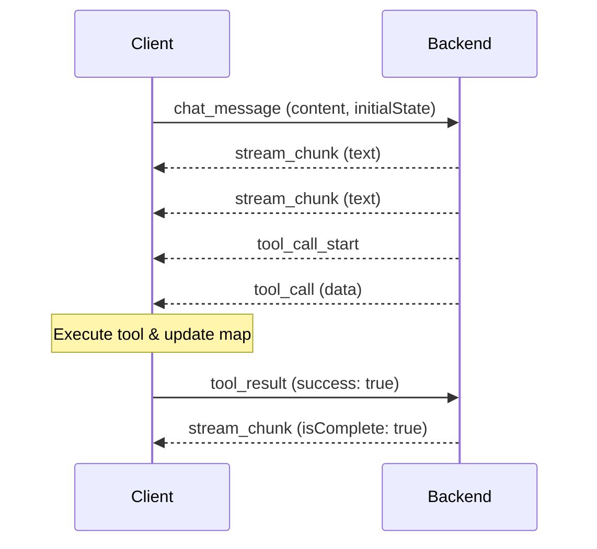
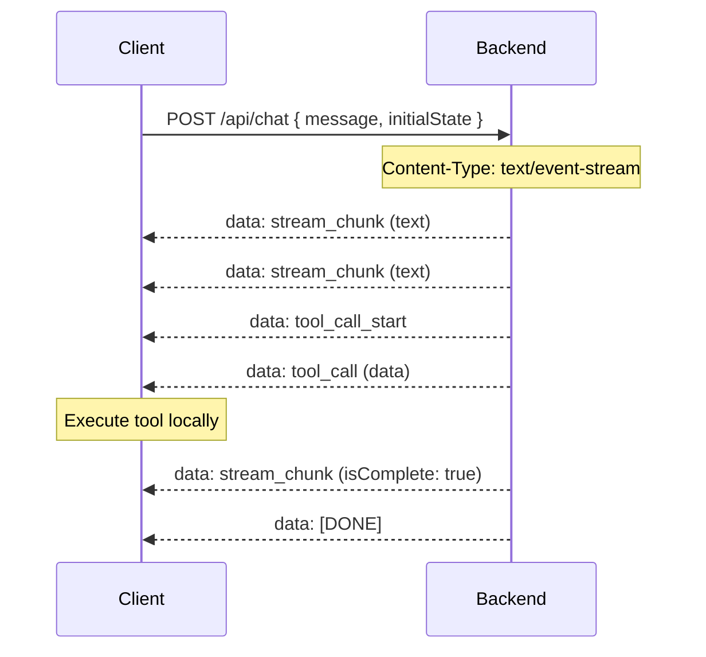

# Communication Protocol

All backends expose two communication channels: **WebSocket** (recommended) and **HTTP/SSE**. Both use the same JSON message shapes, so frontends can switch between them without changing message handling logic. Any frontend works with any backend without changes.

---

## Endpoints

| Endpoint | Protocol | Description |
|----------|----------|-------------|
| `/ws` | WebSocket | Primary communication channel (streaming + tool calls) |
| `/api/chat` | POST | HTTP SSE alternative for environments without WebSocket |
| `/health` | GET | Health check endpoint |
| `/api/semantic-config` | GET | Returns semantic layer configuration (welcome message, chips) |

---

## Communication Modes

### WebSocket (`/ws`) — Recommended

Full-duplex, persistent connection. This is the default and recommended mode.

- **Session management:** Each connection is assigned a unique UUID session ID
- **Conversation history:** Maintained per session (max 20 messages, first message always preserved on prune)
- **Bidirectional:** Client sends `chat_message` and `tool_result`; server streams responses
- **Cleanup:** Session history is automatically cleared when the connection closes

**Configuration:**

| Framework             | Variable            | Default                  |
|-----------------------|---------------------|--------------------------|
| Angular               | `environment.wsUrl` | `ws://localhost:3003/ws`  |
| React / Vue / Vanilla | `VITE_WS_URL`       | `ws://localhost:3003/ws`  |

### HTTP/SSE (`POST /api/chat`)

Stateless request-response using Server-Sent Events for streaming. Useful for environments where WebSocket connections are not available (e.g., serverless, restrictive proxies).

**Request:**

```http
POST /api/chat
Content-Type: application/json

{
  "message": "Show me population by county",
  "initialState": { ... }    // Optional: current map state
}
```

**Response:**

```http
Content-Type: text/event-stream
Cache-Control: no-cache
Connection: keep-alive

data: {"type":"stream_chunk","content":"I'll create","messageId":"msg_1","isComplete":false}

data: {"type":"tool_call_start","toolName":"set-deck-state","callId":"call_1"}

data: {"type":"tool_call","toolName":"set-deck-state","data":{...},"callId":"call_1"}

data: {"type":"stream_chunk","content":"Here's the map.","messageId":"msg_1","isComplete":true}

data: [DONE]
```

Key differences from WebSocket:

- **No session persistence:** Uses a fixed `'http-session'` ID — conversation history is not maintained across requests
- **No tool result feedback:** The client cannot send `tool_result` messages back, so the AI cannot retry failed tool calls within the same turn
- **Unidirectional streaming:** Server streams to client only; each user message requires a new HTTP request

**Configuration:**

| Framework             | Variable                 | Default                          |
|-----------------------|--------------------------|----------------------------------|
| Angular               | `environment.httpApiUrl` | `http://localhost:3003/api/chat` |
| React / Vue / Vanilla | `VITE_HTTP_API_URL`      | `http://localhost:3003/api/chat` |

To switch to HTTP mode, set `useHttp` (Angular) or `VITE_USE_HTTP` (Vite-based frontends) to `true`. See [Environment Configuration](ENVIRONMENT.md) for details.

### Comparison

| Feature                | WebSocket                    | HTTP/SSE                       |
|------------------------|------------------------------|--------------------------------|
| Connection             | Persistent, full-duplex      | One request-response per turn  |
| Session ID             | UUID per connection          | Fixed `'http-session'`         |
| Conversation history   | Yes (max 20 messages)        | No                             |
| Tool result feedback   | Yes (`tool_result` message)  | No                             |
| Cleanup                | On disconnect                | On response end                |
| Best for               | Interactive chat sessions    | Simple/stateless integrations  |

---

## Client to Server

The frontend sends these message types to the backend. In HTTP/SSE mode, only `chat_message` is sent (as the POST request body).

```typescript
// User sends a chat message with current map state
{
  type: 'chat_message',
  content: string,          // User's message text
  timestamp: number,        // Unix timestamp in milliseconds
  initialState?: InitialState  // Current map state (viewState, layers, basemap)
}
```

**When sent:** User submits a message in the chat UI.

**Purpose:** Initiates an AI conversation turn. The `initialState` provides context about the current map (camera position, active layers, styling) so the AI can make informed decisions about layer updates.

---

```typescript
// Frontend reports tool execution result (WebSocket only)
{
  type: 'tool_result',
  toolName: string,         // Name of the tool that was executed
  callId: string,           // Unique identifier for this tool call
  success: boolean,         // Whether execution succeeded
  message: string,          // Human-readable result or error message
  layerState?: LayerSpec[]  // Updated layer state after execution
}
```

**When sent:** After the frontend executes a tool call (e.g., `set-deck-state`, `set-marker`). WebSocket only — HTTP/SSE has no back-channel for tool results.

**Purpose:** Provides feedback to the AI about whether the tool execution succeeded. If execution failed, the AI can retry with corrected parameters. The `layerState` gives the AI visibility into the updated map state.

---

## Server to Client

The backend sends these message types to the frontend. In both modes the JSON shapes are identical — in HTTP/SSE mode each message is delivered as a `data:` line in the SSE stream.

```typescript
// Streaming text response from the AI
{
  type: 'stream_chunk',
  content: string,        // Text chunk (incremental or full text)
  messageId: string,      // Unique identifier for this AI message
  isComplete: boolean     // True when the AI message is finished
}
```

**When sent:** While the AI is generating a text response.

**Purpose:** Streams AI-generated text to the chat UI. Frontend accumulates chunks with the same `messageId` to build the complete message. When `isComplete: true`, the message is finalized.

---

```typescript
// Signals that a tool call is about to be executed
{
  type: 'tool_call_start',
  toolName: string,       // Name of the tool (e.g., 'set-deck-state')
  callId: string          // Unique identifier for this tool call
}
```

**When sent:** Before sending a `tool_call` message.

**Purpose:** Allows frontend to show a loading state or prepare for the incoming tool execution.

---

```typescript
// Tool call to be executed on the frontend
{
  type: 'tool_call',
  toolName: string,       // Name of the tool (e.g., 'set-deck-state')
  data: object,           // Tool parameters (validated by backend)
  callId: string          // Unique identifier for this tool call
}
```

**When sent:** AI decides to call a frontend-executed tool.

**Purpose:** Frontend executes the tool (via `ConsolidatedExecutorsService`), updates map state, and sends a `tool_result` message back to the backend (WebSocket only). See [Tool System](TOOLS.md) for detailed tool documentation.

---

```typescript
// Result from an MCP tool executed server-side
{
  type: 'mcp_tool_result',
  toolName: string,       // Name of the MCP tool
  result: unknown,        // Tool output (schema varies by tool)
  callId: string          // Unique identifier for this tool call
}
```

**When sent:** Backend finishes executing an MCP tool (e.g., geocoding, spatial analysis).

**Purpose:** Informs the frontend about the MCP tool result. Typically followed by a `tool_call` message that uses the MCP output (e.g., adding a layer with the result table).

---

```typescript
// Error message
{
  type: 'error',
  content: string,        // Human-readable error description
  code?: string           // Optional error code (e.g., 'VALIDATION_ERROR')
}
```

**When sent:** Backend encounters an error (AI provider failure, validation error, etc.).

**Purpose:** Frontend displays the error to the user in the chat UI.

---

## Message Flow

### WebSocket



**Step-by-step:**

1. Client sends `chat_message` with current map state
2. Server streams `stream_chunk` messages as AI generates text
3. Server sends `tool_call_start` to signal an upcoming tool execution
4. Server sends `tool_call` with parameters
5. Client executes the tool and updates the map
6. Client sends `tool_result` with success/failure status
7. Server continues streaming (potentially more tool calls)
8. Server sends final `stream_chunk` with `isComplete: true`

### HTTP/SSE



**Step-by-step:**

1. Client sends `POST /api/chat` with message and optional initial state
2. Server responds with an SSE stream
3. Server sends the same message types as WebSocket (`stream_chunk`, `tool_call`, etc.)
4. Client executes tool calls locally but cannot send results back to the server
5. Stream ends with `data: [DONE]`

---

## Session Management

### WebSocket Sessions

- **Per-session conversation history:** Each WebSocket connection maintains its own conversation history
- **Max 20 messages:** Conversation history is pruned when it exceeds 20 messages
- **First message preserved:** The initial context message is always kept during pruning
- **Cleanup on disconnect:** Sessions are automatically cleaned up when the WebSocket connection closes

### HTTP Sessions

- **No persistent history:** Each request is independent — the backend uses a fixed `'http-session'` session ID with no history carried between requests
- **Stateless:** No cleanup needed; each request is self-contained

---

## See Also

- [Getting Started](GETTING_STARTED.md) — Backend and frontend setup
- [Environment Configuration](ENVIRONMENT.md) — Backend and frontend variables
- [Tool System](TOOLS.md) — Consolidated tools and MCP integration
