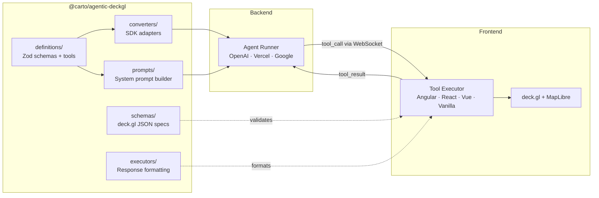
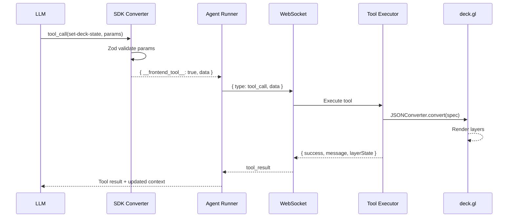
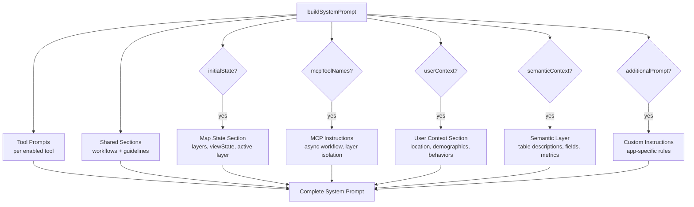

# @carto/agentic-deckgl

Isomorphic TypeScript library for AI-powered map controls. Provides tool definitions, system prompt generation, schema validation, and SDK converters for building AI agents that control deck.gl maps via natural language.

## Installation

```bash
npm install @carto/agentic-deckgl
```

## Features

- **Isomorphic** — Works in both Node.js and browser environments
- **Type-safe** — Full TypeScript support with Zod validation
- **Consolidated Tools** — 3 tools for complete map control (deck.gl state, marker placement, spatial mask filtering)
- **Prompts Module** — Composable system prompt generation for AI agents
- **SDK Converters** — One-line integration with OpenAI Agents SDK, Vercel AI SDK, and Google ADK
- **Tree-shakeable** — Import only what you need via subpath exports

---

## Architecture Overview

The library sits between the AI backend and the frontend, providing the contracts and prompt engineering that enable an LLM to control a deck.gl map:



### Design Principles

1. **Consolidated Tool Pattern** — 3 tools (`set-deck-state`, `set-marker`, `set-mask-layer`) replace 40+ granular tools. The AI sends structured JSON specs instead of imperative calls, reducing tool selection complexity and improving reliability.

2. **Zod-First Design** — A single Zod schema per tool serves four purposes: TypeScript type inference, runtime validation, OpenAI function calling JSON Schema generation, and SDK converter input. No schema duplication.

3. **@deck.gl/json as Intermediate Representation** — All map operations are expressed as JSON specs with special prefixes (`@@type`, `@@function`, `@@=`, `@@#`), resolved by the frontend's JSONConverter. This decouples the AI from framework-specific code.

4. **Frontend Tool Marker Pattern** — Backend SDK converters validate tool parameters and return a `{ __frontend_tool__: true, toolName, data }` marker. The agent runner detects this marker and forwards the tool call to the frontend via WebSocket (or HTTP/SSE), rather than executing it server-side.

---

## Key Concepts

### Consolidated Tools

Instead of exposing dozens of granular tools (set view, add layer, update style, remove widget...), the library provides 3 consolidated tools that accept structured JSON specs:

| Tool               | Purpose                                                                              |
|--------------------|--------------------------------------------------------------------------------------|
| `set-deck-state`   | Full deck.gl state control: navigation, basemap, layers, widgets, effects            |
| `set-marker`       | Place, remove, or clear location marker pins at specified coordinates                |
| `set-mask-layer`   | Editable mask layer for spatial filtering (geometry, table name, draw mode, or clear) |

This approach reduces tool selection errors and allows the AI to batch multiple operations (e.g., fly to a location AND add a layer) in a single tool call.

### @deck.gl/json Spec Format

The AI generates JSON objects using special prefixes that the frontend's JSONConverter resolves at runtime:

| Prefix       | Purpose               | Example                                                |
|--------------|-----------------------|--------------------------------------------------------|
| `@@type`     | Layer class            | `{ "@@type": "VectorTileLayer", ... }`                 |
| `@@function` | Data source or styling | `{ "@@function": "vectorTableSource", "tableName": "..." }` |
| `@@=`        | Accessor expression    | `"@@=properties.population"`                           |
| `@@#`        | Constant reference     | `"@@#Red"` → `[255, 0, 0, 200]`                       |

This format is framework-agnostic — the same JSON spec works in Angular, React, Vue, or Vanilla JS.

### Frontend Tool Marker

When the AI calls a tool, the SDK converter validates parameters with Zod and returns a marker object:

```typescript
// What the SDK converter returns to the agent runner
{
  __frontend_tool__: true,
  toolName: 'set-deck-state',
  data: { /* validated parameters */ }
}
```

The agent runner detects this marker using `isFrontendToolResult()` and forwards the tool call to the frontend via WebSocket. This cleanly separates frontend-executed tools (map manipulation) from backend-executed tools (geocoding, MCP queries).

### Tool Execution Lifecycle



### Prompt Composition

The system prompt is not a static string — it's dynamically composed from modular sections based on available tools, current map state, and application context:



For a deep dive into prompt internals, see [Prompt System Architecture](LIBRARY_PROMPT_SYSTEM.md).

---

## Subpath Exports

```typescript
// Main entry — all exports
import { ... } from '@carto/agentic-deckgl';

// Specific modules
import { ... } from '@carto/agentic-deckgl/definitions';
import { ... } from '@carto/agentic-deckgl/prompts';
import { ... } from '@carto/agentic-deckgl/schemas';
import { ... } from '@carto/agentic-deckgl/executors';
import { ... } from '@carto/agentic-deckgl/converters';
```

---

## Quick Start

### Backend (Node.js)

```typescript
import {
  getConsolidatedToolDefinitions,
  buildSystemPrompt,
  TOOL_NAMES,
} from '@carto/agentic-deckgl';

// Get tool definitions for OpenAI function calling
const tools = getConsolidatedToolDefinitions();

// Build system prompt with current map state
const systemPrompt = buildSystemPrompt({
  toolNames: [
    TOOL_NAMES.SET_DECK_STATE,
    TOOL_NAMES.SET_MARKER,
    TOOL_NAMES.SET_MASK_LAYER,
  ],
  initialState: {
    viewState: { latitude: 40.7128, longitude: -74.006, zoom: 12 },
    layers: [{ id: 'my-layer', type: 'VectorTileLayer', visible: true }],
    activeLayerId: 'my-layer',
  },
  userContext: {
    country: 'United States',
    businessType: 'Retail',
  },
});

// Use with OpenAI
const response = await openai.chat.completions.create({
  model: 'gpt-4o',
  messages: [
    { role: 'system', content: systemPrompt },
    { role: 'user', content: 'Add a layer showing population density' },
  ],
  tools,
});
```

### Frontend (Browser)

```typescript
import { TOOL_NAMES } from '@carto/agentic-deckgl';

// Execute tools received from backend (WebSocket or HTTP/SSE)
connection.on('tool_call', async (message) => {
  const { toolName, data, callId } = message;

  switch (toolName) {
    case TOOL_NAMES.SET_DECK_STATE:
      // Update deck.gl state (viewState, layers, basemap, widgets)
      applyDeckState(data);
      break;
    case TOOL_NAMES.SET_MARKER:
      // Place/remove location markers
      handleMarker(data);
      break;
    case TOOL_NAMES.SET_MASK_LAYER:
      // Set/clear spatial mask
      handleMask(data);
      break;
  }

  // Send result back to backend (WebSocket only — not available in HTTP/SSE mode)
  connection.send({ type: 'tool_result', toolName, callId, success: true, message: 'Done' });
});
```

---

## Integration Guides

The library is designed to integrate with **any** backend framework and **any** frontend framework. These guides explain the patterns step-by-step:

- **[Backend Integration Guide](LIBRARY_BACKEND_INTEGRATION.md)** — How to set up tool definitions, build system prompts, create an agent runner, and detect frontend tool calls. Covers OpenAI Agents SDK, Vercel AI SDK, Google ADK, and custom backends.

- **[Frontend Integration Guide](LIBRARY_FRONTEND_INTEGRATION.md)** — How to execute tool calls, set up JSONConverter for `@@` prefix resolution, manage deck.gl state, and send tool results back. Framework-agnostic patterns with React, Angular, Vue, and Vanilla JS notes.

- **[Prompt System Architecture](LIBRARY_PROMPT_SYSTEM.md)** — Deep dive into how `buildSystemPrompt()` composes tool prompts, shared sections, map state, MCP instructions, and user context into a complete system prompt.

---

## Tool Definitions

### Tool Names

```typescript
import { TOOL_NAMES } from '@carto/agentic-deckgl';

TOOL_NAMES.SET_DECK_STATE  // 'set-deck-state'
TOOL_NAMES.SET_MARKER      // 'set-marker'
TOOL_NAMES.SET_MASK_LAYER  // 'set-mask-layer'
```

### Tool Registry API

```typescript
import {
  tools,                          // Full tool registry object
  getTool,                        // Get a single tool by name
  getToolNames,                   // Get all tool names
  getToolDefinition,              // Get one tool in OpenAI format
  getAllToolDefinitions,           // Get all tools in OpenAI format
  getConsolidatedToolDefinitions, // Alias for getAllToolDefinitions
  getToolDefinitionsByNames,      // Get subset by names
  validateToolParams,             // Validate params against Zod schema
  isSpecTool,                     // Check if tool returns a @deck.gl/json spec
  getSpecTools,                   // Get all spec-type tools
} from '@carto/agentic-deckgl';
```

---

## SDK Converters

One-line conversion from internal tool definitions to SDK-native formats. Each converter validates parameters with Zod and returns a `FrontendToolResult` marker.

### OpenAI Agents SDK

```typescript
import { getToolsForOpenAIAgents } from '@carto/agentic-deckgl';
import { tool } from '@openai/agents';

const toolDefs = getToolsForOpenAIAgents();
const agentTools = toolDefs.map(def => tool(def));
// Returns OpenAIAgentToolDef[] with { name, description, parameters: ZodSchema, execute }
// execute() returns JSON string (OpenAI SDK requirement)
```

### Vercel AI SDK

```typescript
import { getToolsRecordForVercelAI } from '@carto/agentic-deckgl';
import { streamText } from 'ai';

const result = await streamText({
  model,
  tools: getToolsRecordForVercelAI(),
  // Returns Record<string, { description, inputSchema: ZodSchema, execute }>
  // Note: Vercel uses 'inputSchema' instead of 'parameters'
});
```

### Google ADK

```typescript
import { getToolsForGoogleADK } from '@carto/agentic-deckgl';
import { FunctionTool } from '@google/adk';

const toolDefs = getToolsForGoogleADK();
const adkTools = toolDefs.map(def => new FunctionTool(def));
// Returns GoogleADKToolDef[] with { name, description, parameters: ZodSchema, execute }
// execute() returns object (not string)
```

### Frontend Tool Detection

After the agent runs, detect which tool results should be forwarded to the frontend:

```typescript
import {
  isFrontendToolResult,    // Check if result has __frontend_tool__: true
  parseFrontendToolResult, // Parse from JSON string (OpenAI SDK)
} from '@carto/agentic-deckgl';

// For Vercel AI / Google ADK (result is already an object)
if (isFrontendToolResult(toolOutput)) {
  ws.send(JSON.stringify({
    type: 'tool_call',
    toolName: toolOutput.toolName,
    data: toolOutput.data,
    callId,
  }));
}

// For OpenAI Agents SDK (result is a JSON string)
const parsed = parseFrontendToolResult(toolOutputString);
if (parsed) {
  ws.send(JSON.stringify({
    type: 'tool_call',
    toolName: parsed.toolName,
    data: parsed.data,
    callId,
  }));
}
```

---

## Prompts Module

### Building System Prompts

```typescript
import {
  buildSystemPrompt,
  type BuildSystemPromptOptions,
} from '@carto/agentic-deckgl';

const options: BuildSystemPromptOptions = {
  // Required: which tools are available to the AI
  toolNames: ['set-deck-state', 'set-marker', 'set-mask-layer'],

  // Optional: current map state for spatial awareness
  initialState: {
    viewState: { latitude: 40.7128, longitude: -74.006, zoom: 12 },
    layers: [{ id: 'population-layer', type: 'H3TileLayer', visible: true }],
    activeLayerId: 'population-layer',
  },

  // Optional: user context for behavioral injections
  userContext: {
    country: 'United States',
    businessType: 'Restaurant',
    demographics: ['millennials', 'urban professionals'],
    proximityPriorities: [
      { name: 'Public Transit', weight: 8 },
      { name: 'Foot Traffic', weight: 7 },
    ],
  },

  // Optional: semantic layer context (table/field descriptions)
  semanticContext: '## Available Data Tables\n...',

  // Optional: MCP tool names (enables async workflow instructions)
  mcpToolNames: ['pois_filter', 'async_workflow_job_get_status_v1_0_0'],

  // Optional: additional app-specific prompt text
  additionalPrompt: 'Focus on data visualization.',
};

const prompt = buildSystemPrompt(options);
```

### Accessing Individual Sections

```typescript
import {
  toolPrompts,           // All tool prompt configs
  getToolPrompt,         // Get one tool's prompt text
  getToolPrompts,        // Get combined prompt for multiple tools
  sharedSections,        // Reusable prompt sections
  getSharedSection,      // Get a specific shared section
  buildMapStateSection,  // Build map state context from current state
  buildUserContextSection, // Build user context with behavioral injections
} from '@carto/agentic-deckgl';
```

See [Prompt System Architecture](LIBRARY_PROMPT_SYSTEM.md) for details on each section and customization options.

---

## Schema Validation

```typescript
import {
  validateToolParams,
  deckGLJsonSpecSchema,
  layerSpecSchema,
} from '@carto/agentic-deckgl';

// Validate tool parameters against Zod schema
const result = validateToolParams('set-deck-state', {
  initialViewState: { latitude: 40.7, longitude: -74.0, zoom: 12 },
  layers: [{ '@@type': 'VectorTileLayer', id: 'my-layer' }],
});

if (result.success) {
  console.log('Valid params:', result.data);
} else {
  console.error('Validation errors:', result.errors);
}
```

### @deck.gl/json Spec Utilities

```typescript
import {
  isSpecialPrefix,   // Check for "@@" prefix
  isFunctionRef,     // Check for "@@function"
  isConstantRef,     // Check for "@@#"
  isExpression,      // Check for "@@="
  createFunctionRef, // Build "@@function/..." string
  createConstantRef, // Build "@@#..." string
  createExpression,  // Build "@@=..." string
} from '@carto/agentic-deckgl';
```

---

## Response Utilities

```typescript
import {
  // Response formatting (backend)
  successResponse,    // Create success ToolResponse
  errorResponse,      // Create error ToolResponse
  createError,        // Create ToolError with code

  // Response parsing (frontend)
  parseToolResponse,  // Parse response (handles legacy format)
  isSuccessResponse,  // Check for success
  isErrorResponse,    // Check for error

  // Error codes
  ErrorCodes,         // VALIDATION_ERROR, TOOL_NOT_FOUND, EXECUTION_ERROR, etc.
} from '@carto/agentic-deckgl';
```

---

## Types

```typescript
import type {
  // Prompt types
  BuildSystemPromptOptions,
  MapViewState,
  LayerState,
  MapState,
  UserContext,
  ProximityWeight,

  // Tool types
  ToolName,
  ToolDefinition,
  ToolExecutor,
  CustomToolDefinition,

  // Response types
  ToolRequest,
  ToolResponse,
  ParsedToolResponse,
  ToolError,

  // Execution types
  ExecutionContext,
  ExecutionResult,
  MapToolsConfig,
  ToolInterceptors,

  // Converter types
  OpenAIAgentToolDef,
  VercelAIToolDef,
  GoogleADKToolDef,
  FrontendToolResult,
} from '@carto/agentic-deckgl';
```

---

## Module Architecture

```
@carto/agentic-deckgl/
├── definitions/          # Tool registry with Zod schemas
│   ├── tools.ts          # Tool definitions (3 consolidated tools)
│   └── dictionary.ts     # TOOL_NAMES constants
├── prompts/              # System prompt generation
│   ├── builder.ts        # buildSystemPrompt() composition
│   ├── tool-prompts.ts   # Per-tool instruction blocks
│   ├── shared-sections.ts # Reusable prompt sections
│   └── types.ts          # BuildSystemPromptOptions, UserContext, MapState
├── schemas/              # Zod schemas for @deck.gl/json
│   ├── deckgl-json.ts    # Spec schemas (layers, viewState, operations)
│   ├── layer-specs.ts    # Per-layer-type schemas (8 types)
│   ├── initial-state.ts  # Map state + data source metadata
│   └── coercion-helpers.ts # LLM output normalization
├── converters/           # SDK adapters
│   ├── agentic-sdks.ts   # OpenAI, Vercel, Google ADK converters
│   └── spec-generator.ts # Spec merge utilities
├── executors/            # Response formatting
│   ├── interface.ts      # ToolRequest, ToolResponse, ToolError
│   └── errors.ts         # ErrorCodes, createError, successResponse
└── utils/                # Parsing utilities
    └── response.ts       # parseToolResponse, isSuccessResponse
```

---

## See Also

- [Backend Integration Guide](LIBRARY_BACKEND_INTEGRATION.md) — Step-by-step backend setup
- [Frontend Integration Guide](LIBRARY_FRONTEND_INTEGRATION.md) — Step-by-step frontend setup
- [Prompt System Architecture](LIBRARY_PROMPT_SYSTEM.md) — Prompt composition deep dive
- [Tool System](TOOLS.md) — Tool behavior, parameters, and examples
- [Communication Protocol](COMMUNICATION_PROTOCOL.md) — WebSocket and HTTP/SSE message formats
- [System Prompt](SYSTEM_PROMPT.md) — App-level prompt customization
- [Semantic Layer](SEMANTIC_LAYER_GUIDE.md) — YAML data catalog configuration
- [Environment Configuration](ENVIRONMENT.md) — Backend and frontend variables
- [Getting Started](GETTING_STARTED.md) — Quick setup guide

## License

MIT
