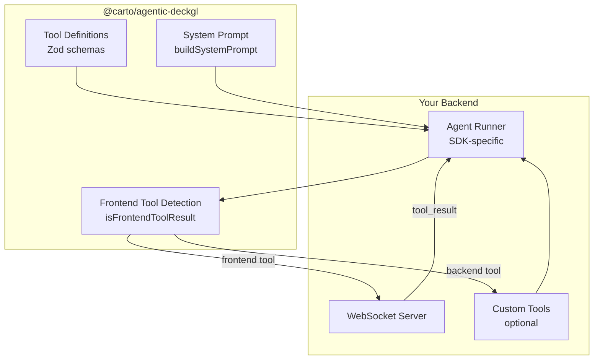

# Backend Integration Guide

How to integrate `@carto/agentic-deckgl` with any AI backend to create an agent that controls a deck.gl map. This guide is framework-agnostic — the same pattern applies whether you use OpenAI Agents SDK, Vercel AI SDK, Google ADK, or a custom setup.

---

## Overview

The library provides three things your backend needs:

1. **Tool definitions** — Zod-validated schemas the AI can call, converted to your SDK's format
2. **System prompt** — Dynamically composed instructions that teach the AI how to control the map
3. **Frontend tool detection** — Helpers to identify which tool results should be forwarded to the client

Your backend provides:

1. **Agent runner** — SDK-specific orchestration (streaming, tool execution loop)
2. **WebSocket/HTTP server** — Communication with the frontend
3. **Custom tools** — Optional backend-only tools (geocoding, MCP integration)



---

## Step 1: Install and Import

```bash
npm install @carto/agentic-deckgl
```

Import the functions you need:

```typescript
// Tool definitions — pick your SDK converter
import {
  getToolsForOpenAIAgents,   // OpenAI Agents SDK
  getToolsForVercelAI,       // Vercel AI SDK
  getToolsRecordForVercelAI, // Vercel AI SDK (record format)
  getToolsForGoogleADK,      // Google ADK
  consolidatedToolNames,     // ['set-deck-state', 'set-marker', 'set-mask-layer']
} from '@carto/agentic-deckgl';

// System prompt
import {
  buildSystemPrompt,
  type BuildSystemPromptOptions,
  type MapState,
} from '@carto/agentic-deckgl';

// Frontend tool detection
import {
  isFrontendToolResult,      // For Vercel/Google (object result)
  parseFrontendToolResult,   // For OpenAI (string result)
} from '@carto/agentic-deckgl';
```

---

## Step 2: Create Tool Definitions

Convert library tools to your SDK's format and combine with any custom or MCP tools.

### SDK-Specific Conversion

Each converter wraps the library's Zod schemas into the format your SDK expects:

```typescript
// OpenAI Agents SDK
import { tool } from '@openai/agents';
const toolDefs = getToolsForOpenAIAgents(consolidatedToolNames);
const mapTools = toolDefs.map(def => tool(def));

// Vercel AI SDK
import { streamText } from 'ai';
const tools = getToolsRecordForVercelAI(consolidatedToolNames);
// Use directly: streamText({ tools, ... })

// Google ADK
import { FunctionTool } from '@google/adk';
const toolDefs = getToolsForGoogleADK(consolidatedToolNames);
const mapTools = toolDefs.map(def => new FunctionTool(def));
```

### Combining with Custom Tools

If you have backend-only tools (geocoding, database queries, MCP), combine them with map tools using a deduplication pattern:

```typescript
function getAllTools() {
  const mapTools = getToolsForYourSDK(consolidatedToolNames);
  const customTools = getCustomTools();  // Your backend-only tools
  const mcpTools = getMCPTools();        // Optional MCP server tools

  // Deduplicate: local > custom > MCP (precedence order)
  const toolMap = new Map();
  for (const t of mcpTools)    toolMap.set(t.name, t);
  for (const t of customTools) toolMap.set(t.name, t);
  for (const t of mapTools)    toolMap.set(t.name, t);  // Highest priority

  return Array.from(toolMap.values());
}

// Collect all tool names for prompt building
function getAllToolNames(): string[] {
  return [...new Set([
    ...consolidatedToolNames,
    ...getCustomToolNames(),
    ...getMCPToolNames(),
  ])];
}
```

---

## Step 3: Build the System Prompt

The system prompt teaches the AI how to use the tools. It's built dynamically based on which tools are available and the current map state.

```typescript
function buildPrompt(initialState?: MapState): string {
  const toolNames = getAllToolNames();

  // Detect MCP tools (convention: names with underscores)
  const mcpToolNames = toolNames.filter(name => name.includes('_'));

  const options: BuildSystemPromptOptions = {
    // Required: list of all available tool names
    toolNames,

    // Optional: current map state (viewState, layers, active layer)
    // Sent by frontend with each chat_message
    initialState: initialState ? {
      viewState: initialState.viewState,
      layers: initialState.layers,
      activeLayerId: initialState.activeLayerId,
    } : undefined,

    // Optional: user context (triggers behavioral injections)
    userContext: initialState?.userContext,

    // Optional: semantic layer (table/field descriptions from YAML)
    semanticContext: loadSemanticContext(),

    // Optional: MCP tools (enables async workflow instructions)
    mcpToolNames: mcpToolNames.length > 0 ? mcpToolNames : undefined,

    // Optional: app-specific instructions
    additionalPrompt: 'Always explain what you are doing.',
  };

  return buildSystemPrompt(options);
}
```

### What the Prompt Contains

The `buildSystemPrompt()` function composes these sections in order:

1. **Role introduction** — "You are a helpful map assistant..."
2. **Tool prompts** — Detailed instructions per enabled tool (~700 lines for `set-deck-state` covering layer types, styling, filtering, widgets)
3. **Workflow patterns** — Common multi-step workflows (navigate, add layer, filter, style)
4. **Guidelines** — Critical rules (layers merge by ID, frontend executes after response)
5. **Map state** — Current layers, viewState, active layer (if `initialState` provided)
6. **MCP instructions** — Async workflow, layer isolation rules (if `mcpToolNames` provided)
7. **User context** — Analysis parameters with behavioral injections like "fly to location first" (if `userContext` provided)
8. **Semantic context** — Table descriptions, fields, metrics (if `semanticContext` provided)
9. **Additional prompt** — App-specific text (if `additionalPrompt` provided)

See [Prompt System Architecture](LIBRARY_PROMPT_SYSTEM.md) for details on each section.

---

## Step 4: Create the Agent Runner

The agent runner orchestrates the AI conversation, detects frontend tool calls, and forwards them via WebSocket.

### Core Pattern

Regardless of SDK, the agent runner follows this pattern:

```typescript
async function runAgent(
  message: string,
  ws: WebSocket,
  sessionId: string,
  initialState?: InitialState
) {
  // 1. Build system prompt with current state
  const systemPrompt = buildPrompt(initialState);

  // 2. Get conversation history
  const history = conversationManager.getHistory(sessionId);

  // 3. Run the agent (SDK-specific)
  const stream = await runWithSDK(systemPrompt, message, history, tools);

  // 4. Process the stream
  for await (const event of stream) {
    if (isTextDelta(event)) {
      // Forward text to frontend
      ws.send(JSON.stringify({
        type: 'stream_chunk',
        content: event.text,
        messageId: event.id,
        isComplete: false,
      }));
    }

    if (isToolResult(event)) {
      handleToolResult(event, ws);
    }
  }

  // 5. Signal completion
  ws.send(JSON.stringify({
    type: 'stream_chunk',
    content: '',
    messageId: lastMessageId,
    isComplete: true,
  }));
}
```

### Detecting Frontend vs Backend Tools

This is the critical integration point. After each tool execution, check if the result is a frontend tool marker:

```typescript
function handleToolResult(event: ToolResultEvent, ws: WebSocket) {
  const output = event.output;

  // For Vercel AI / Google ADK — output is an object
  if (isFrontendToolResult(output)) {
    // Frontend tool → forward to client via WebSocket
    ws.send(JSON.stringify({
      type: 'tool_call',
      toolName: output.toolName,
      data: sanitize(output.data),  // Strip credentials, fix malformed keys
      callId: event.callId,
    }));
    return;
  }

  // For OpenAI Agents SDK — output is a JSON string
  const parsed = parseFrontendToolResult(output as string);
  if (parsed) {
    ws.send(JSON.stringify({
      type: 'tool_call',
      toolName: parsed.toolName,
      data: sanitize(parsed.data),
      callId: event.callId,
    }));
    return;
  }

  // Backend tool → send result notification to client
  ws.send(JSON.stringify({
    type: 'mcp_tool_result',  // or 'custom_tool_result'
    toolName: event.toolName,
    result: output,
    callId: event.callId,
  }));
}
```

### Security: Sanitize Before Sending

Always strip credentials and fix malformed keys before sending tool data to the frontend:

```typescript
const CREDENTIAL_FIELDS = ['accessToken', 'apiBaseUrl', 'connectionName', 'connection'];

function stripCredentials(data: unknown): unknown {
  // Recursively remove credential fields from objects
  if (typeof data !== 'object' || data === null) return data;
  const result: Record<string, unknown> = {};
  for (const [key, value] of Object.entries(data)) {
    if (!CREDENTIAL_FIELDS.includes(key)) {
      result[key] = stripCredentials(value);
    }
  }
  return result;
}

// Fix Gemini-generated keys like "'@@type'" → "@@type"
function sanitizeMalformedKeys(data: unknown): unknown {
  // Remove wrapping quotes from @@ prefixed keys
  // ...
}
```

---

## Step 5: WebSocket Communication

Set up WebSocket endpoints for bidirectional communication with the frontend.

### Server Setup

```typescript
import { createServer } from 'http';
import { WebSocketServer } from 'ws';
import express from 'express';

const app = express();
const server = createServer(app);
const wss = new WebSocketServer({ server, path: '/ws' });

wss.on('connection', (ws) => {
  const sessionId = crypto.randomUUID();

  ws.on('message', async (raw) => {
    const msg = JSON.parse(raw.toString());

    switch (msg.type) {
      case 'chat_message':
        await runAgent(msg.content, ws, sessionId, msg.initialState);
        break;

      case 'tool_result':
        // Feed tool result back to the agent
        // (SDK-specific: resolve pending tool call promise)
        break;
    }
  });

  ws.on('close', () => {
    conversationManager.clearHistory(sessionId);
  });
});
```

For the complete message protocol, see [Communication Protocol](COMMUNICATION_PROTOCOL.md).

---

## Step 6: Custom Backend Integration (No SDK)

If you're not using one of the supported SDKs, you can work with the raw tool definitions:

```typescript
import {
  getConsolidatedToolDefinitions,  // OpenAI function calling format
  validateToolParams,              // Zod validation
} from '@carto/agentic-deckgl';

// Get tools in OpenAI function calling format (works with any OpenAI-compatible API)
const tools = getConsolidatedToolDefinitions();
// Returns: [{ type: 'function', function: { name, description, parameters: JSONSchema } }]

// When AI returns a tool call, validate and forward:
function handleToolCall(toolName: string, args: unknown, ws: WebSocket) {
  const validation = validateToolParams(toolName, args);

  if (!validation.success) {
    // Return error to AI for retry
    return { error: true, message: validation.errors.join(', ') };
  }

  // Forward validated params to frontend
  ws.send(JSON.stringify({
    type: 'tool_call',
    toolName,
    data: validation.data,
    callId: crypto.randomUUID(),
  }));
}
```

---

## See Also

- [Library Overview](LIBRARY.md) — Architecture, concepts, full API reference
- [Frontend Integration Guide](LIBRARY_FRONTEND_INTEGRATION.md) — Client-side tool execution
- [Prompt System Architecture](LIBRARY_PROMPT_SYSTEM.md) — Prompt composition deep dive
- [Communication Protocol](COMMUNICATION_PROTOCOL.md) — WebSocket and HTTP/SSE message formats
- [Tool System](TOOLS.md) — Tool behavior, parameters, and examples
