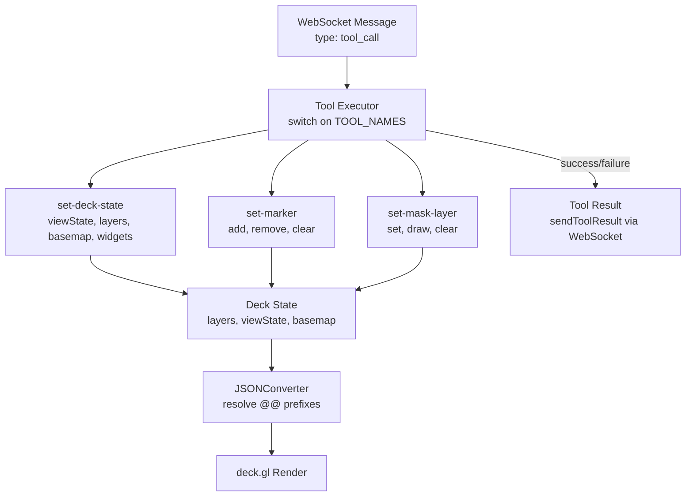

# Frontend Integration Guide

How to integrate `@carto/agentic-deckgl` with any frontend framework to execute AI-generated tool calls on a deck.gl map. This guide is framework-agnostic — the same pattern applies to React, Angular, Vue, and Vanilla JS.

---

## Overview

The frontend receives tool calls from the backend via WebSocket and executes them against deck.gl. The library provides minimal runtime code on the frontend side — primarily constants and response utilities. The heavy lifting (state management, rendering) is framework-specific.

**What the library provides:**
- `TOOL_NAMES` — Constants for tool name matching
- `parseToolResponse`, `isSuccessResponse` — Response parsing utilities

**What you build:**
- WebSocket connection and message handling
- Tool executor (maps tool names to state update functions)
- deck.gl state management
- JSONConverter setup for `@@` prefix resolution



---

## Step 1: Install and Import

```bash
npm install @carto/agentic-deckgl
```

The frontend only needs the constants module:

```typescript
import { TOOL_NAMES } from '@carto/agentic-deckgl';
// TOOL_NAMES.SET_DECK_STATE  → 'set-deck-state'
// TOOL_NAMES.SET_MARKER      → 'set-marker'
// TOOL_NAMES.SET_MASK_LAYER  → 'set-mask-layer'
```

---

## Step 2: Connect to WebSocket

Establish a WebSocket connection to the backend and handle incoming messages:

```typescript
const ws = new WebSocket('ws://localhost:3003/ws');

ws.onmessage = (event) => {
  const msg = JSON.parse(event.data);

  switch (msg.type) {
    case 'stream_chunk':
      // Accumulate AI text response
      handleStreamChunk(msg.content, msg.messageId, msg.isComplete);
      break;

    case 'tool_call_start':
      // Show loading indicator
      showLoader(`Working with ${msg.toolName}...`);
      break;

    case 'tool_call':
      // Execute tool and send result back
      executeTool(msg.toolName, msg.data, msg.callId);
      break;

    case 'mcp_tool_result':
      // Backend tool completed — show notification
      showLoader(`Processing ${msg.toolName} result...`);
      break;

    case 'error':
      showError(msg.content);
      break;
  }
};
```

For the complete message protocol, see [Communication Protocol](COMMUNICATION_PROTOCOL.md).

---

## Step 3: Build the Tool Executor

The tool executor maps `TOOL_NAMES` to handler functions that update deck.gl state. Here's the framework-agnostic pattern:

```typescript
import { TOOL_NAMES } from '@carto/agentic-deckgl';

async function executeTool(toolName: string, data: unknown, callId: string) {
  try {
    let result;

    switch (toolName) {
      case TOOL_NAMES.SET_DECK_STATE:
        result = executeSetDeckState(data);
        break;
      case TOOL_NAMES.SET_MARKER:
        result = executeSetMarker(data);
        break;
      case TOOL_NAMES.SET_MASK_LAYER:
        result = executeSetMaskLayer(data);
        break;
      default:
        result = { success: false, message: `Unknown tool: ${toolName}` };
    }

    sendToolResult(toolName, callId, result);
  } catch (error) {
    sendToolResult(toolName, callId, {
      success: false,
      message: error.message,
    });
  }
}
```

### set-deck-state Executor

This is the primary tool. It handles navigation, basemap changes, layer operations, widgets, and effects in a single call:

```typescript
function executeSetDeckState(data: any) {
  const { initialViewState, mapStyle, layers, widgets, effects,
          layerOrder, removeLayerIds, removeWidgetIds } = data;

  // 1. Update view state (fly to location)
  if (initialViewState) {
    deckState.setInitialViewState(initialViewState);
  }

  // 2. Change basemap
  if (mapStyle) {
    deckState.setBasemap(mapStyle);
  }

  // 3. Remove layers by ID
  if (removeLayerIds?.length) {
    deckState.removeLayers(removeLayerIds);
  }

  // 4. Add or update layers (merge by ID)
  if (layers?.length) {
    for (const layerSpec of layers) {
      deckState.mergeLayer(layerSpec);
      // If layer has an ID matching an existing layer, deep-merge properties
      // If new ID, add as new layer
    }
  }

  // 5. Reorder layers
  if (layerOrder?.length) {
    deckState.reorderLayers(layerOrder);
  }

  // 6. Handle widgets
  if (widgets?.length) {
    for (const widget of widgets) {
      deckState.addWidget(widget);
    }
  }
  if (removeWidgetIds?.length) {
    deckState.removeWidgets(removeWidgetIds);
  }

  // 7. Handle effects
  if (effects?.length) {
    deckState.setEffects(effects);
  }

  return { success: true, message: 'Deck state updated' };
}
```

### set-marker Executor

Manages location pin markers on the map:

```typescript
function executeSetMarker(data: any) {
  const { action = 'add', latitude, longitude } = data;

  switch (action) {
    case 'add':
      // Create an IconLayer spec for the marker
      const markerLayer = {
        '@@type': 'IconLayer',
        id: `__marker-${Date.now()}`,
        data: [{ position: [longitude, latitude] }],
        getPosition: '@@=position',
        getIcon: () => 'marker',
        getSize: 40,
        iconAtlas: MARKER_ICON_URL,
        iconMapping: { marker: { x: 0, y: 0, width: 128, height: 128 } },
      };
      deckState.addSystemLayer(markerLayer);  // System layers use __ prefix
      break;

    case 'remove':
      deckState.removeMarkerAt(latitude, longitude);
      break;

    case 'clear-all':
      deckState.clearAllMarkers();
      break;
  }

  return { success: true, message: `Marker ${action} completed` };
}
```

### set-mask-layer Executor

Manages an editable mask layer for spatial filtering:

```typescript
function executeSetMaskLayer(data: any) {
  const { action, geometry, tableName } = data;

  switch (action) {
    case 'set':
      if (geometry) {
        // Use provided GeoJSON geometry
        maskState.setGeometry(geometry);
      } else if (tableName) {
        // Fetch geometry from CARTO table
        const source = vectorTableSource({ tableName, ...cartoConfig });
        maskState.setFromSource(source);
      }
      maskState.enable();
      break;

    case 'enable-draw':
      // Let user draw a polygon on the map
      maskState.enableDrawMode();
      break;

    case 'clear':
      maskState.clear();
      break;
  }

  return { success: true, message: `Mask ${action} completed` };
}
```

---

## Step 4: Set Up JSONConverter

The AI generates JSON specs with `@@` prefixes that need to be resolved into actual deck.gl objects. Set up `@deck.gl/json`'s JSONConverter with the necessary registrations:

```typescript
import { JSONConverter } from '@deck.gl/json';
import {
  VectorTileLayer, H3TileLayer, QuadbinTileLayer,
  vectorTableSource, h3TableSource, quadbinTableSource,
  colorBins, colorContinuous, colorCategories,
} from '@deck.gl/carto';
import { GeoJsonLayer, ScatterplotLayer, ArcLayer, IconLayer } from '@deck.gl/layers';
import { HexagonLayer } from '@deck.gl/aggregation-layers';
import { FlyToInterpolator } from '@deck.gl/core';

const jsonConverter = new JSONConverter({
  configuration: {
    // @@type — Layer class resolution
    classes: {
      VectorTileLayer,
      H3TileLayer,
      QuadbinTileLayer,
      GeoJsonLayer,
      ScatterplotLayer,
      ArcLayer,
      IconLayer,
      HexagonLayer,
    },

    // @@function — Data source and styling functions
    functions: {
      vectorTableSource,
      h3TableSource,
      quadbinTableSource,
      colorBins,
      colorContinuous,
      colorCategories,
    },

    // @@# — Named constants
    constants: {
      FlyToInterpolator: new FlyToInterpolator(),
      // Color constants
      Red: [255, 0, 0, 200],
      Blue: [0, 0, 255, 200],
      CartoPrimary: [3, 111, 226, 200],
      // Add more as needed
    },

    // @@= — Expression evaluator (built into JSONConverter)
    // Automatically handles accessor expressions like "@@=properties.value"
  },
});
```

### Using JSONConverter

When rendering, convert the JSON spec into deck.gl props:

```typescript
function renderDeckState(deckSpec) {
  const { initialViewState, layers, widgets, effects } = deckSpec;

  // Convert JSON layer specs to instantiated Layer objects
  const converted = jsonConverter.convert({ layers });

  // Apply to deck.gl instance
  deck.setProps({
    initialViewState,
    layers: converted.layers,
  });
}
```

---

## Step 5: Provide Initial State

Each `chat_message` should include the current map state so the AI knows what's on screen:

```typescript
function sendMessage(content: string) {
  // Filter out system layers (__ prefix) — AI shouldn't see internal layers
  const userLayers = deckState.getLayers()
    .filter(l => !l.id.startsWith('__'))
    .map(l => ({
      id: l.id,
      type: l['@@type'] || l.type,
      visible: l.visible !== false,
      // Include style context so AI knows current styling
      styleContext: {
        getFillColor: l.getFillColor,
        getLineColor: l.getLineColor,
        filters: l.data?.filters,
      },
    }));

  ws.send(JSON.stringify({
    type: 'chat_message',
    content,
    timestamp: Date.now(),
    initialState: {
      viewState: deckState.getViewState(),
      layers: userLayers,
      activeLayerId: deckState.getActiveLayerId(),
      cartoConfig: {
        connectionName: config.connectionName,
        hasCredentials: true,
      },
      userContext: getUserContext(),  // Optional business analysis context
    },
  }));
}
```

---

## Step 6: Send Tool Results

After executing a tool, send the result back to the backend so the AI knows what happened:

```typescript
function sendToolResult(toolName: string, callId: string, result: ToolResult) {
  // Include current layer state so AI has updated context
  const layerState = deckState.getLayers()
    .filter(l => !l.id.startsWith('__'))
    .map(l => ({
      id: l.id,
      type: l['@@type'] || l.type,
      visible: l.visible !== false,
    }));

  ws.send(JSON.stringify({
    type: 'tool_result',
    toolName,
    callId,
    success: result.success,
    message: result.message,
    error: result.error?.message,
    layerState,
  }));
}
```

---

## Layer Merge Strategy

When `set-deck-state` receives layers, they should be **merged by ID**, not replaced:

```typescript
function mergeLayer(newSpec: LayerSpec) {
  const existingIndex = layers.findIndex(l => l.id === newSpec.id);

  if (existingIndex >= 0) {
    // Deep merge: new properties override, unspecified properties preserved
    layers[existingIndex] = deepMerge(layers[existingIndex], newSpec);
  } else {
    // New layer: append to array
    layers.push(newSpec);
  }
}
```

This allows the AI to send partial updates (e.g., just change `getFillColor` on an existing layer) without resending the entire layer spec.

---

## Framework-Specific Notes

### React

- State: `useReducer` in a `DeckStateContext` provider
- Tool executor: `createToolExecutor()` factory receiving state dispatch actions
- Rendering: `useDeckProps()` hook calls `jsonConverter.convert()` on state changes
- WebSocket: `WebSocketContext` provider with `useRef` for mutable state

### Angular

- State: `DeckStateService` with `BehaviorSubject<DeckSpec>`
- Tool executor: `ConsolidatedExecutorsService` injectable
- Rendering: `DeckMapService.renderFromState()` subscribes to state changes
- WebSocket: `WebSocketService` with RxJS Subjects

### Vue

- State: `useDeckMap()` composable with `ref()` and `computed()`
- Tool executor: `createToolExecutor()` factory (identical to React)
- Rendering: `watch()` on state, calls `jsonConverter.convert()`
- WebSocket: `useWebSocket()` singleton composable

### Vanilla JS

- State: `DeckState` class extending `EventEmitter`
- Tool executor: `ToolExecutor` class
- Rendering: Event listener on state change, calls `jsonConverter.convert()`
- WebSocket: `WebSocketClient` class extending `EventEmitter`

---

## See Also

- [Library Overview](LIBRARY.md) — Architecture, concepts, full API reference
- [Backend Integration Guide](LIBRARY_BACKEND_INTEGRATION.md) — Server-side setup
- [Prompt System Architecture](LIBRARY_PROMPT_SYSTEM.md) — Prompt composition deep dive
- [Communication Protocol](COMMUNICATION_PROTOCOL.md) — WebSocket and HTTP/SSE message formats
- [Tool System](TOOLS.md) — Tool behavior, parameters, and examples
