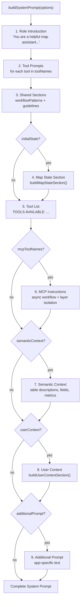

# Prompt System Architecture

> **Scope**: Library internals — how `buildSystemPrompt()` composes its modular sections. For application-level prompt customization (combining library prompt with custom instructions), see [System Prompt Architecture](SYSTEM_PROMPT.md).

Deep dive into how `@carto/agentic-deckgl` composes system prompts for AI agents that control deck.gl maps.

---

## Overview

The system prompt is not a static string — it's a document dynamically composed from modular sections. `buildSystemPrompt()` assembles these sections based on which tools are available, the current map state, and application context.

This modular design means:
- Only relevant instructions are included (no unnecessary token usage)
- The prompt adapts to runtime state (the AI knows what's on the map)
- Applications can inject custom context without modifying library code

---

## Composition Pipeline



Each section is only included when its corresponding option is provided. This keeps the prompt as compact as possible while ensuring the AI has all necessary context.

---

## Section Details

### 1. Role Introduction

Always present. Sets the AI's identity and purpose:

```
You are a helpful map assistant that controls an interactive deck.gl map visualization.

## AVAILABLE TOOLS

You have 3 consolidated tools for complete map control:
```

### 2. Tool Prompts

Included per-tool based on the `toolNames` array. Each tool has a detailed instruction block defined in `src/prompts/tool-prompts.ts`.

#### `set-deck-state` (~695 lines)

The largest and most critical tool prompt. Covers:

| Section | Content |
|---------|---------|
| Navigation | How to use `initialViewState` with `FlyToInterpolator` |
| Basemap | Available styles: `dark-matter`, `positron`, `voyager` |
| Layer types | `VectorTileLayer`, `H3TileLayer`, `QuadbinTileLayer`, `GeoJsonLayer`, `ScatterplotLayer`, `ArcLayer`, `HexagonLayer` |
| Data sources | `vectorTableSource`, `h3TableSource`, `quadbinTableSource` — how to construct `@@function` refs |
| Color styling | `colorBins`, `colorContinuous`, `colorCategories` — when to use each, with examples |
| Filtering | CARTO column filters: `in`, `between`, `closed_open`, `time`, `stringSearch` |
| Widgets | Formula and category widgets using Vega-Lite spec format |
| Layer ordering | Array position rules (index 0 = bottom, last = top) |
| Update triggers | When and how to set `updateTriggers` for color changes |
| Layer ID rules | Unique IDs for new layers, same ID for updates |
| Default styling | Point radius, line width, opacity defaults |
| Color palettes | 13 named palettes (Sunset, Teal, BluYl, PurpOr, etc.) |

This prompt is intentionally detailed because the AI needs precise instructions to generate correct `@deck.gl/json` specs. Vague instructions lead to broken layer configs.

#### `set-marker` (~40 lines)

Covers:
- When to call (explicit marker mention or MCP spatial analysis results)
- When NOT to call (simple navigation without "marker" keyword)
- Marker accumulation behavior (markers persist until removed)
- Removal by coordinates or clear-all

#### `set-mask-layer` (~43 lines)

Covers:
- When to call (user asks to draw/mask/filter by area)
- Three actions: `set` (apply geometry), `enable-draw` (user draws), `clear`
- MCP result → mask workflow (only on explicit user request)
- Single mask active at a time

### 3. Shared Sections

Always included. Reusable instruction blocks defined in `src/prompts/shared-sections.ts`:

#### `workflowPatterns`

Eight common multi-step workflows:

1. Navigate to a place
2. Add a data layer
3. Add a filtered layer
4. Update existing filters
5. Remove filters
6. Style by property
7. Modify existing layer
8. Remove all layers

Each pattern shows the step-by-step tool calls needed.

#### `guidelines`

Eleven critical rules the AI must follow:

- Layers merge by ID (same ID = update, new ID = add)
- Use present tense in responses
- Frontend executes tools after the full response
- Never re-add layers that already exist
- Respect layer visibility state
- Use `removeLayerIds` instead of empty layers array
- And more...

#### Other Shared Sections (used conditionally)

| Section | Key | Used when |
|---------|-----|-----------|
| Color palettes | `colorPalettes` | Always (part of tool prompts) |
| Layer ID rules | `layerIdRules` | Always (part of tool prompts) |
| Update triggers | `updateTriggers` | Always (part of tool prompts) |
| Filter types | `filterTypes` | Always (part of tool prompts) |
| Default styling | `defaultStyling` | Always (part of tool prompts) |
| MCP instructions | `mcpInstructions` | `mcpToolNames` provided |
| MCP async workflow | `mcpAsyncWorkflow` | Async workflow tools available |
| MCP unavailable | `mcpAsyncUnavailable` | Async tools not in list |
| MCP critical rules | `mcpCriticalRules` | `mcpToolNames` provided |
| MCP layer isolation | `mcpLayerIsolation` | Async workflow tools available |

### 4. Map State Section

Included when `initialState` is provided. Built by `buildMapStateSection()`:

```
## CURRENT MAP STATE
- Position: lat=40.7128, lng=-74.0060, zoom=12.0
- Pitch: 45°
- Current layers (render order, BOTTOM to TOP):
  1. "population-layer" (H3TileLayer, visible) [BOTTOM] ← ACTIVE
  2. "roads-layer" (VectorTileLayer, visible) [TOP]
      Filters: {"state": {"type": "in", "values": ["CA"]}}
      Fill color styling: {"@@function": "colorBins", ...}
- **Active layer**: "population-layer" (use this ID for style updates when user doesn't specify a layer)
```

Key behaviors:
- System layers (ID starting with `__`) are filtered out
- Layers shown in render order (bottom to top) with position labels
- Active layer highlighted with `← ACTIVE` marker
- Style context included (filters, colors) so AI understands current state

### 5. MCP Instructions

Included when `mcpToolNames` is provided. Teaches the AI how to work with MCP (Model Context Protocol) tools:

- **Sync vs async detection** — How to identify which tools need polling
- **Async workflow** — 7-step pattern: call tool → poll status → get results → create layer → respond
- **Layer isolation** — Critical rule: only use MCP result data, don't mix in semantic layer data
- **Error handling** — What to do when MCP tools fail or timeout

### 6. Semantic Context

Included when `semanticContext` is provided. This is a markdown string describing available data tables:

```
## Available Data Tables

### carto-demo-data.demo_tables.population_h3
- Type: H3TileLayer
- Description: Population density by H3 hexagon
- Fields:
  - population (integer): Total population count
  - density (float): Population per square km
  - state (string): US state name
```

The semantic context is typically generated from YAML files by a semantic layer loader. See [Semantic Layer](SEMANTIC_LAYER_GUIDE.md) for the YAML schema.

### 7. User Context Section

Included when `userContext` is provided. Built by `buildUserContextSection()`:

```
## USER ANALYSIS CONTEXT

The user has configured an analysis session with the following parameters:

- **Analysis Type:** Site Selection
- **Country:** United States
- **POI Category:** Restaurant
- **Search Radius:** 5 miles
- **Target Demographics:** millennials, urban professionals
- **Proximity Priorities:**
  - Public Transit: weight 8/10
  - Foot Traffic: weight 7/10
- **Target Location:** Manhattan, New York

**CRITICAL BEHAVIOR - FLY TO LOCATION FIRST:**
[...mandatory fly-to behavior...]

**CRITICAL BEHAVIOR - AUTO-CREATE LAYERS:**
[...mandatory layer creation behavior...]
```

Two behavioral injections are automatically added when location/analysis context is present:

1. **FLY TO LOCATION FIRST** — Forces the AI to navigate to the target location before executing any analysis, ensuring the user sees the area before results appear
2. **AUTO-CREATE LAYERS** — Forces the AI to automatically create layers from MCP tool results, without waiting for the user to ask

### 8. Additional Prompt

Included when `additionalPrompt` is provided. Raw text appended to the end of the prompt. Use this for app-specific instructions that don't fit into the other categories.

---

## Customization

### Adding App-Specific Instructions

Use `additionalPrompt` for rules specific to your application:

```typescript
const prompt = buildSystemPrompt({
  toolNames,
  additionalPrompt: `
## APPLICATION RULES
- Always use the "dark-matter" basemap unless the user asks for a light theme
- Prefer H3TileLayer over VectorTileLayer for large datasets
- Include a formula widget showing total count for every new layer
  `,
});
```

### Injecting Semantic Context

Provide table descriptions so the AI knows what data is available:

```typescript
const prompt = buildSystemPrompt({
  toolNames,
  semanticContext: `
## AVAILABLE DATA TABLES

### my_project.stores
Connection: carto_dw
Layer type: VectorTileLayer (point geometry)
Fields:
- name (string): Store name
- revenue (float): Annual revenue in USD
- category (string): Store category [grocery, pharmacy, restaurant]
- opened_date (date): Opening date

### my_project.demographics_h3
Connection: carto_dw
Layer type: H3TileLayer
Fields:
- population (integer): Total population
- median_income (float): Median household income
- h3 (string): H3 cell index at resolution 7
  `,
});
```

### Building Custom Sections

You can also use the helper functions independently to compose your own prompt:

```typescript
import {
  getToolPrompts,
  getSharedSection,
  buildMapStateSection,
  buildUserContextSection,
} from '@carto/agentic-deckgl';

// Build a custom prompt from individual sections
let customPrompt = 'You are a specialized geospatial analyst.\n\n';
customPrompt += getToolPrompts(['set-deck-state', 'set-marker']);
customPrompt += getSharedSection('workflowPatterns');
customPrompt += buildMapStateSection(currentState);
```

---

## See Also

- [Library Overview](LIBRARY.md) — Architecture, concepts, full API reference
- [Backend Integration Guide](LIBRARY_BACKEND_INTEGRATION.md) — How prompts are used in the agent runner
- [System Prompt](SYSTEM_PROMPT.md) — App-level prompt customization (library prompt + custom prompt)
- [Tool System](TOOLS.md) — Detailed tool behavior and parameters
- [Semantic Layer](SEMANTIC_LAYER_GUIDE.md) — YAML configuration for semantic context
