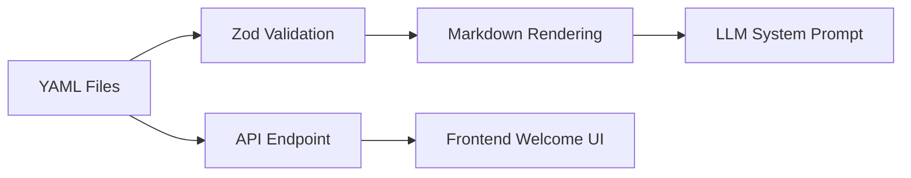
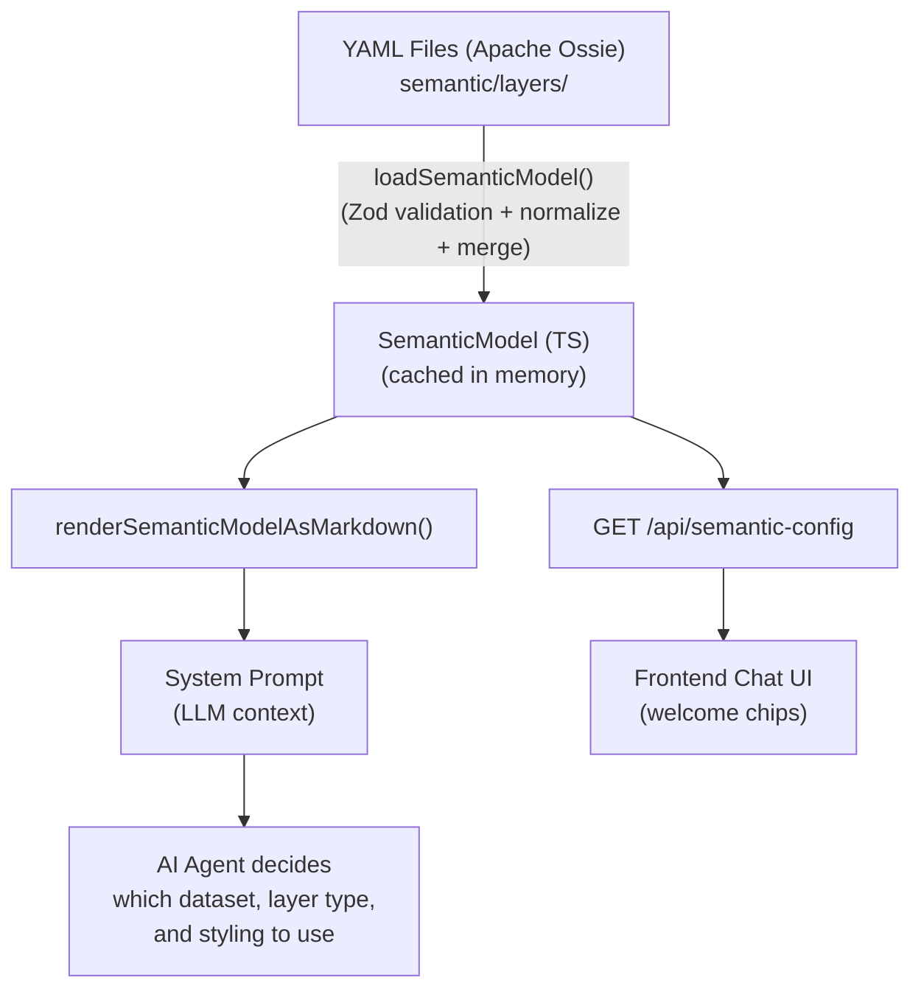

# How the Apache Ossie Semantic Model Is Used in `carto-agentic-deckgl`

## 1. What Is Apache Ossie?

**Apache Ossie** (incubating) — formerly **Open Semantic Interchange (OSI)** — is an open-source specification (Apache 2.0) for standardizing semantic model exchange across data analytics, AI, and BI tools. It defines a vendor-agnostic YAML/JSON format so that data definitions (datasets, fields, relationships, metrics) remain consistent as they move between AI agents, BI platforms, and other tools. The spec lives at [github.com/apache/ossie](https://github.com/apache/ossie/blob/main/core-spec/spec.md).

### Document Shape

An Ossie document carries an optional top-level `version` and a **list** of semantic models:

```yaml
version: 0.2.0.dev0
semantic_model:
  - name: data_analysis
    datasets: [...]
```

> **Migration note:** legacy OSI v1.0 authored `semantic_model` as a single mapping (no `version`). The loader still accepts that shape for backward compatibility and normalizes both into one merged internal model.

### Core Ossie Building Blocks

| Concept               | Purpose                                                                                       |
| --------------------- | --------------------------------------------------------------------------------------------- |
| **Semantic Model**    | Top-level container with name, description, and `ai_context`                                  |
| **Dataset**           | Logical entity (table) with `source`, `primary_key`, and `fields`                             |
| **Field**             | Column-level attribute with multi-dialect SQL `expression` and optional `dimension`           |
| **Relationship**      | Foreign key join between datasets (`from_columns` / `to_columns`)                             |
| **Metric**            | Aggregate measure (e.g., `SUM(population)`) spanning datasets                                 |
| **Expression**        | Multi-dialect SQL: `{dialects: [{dialect: "ANSI_SQL", expression: "..."}]}`                   |
| **ai_context**        | LLM instructions, synonyms, examples — can be a string or structured object                   |
| **custom_extensions** | Vendor-specific metadata via `{vendor_name, data}` — extensibility without breaking core spec |

Supported SQL dialects: `ANSI_SQL`, `SNOWFLAKE`, `MDX`, `TABLEAU`, `DATABRICKS`, `BIGQUERY`, `MAQL`.

---

## 2. Why Apache Ossie Matters Here

1. **Portability** — The same YAML files could be consumed by any Ossie-compatible tool (BI platform, another AI agent, etc.)
2. **AI-First Design** — `ai_context` at every level (model, dataset, field, metric) gives LLMs rich instructions, synonyms, and examples
3. **Clean Extension Model** — CARTO geospatial metadata lives in `custom_extensions` rather than polluting the core spec
4. **Multi-Dialect SQL** — Expressions work across ANSI SQL, Snowflake, Databricks, etc.
5. **Decoupled Frontend** — Welcome chips and messages are authored in the semantic model YAML, not hardcoded in frontend code
6. **Validation at Runtime** — Zod schemas catch malformed YAML before it reaches the AI, preventing hallucinated queries

---

## 3. How This Project Extends Apache Ossie: CARTO Custom Extensions

The project uses Ossie's `custom_extensions` mechanism with `vendor_name: "CARTO"` to carry geospatial metadata. This keeps models Ossie-compliant while adding domain-specific context. Extensions are defined at three levels:

> **`data` encoding:** the Ossie spec types `custom_extensions[].data` as a JSON-encoded **string**. To keep the CARTO models readable, we author `data` as nested YAML objects (shown below) and the loader accepts **both** forms — parsing a string with `JSON.parse` and using an object as-is. When emitting Ossie for an external consumer, serialize `data` to a JSON string.

### a) Dataset-Level: `spatial_data`

Tells the AI what kind of geometry a dataset contains and how to render it:

```yaml
custom_extensions:
  - vendor_name: CARTO
    data:
      spatial_data:
        spatial_data_column: geom       # or "h3"
        spatial_data_type: polygon       # point | polygon | line | spatial_index
        srid: 4326
        spatial_index:                   # for H3/quadbin datasets
          type: h3
          resolution: 8
          rollup_resolutions: [7, 6, 5]
        geographic_level: county
        aggregation_guidance:
          note: "Population aggregates with SUM, climate with AVG"
```

### b) Field-Level: `visualization_hint`

Guides the AI on how to style a field on the map:

```yaml
custom_extensions:
  - vendor_name: CARTO
    data:
      visualization_hint:
        style: color_bins           # color_bins | color_categories | color_continuous
        palette: Sunset
        classification: quantile
        bins: 5
        domain: [0, 100]
```

### c) Model-Level: Configuration

Top-level model metadata for welcome UI and initial map state:

```yaml
custom_extensions:
  - vendor_name: CARTO
    data:
      connection: "cartobq"
      welcome_message: "Welcome! Ask me about..."
      welcome_chips:
        - id: high_education_counties
          label: "Counties with 40%+ higher education"
          prompt: "Show me counties where..."
      initial_view:
        longitude: -98.5795
        latitude: 39.8283
        zoom: 4
```

---

## 4. Implementation Architecture

The Ossie integration flows through **four stages**:



### Stage 1: YAML Data Layer (`semantic/layers/*.yaml`)

Three YAML files define the available geospatial datasets:

| File                       | Dataset                   | Layer Type                  | Content                                                    |
| -------------------------- | ------------------------- | --------------------------- | ---------------------------------------------------------- |
| `counties.yaml`            | `higher_edu_by_county`    | VectorTileLayer (polygon)   | Education rates, election results, income by US county     |
| `h3-spatial-features.yaml` | `usa_spatial_features_h3` | H3TileLayer (spatial_index) | Demographics, POIs, elevation, monthly climate at H3 res 8 |
| `osm-pois-usa.yaml`        | *(OSM POIs)*              | VectorTileLayer (point)     | OpenStreetMap points of interest                           |

Each file is a self-contained Apache Ossie document (`version` + a `semantic_model` list) with datasets, fields, metrics, relationships, and CARTO extensions. Files are located at:

```
examples/backend/<sdk>/src/semantic/layers/
```

(Identical across all three backend SDKs: `openai-agents-sdk`, `vercel-ai-sdk`, `google-adk`.)

### Stage 2: Schema Validation (`semantic/schema.ts`)

All YAML is validated at runtime using **Zod schemas** that mirror the Apache Ossie core metadata spec:

**Ossie core schemas:**
- `ossieDocumentSchema` — the on-disk/wire document (`version` + `semantic_model` list; also accepts a legacy single object)
- `semanticModelBodySchema` — a single model body (the object under a list item)
- `semanticModelSchema` — the internal, already-merged single-model shape the app consumes
- `datasetSchema` — dataset with name, source, primary_key, fields
- `fieldSchema` — field with expression, dimension, ai_context
- `relationshipSchema` — foreign key join
- `metricSchema` — aggregate measure
- `expressionSchema` — multi-dialect SQL expression
- `aiContextSchema` — string or `{instructions, synonyms, examples}`
- `customExtensionSchema` — `{vendor_name, data}`

**CARTO extension schemas:**
- `cartoSpatialDataSchema` — geometry type, SRID, spatial index, aggregation guidance
- `cartoVisualizationHintSchema` — style, palette, classification, bins, domain
- `cartoModelExtensionSchema` — connection, welcome_message, welcome_chips, initial_view
- `cartoSpatialRelationshipSchema` — spatial join types (contains, intersects, proximity)

Types are derived via `z.infer<>` — no separate interface files needed. Invalid YAML is logged and skipped, not fatal.

### Stage 3: Loading & Merging (`semantic/loader.ts`)

`loadSemanticModel()` performs:

1. Reads all `.yaml` files from `semantic/layers/` (sorted alphabetically)
2. Validates each against `ossieDocumentSchema` using Zod
3. Normalizes the `semantic_model` list (or a legacy single object) into model bodies
4. Merges into a single model: concatenates datasets, metrics, relationships, and welcome_chips
5. Caches the result in memory

**Helper functions** extract typed CARTO extension data:

| Function                      | Returns                            | Purpose                                                |
| ----------------------------- | ---------------------------------- | ------------------------------------------------------ |
| `getCartoExtension()`         | `Record<string, unknown>`          | Raw vendor data from any entity                        |
| `getDatasetSpatialData()`     | `CartoSpatialData`                 | Validated spatial metadata                             |
| `getFieldVisualizationHint()` | `CartoVisualizationHint`           | Validated styling hints                                |
| `getModelCartoConfig()`       | `CartoModelExtension`              | Model-level config (connection, welcome, initial_view) |
| `getMetricGroup()`            | `string`                           | CARTO group tag for metric categorization              |
| `getInitialViewState()`       | `{longitude, latitude, zoom, ...}` | Map initial view                                       |
| `getWelcomeMessage()`         | `string`                           | Welcome message text                                   |
| `getWelcomeChips()`           | `Array<{id, label, prompt}>`       | Welcome suggestion chips                               |

### Stage 4: Prompt Injection (`renderSemanticModelAsMarkdown()`)

The loaded model is rendered as structured markdown and injected into the LLM system prompt. The rendered output includes:

1. **Quick Reference Table** — maps each dataset to its deck.gl layer type and CARTO source function
2. **Dataset Sections** — table source, spatial metadata, field list with visualization hints, aggregation guidance
3. **Relationships** — including spatial relationship types
4. **Metrics** — grouped by CARTO group tag (demographics, pois, elevation, climate)
5. **Business Types / Demographic Options** — if present in model extensions

This gives the AI agent full awareness of available data, how to query it, and how to style it on the map.

---

## 5. Integration Points

### Backend System Prompt (`system-prompt.ts`)

```typescript
const semanticModel = loadSemanticModel();
const semanticContext = semanticModel
  ? renderSemanticModelAsMarkdown(semanticModel)
  : undefined;

// Passed to the library's buildSystemPrompt()
const options: BuildSystemPromptOptions = {
  toolNames, initialState, userContext,
  semanticContext,       // <-- injected between tool instructions and map state
  mcpToolNames, additionalPrompt,
};
```

### Backend REST API (`server.ts`)

```typescript
app.get('/api/semantic-config', (_req, res) => {
  const model = loadSemanticModel();
  res.json({
    welcomeMessage: getWelcomeMessage(model),
    welcomeChips: getWelcomeChips(model),
  });
});
```

### Frontend (all 4 frameworks)

Each frontend (`react`, `angular`, `vue`, `vanilla`) has a `semantic-config.ts` that:

1. Fetches `GET /api/semantic-config` at startup
2. Falls back to a hardcoded `FALLBACK_CONFIG` if the backend is unreachable
3. Provides the welcome message and clickable suggestion chips to the chat UI

### Core Library (`src/prompts/builder.ts`)

The framework-agnostic library accepts `semanticContext?: string` in `BuildSystemPromptOptions` and injects it into the prompt after tool definitions and before user context.

---

## 6. Data Flow Summary



---

## 7. Key Files Reference

### Backend (identical across all 3 SDK backends)

| File                                           | Purpose                                            |
| ---------------------------------------------- | -------------------------------------------------- |
| `src/semantic/schema.ts`                       | Zod schemas for Apache Ossie + CARTO extensions    |
| `src/semantic/loader.ts`                       | YAML loading, merging, caching, markdown rendering |
| `src/semantic/index.ts`                        | Re-exports all types and functions                 |
| `src/semantic/layers/counties.yaml`            | County education & election data                   |
| `src/semantic/layers/h3-spatial-features.yaml` | H3 demographics, POIs, climate                     |
| `src/semantic/layers/osm-pois-usa.yaml`        | OpenStreetMap POIs                                 |
| `src/prompts/system-prompt.ts`                 | Loads semantic model and injects into LLM prompt   |
| `src/server.ts`                                | Exposes `/api/semantic-config` endpoint            |

### Core Library

| File                     | Purpose                                                  |
| ------------------------ | -------------------------------------------------------- |
| `src/prompts/builder.ts` | Accepts `semanticContext` and injects into system prompt |
| `src/prompts/types.ts`   | Defines `BuildSystemPromptOptions` interface             |

### Frontend (all 4 frameworks)

| File                            | Purpose                                            |
| ------------------------------- | -------------------------------------------------- |
| `src/config/semantic-config.ts` | Fetches welcome config from backend, with fallback |

### Tests

| File                                      | Purpose                                            |
| ----------------------------------------- | -------------------------------------------------- |
| `tests/unit/semantic/schema.test.ts`      | Validates all Zod schemas (valid + invalid inputs) |
| `tests/unit/semantic/loader.test.ts`      | Tests YAML loading, merging, rendering             |
| `e2e/tests/semantic-direct-layer.spec.ts` | E2E test for direct semantic layer chip            |
| `e2e/tests/semantic-mcp-tool.spec.ts`     | E2E test for MCP workflow chips                    |

---

## Cross-References

- **System Prompt**: See [System Prompt Architecture](SYSTEM_PROMPT.md) for how semantic context is injected into the prompt
