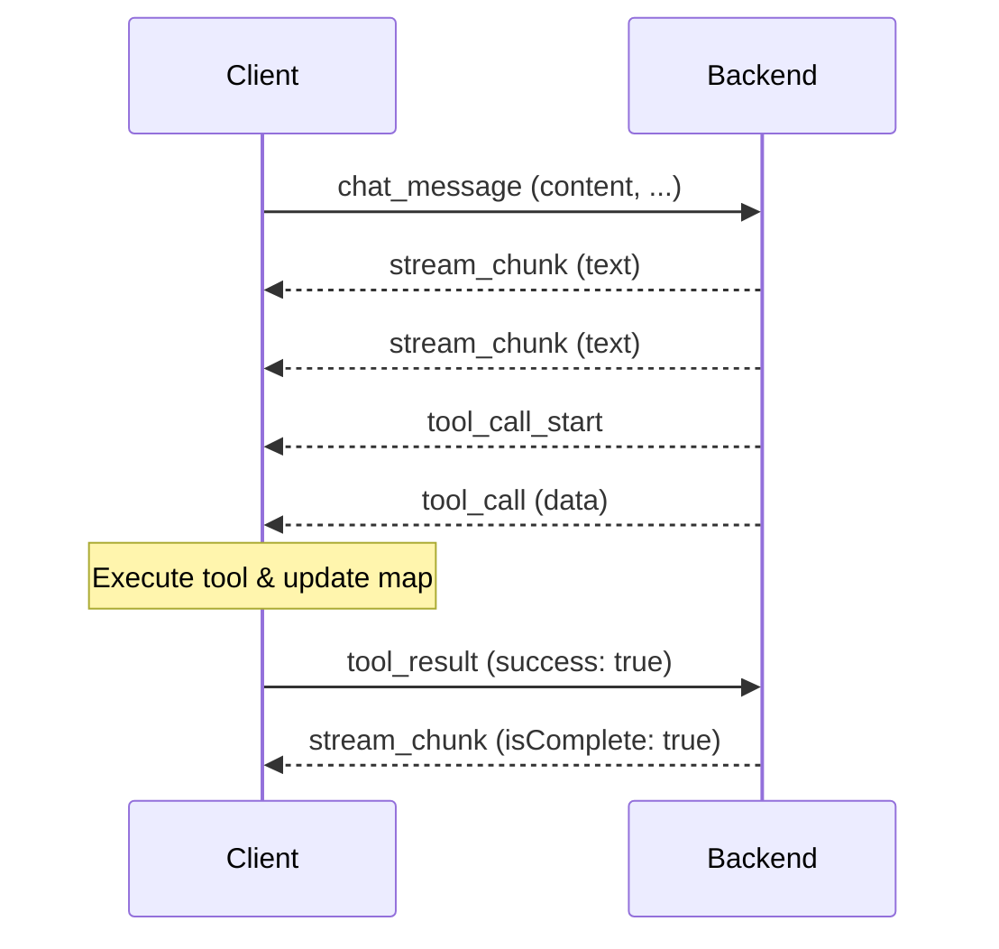

# WebSocket Message Protocol

All backend integrations use the same WebSocket message protocol. Any frontend works with any backend without changes.

---

## Endpoints

| Endpoint | Protocol | Description |
|----------|----------|-------------|
| `/ws` | WebSocket | Primary communication channel (streaming + tool calls) |
| `/api/chat` | POST | HTTP SSE fallback for environments without WebSocket |
| `/health` | GET | Health check endpoint |
| `/api/semantic-config` | GET | Returns semantic layer configuration (welcome message, chips) |

---

## Client to Server

The frontend sends these message types to the backend.

```typescript
// User sends a chat message with current map state
{
  type: 'chat_message',
  content: string,          // User's message text
  timestamp: number,        // Unix timestamp in milliseconds
  initialState?: InitialState  // Current map state (viewState, layers, basemap)
}
```

**When sent:** User submits a message in the chat UI.

**Purpose:** Initiates an AI conversation turn. The `initialState` provides context about the current map (camera position, active layers, styling) so the AI can make informed decisions about layer updates.

---

```typescript
// Frontend reports tool execution result
{
  type: 'tool_result',
  toolName: string,         // Name of the tool that was executed
  callId: string,           // Unique identifier for this tool call
  success: boolean,         // Whether execution succeeded
  message: string,          // Human-readable result or error message
  layerState?: LayerSpec[]  // Updated layer state after execution
}
```

**When sent:** After the frontend executes a tool call (e.g., `set-deck-state`, `set-marker`).

**Purpose:** Provides feedback to the AI about whether the tool execution succeeded. If execution failed, the AI can retry with corrected parameters. The `layerState` gives the AI visibility into the updated map state.

---

## Server to Client

The backend sends these message types to the frontend.

```typescript
// Streaming text response from the AI
{
  type: 'stream_chunk',
  content: string,        // Text chunk (incremental or full text)
  messageId: string,      // Unique identifier for this AI message
  isComplete: boolean     // True when the AI message is finished
}
```

**When sent:** While the AI is generating a text response.

**Purpose:** Streams AI-generated text to the chat UI. Frontend accumulates chunks with the same `messageId` to build the complete message. When `isComplete: true`, the message is finalized.

---

```typescript
// Signals that a tool call is about to be executed
{
  type: 'tool_call_start',
  toolName: string,       // Name of the tool (e.g., 'set-deck-state')
  callId: string          // Unique identifier for this tool call
}
```

**When sent:** Before sending a `tool_call` message.

**Purpose:** Allows frontend to show a loading state or prepare for the incoming tool execution.

---

```typescript
// Tool call to be executed on the frontend
{
  type: 'tool_call',
  toolName: string,       // Name of the tool (e.g., 'set-deck-state')
  data: object,           // Tool parameters (validated by backend)
  callId: string          // Unique identifier for this tool call
}
```

**When sent:** AI decides to call a frontend-executed tool.

**Purpose:** Frontend executes the tool (via `ConsolidatedExecutorsService`), updates map state, and sends a `tool_result` message back to the backend. See [Tool System](tools.md) for detailed tool documentation.

---

```typescript
// Result from an MCP tool executed server-side
{
  type: 'mcp_tool_result',
  toolName: string,       // Name of the MCP tool
  result: unknown,        // Tool output (schema varies by tool)
  callId: string          // Unique identifier for this tool call
}
```

**When sent:** Backend finishes executing an MCP tool (e.g., geocoding, spatial analysis).

**Purpose:** Informs the frontend about the MCP tool result. Typically followed by a `tool_call` message that uses the MCP output (e.g., adding a layer with the result table).

---

```typescript
// Error message
{
  type: 'error',
  content: string,        // Human-readable error description
  code?: string           // Optional error code (e.g., 'VALIDATION_ERROR')
}
```

**When sent:** Backend encounters an error (AI provider failure, validation error, etc.).

**Purpose:** Frontend displays the error to the user in the chat UI.

---

## Message Flow

Typical request-response cycle:



**Step-by-step:**

1. Client sends `chat_message` with current map state
2. Server streams `stream_chunk` messages as AI generates text
3. Server sends `tool_call_start` to signal an upcoming tool execution
4. Server sends `tool_call` with parameters
5. Client executes the tool and updates the map
6. Client sends `tool_result` with success/failure status
7. Server continues streaming (potentially more tool calls)
8. Server sends final `stream_chunk` with `isComplete: true`

---

## Session Management

- **Per-session conversation history:** Each WebSocket connection maintains its own conversation history
- **Max 20 messages:** Conversation history is pruned when it exceeds 20 messages
- **First message preserved:** The initial context message is always kept during pruning
- **Cleanup on disconnect:** Sessions are automatically cleaned up when the WebSocket connection closes

---

## See Also

- [Getting Started](getting-started.md) — Backend and frontend setup
- [Environment Configuration](environment.md) — Backend and frontend variables
