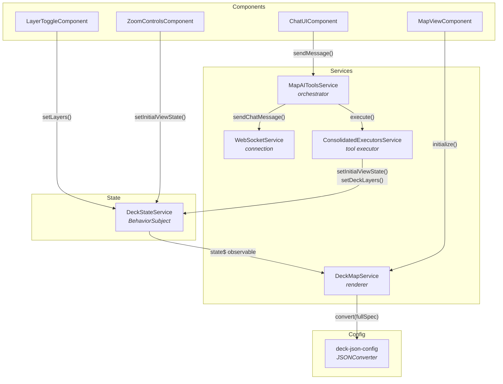

# Angular Frontend

> Angular 20 integration with deck.gl map controlled by AI-powered natural language chat.

## Architecture

The Angular integration uses dependency injection with `providedIn: 'root'` singletons. All services are automatically available throughout the component tree without explicit provider configuration.



### Service Dependencies

```typescript
// All services use @Injectable({ providedIn: 'root' })
// Angular DI handles instantiation and wiring

ConsolidatedExecutorsService  ← injects DeckStateService
MapAIToolsService             ← injects WebSocketService,
                                        ConsolidatedExecutorsService,
                                        DeckStateService
DeckMapService                ← injects DeckStateService
```

## Key Patterns

### State Management

- **RxJS BehaviorSubject in DeckStateService**: Centralized reactive state with `viewState$`, `layers$`, `basemap$` observables
- **Unified DeckSpec pattern**: Single BehaviorSubject mirrors deck.gl JSON spec structure (`initialViewState`, `layers`, `widgets`, `effects`)
- **Change tracking**: Every setter notifies with `changedKeys` array to optimize rendering
- **Reactive subscriptions**: Components subscribe to state observables and update on changes

### Orchestrator

- **AgenticDeckglService**: Routes WebSocket messages, executes tool calls via ConsolidatedExecutorsService, manages chat history and loader state

### Deck Map Renderer

- **DeckMapService**: Creates deck.gl + MapLibre instances, subscribes to `DeckStateService.state$`, performs full-spec conversion via JSONConverter on state changes

### Components

- **MapViewComponent**: deck.gl + MapLibre container, initializes DeckMapService
- **ChatUIComponent**: Chat interface with markdown rendering
- **LayerToggleComponent**: Layer visibility controls with legend
- **ZoomControlsComponent**: Zoom in/out buttons
- **SnackbarComponent**: Toast notifications
- **ConfirmationDialogComponent**: Modal confirmation dialogs

All components are **standalone** (no NgModule required) and use Angular's modern control flow syntax.

## Shared Documentation

- [Getting Started](../../../docs/GETTING_STARTED.md) — Prerequisites, installation, running
- [Environment Configuration](../../../docs/ENVIRONMENT.md#angular) — Angular environment variables
- [Tool System](../../../docs/TOOLS.md) — set-deck-state, set-marker, set-mask-layer
- [Communication Protocol](../../../docs/COMMUNICATION_PROTOCOL.md) — Message types and flow
- [System Prompt](../../../docs/SYSTEM_PROMPT.md) — Prompt architecture
- [Semantic Layer](../../../docs/SEMANTIC_LAYER_GUIDE.md) — Data catalog configuration
