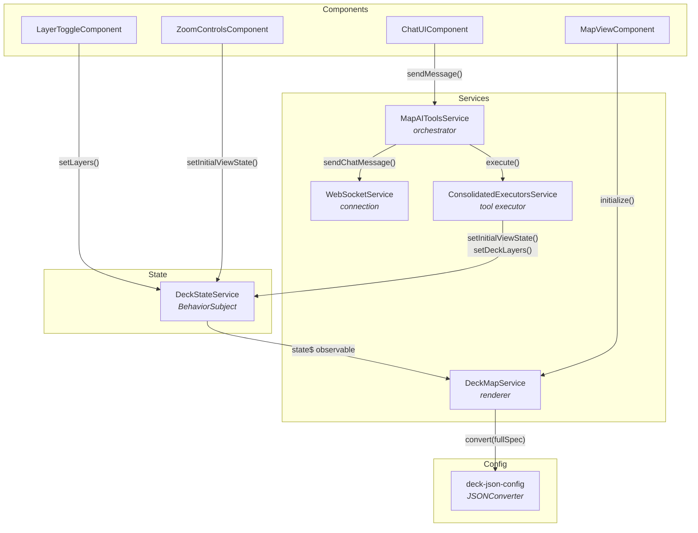

# @carto/agentic-deckgl — Angular Integration

> Angular 20 implementation of the AI-powered map application using standalone components, RxJS, and dependency injection.

This guide covers the Angular-specific architecture, services, and patterns. For shared concepts (tool schema, JSONConverter, communication protocol, layer types, color styling), see the [global integration guide](../README.md).

---

## Table of Contents

- [Getting Started](#getting-started)
- [Project Structure](#project-structure)
- [Architecture](#architecture)
- [State Management](#state-management)
- [Tool Executor](#tool-executor)
- [Orchestrator Service](#orchestrator-service)
- [Deck Map Renderer](#deck-map-renderer)
- [Components](#components)
- [Environment Configuration](#environment-configuration)

---

## Getting Started

### Prerequisites

- Node.js v18+
- pnpm (`npm install -g pnpm`)
- Backend server running on `ws://localhost:3003/ws`

### Installation

```bash
pnpm install
```

### Environment Setup

Copy the example environment file and configure your CARTO credentials:

```bash
cp src/environments/environment.example src/environments/environment.ts
```

Edit `src/environments/environment.ts`:

```typescript
export const environment = {
  production: false,
  apiBaseUrl: 'https://gcp-us-east1.api.carto.com',
  accessToken: 'YOUR_CARTO_ACCESS_TOKEN',
  connectionName: 'carto_dw',
  wsUrl: 'ws://localhost:3003/ws',
  httpApiUrl: 'http://localhost:3003/api/chat',
  useHttp: false,
};
```

| Variable | Description |
|----------|-------------|
| `apiBaseUrl` | CARTO API endpoint URL |
| `accessToken` | Your CARTO API access token |
| `connectionName` | CARTO data warehouse connection name |
| `wsUrl` | WebSocket URL for the backend server |
| `httpApiUrl` | HTTP fallback URL (used when `useHttp: true`) |
| `useHttp` | Use HTTP instead of WebSocket (`false` recommended) |

### Running

```bash
# 1. Build the core library (if not already built)
cd ../../.. && npm run build && cd -

# 2. Start the backend
cd ../../examples/backend/vercel-ai-sdk && npm run dev &

# 3. Start the Angular frontend
pnpm start
```

Open `http://localhost:4200` in your browser.

### Building

```bash
pnpm build
```

Output is written to `dist/`.

---

## Project Structure

```
src/app/
├── app.ts                              # Root component (lifecycle, state wiring)
├── app.html                            # Root template
├── app.css                             # Root styles
├── app.config.ts                       # Angular application configuration
│
├── components/
│   ├── map-view/                       # deck.gl + MapLibre container
│   ├── chat-ui/                        # Chat interface with markdown rendering
│   ├── layer-toggle/                   # Layer visibility + legend panel
│   ├── zoom-controls/                  # Zoom in/out buttons
│   ├── snackbar/                       # Toast notifications
│   └── confirmation-dialog/            # Modal confirmation dialogs
│
├── services/
│   ├── agentic-deckgl.service.ts       # Orchestrator: messages, tools, loader
│   ├── websocket.service.ts            # WebSocket client with auto-reconnect
│   ├── consolidated-executors.service.ts  # Tool executor (set-deck-state)
│   └── deck-map.service.ts             # deck.gl + MapLibre renderer
│
├── state/
│   └── deck-state.service.ts           # Centralized reactive state (BehaviorSubject)
│
├── config/
│   ├── deck-json-config.ts             # JSONConverter setup (@@type, @@function, @@=, @@#)
│   ├── location-pin.config.ts          # Location pin layer spec generator
│   └── semantic-config.ts              # Welcome chips configuration
│
├── utils/
│   ├── layer-merge.utils.ts            # Deep merge for layer updates
│   ├── legend.utils.ts                 # Legend extraction from layer styling
│   └── tooltip.utils.ts               # Tooltip content formatting
│
└── models/
    └── message.model.ts                # TypeScript interfaces
```

---

## Architecture

The Angular integration uses dependency injection with `providedIn: 'root'` singletons. All services are automatically available throughout the component tree without explicit provider configuration.



### Service Dependencies

```typescript
// All services use @Injectable({ providedIn: 'root' })
// Angular DI handles instantiation and wiring

ConsolidatedExecutorsService  ← injects DeckStateService
MapAIToolsService             ← injects WebSocketService,
                                        ConsolidatedExecutorsService,
                                        DeckStateService
DeckMapService                ← injects DeckStateService
```

---

## State Management

The `DeckStateService` is the single source of truth for all map-related state. It uses a unified `DeckSpec` BehaviorSubject that mirrors the official deck.gl JSON spec pattern. Basemap is kept separate because it's a MapLibre concern.

### State Shape

```typescript
interface DeckSpec {
  initialViewState: {
    longitude: number; latitude: number; zoom: number;
    pitch: number; bearing: number;
    transitionDuration?: number;
  };
  layers: LayerSpec[];
  widgets: Record<string, unknown>[];
  effects: Record<string, unknown>[];
}
```

### Reactive State with BehaviorSubject

```typescript
@Injectable({ providedIn: 'root' })
export class DeckStateService {
  // Unified deck.gl spec
  private deckSpecSubject = new BehaviorSubject<DeckSpec>(DEFAULT_DECK_SPEC);
  // Separate concerns
  private basemapSubject = new BehaviorSubject<Basemap>('positron');
  private activeLayerIdSubject = new BehaviorSubject<string | undefined>(undefined);
  private changedKeysSubject = new BehaviorSubject<string[]>([]);

  // Combined observable emits on any change
  public state$: Observable<StateChange> = combineLatest([
    this.deckSpecSubject,
    this.basemapSubject,
    this.activeLayerIdSubject,
    this.changedKeysSubject,
  ]).pipe(
    map(([deckSpec, basemap, activeLayerId, changedKeys]) => ({
      state: { deckSpec, basemap, activeLayerId },
      changedKeys,
    })),
    distinctUntilChanged(/* deep equality check */)
  );

  // Convenience observable for components that only need layers
  public layers$: Observable<LayerSpec[]> = this.deckSpecSubject.pipe(
    map(spec => spec.layers),
    distinctUntilChanged()
  );

  // Setters notify change through changedKeys
  setInitialViewState(partial: Partial<ViewState> & { transitionDuration?: number }): void {
    const current = this.deckSpecSubject.value;
    this.deckSpecSubject.next({
      ...current,
      initialViewState: { ...current.initialViewState, ...partial },
    });
    this.notifyChange(['initialViewState']);
  }

  setDeckLayers(config: { layers; widgets; effects }): void {
    const current = this.deckSpecSubject.value;
    this.deckSpecSubject.next({
      ...current,
      layers: config.layers ?? [],
      widgets: config.widgets ?? [],
      effects: config.effects ?? [],
    });
    this.notifyChange(['layers']);
  }

  getDeckSpec(): DeckSpec { return { ...this.deckSpecSubject.value }; }
}
```

### Subscribing in Components

```typescript
@Component({ /* ... */ })
export class LayerToggleComponent implements OnInit, OnDestroy {
  layers: LayerConfig[] = [];
  private subscription: Subscription;

  constructor(private mapAITools: MapAIToolsService) {}

  ngOnInit() {
    this.subscription = this.mapAITools.layers$.subscribe(layers => {
      this.layers = layers;
    });
  }

  ngOnDestroy() {
    this.subscription.unsubscribe();
  }
}
```

### Change Tracking

Every setter calls `notifyChange(['initialViewState'])` or `notifyChange(['layers'])` with an array of changed keys. The `DeckMapService` uses these keys to decide when to re-convert the full spec.

---

## Tool Executor

The `ConsolidatedExecutorsService` receives tool call parameters and updates the centralized state. It is injected with `DeckStateService` through Angular's DI system.

```typescript
@Injectable({ providedIn: 'root' })
export class ConsolidatedExecutorsService {
  constructor(private deckState: DeckStateService) {
    this.executors = this.createExecutors();
  }

  async execute(toolName: string, params: unknown): Promise<ToolResult> {
    const executor = this.executors[toolName];
    if (!executor) {
      return { success: false, message: `Unknown tool: ${toolName}` };
    }
    return await Promise.resolve(executor(params));
  }
}
```

The service handles 3 tools:

### `set-deck-state`

Follows the three-phase pipeline described in the [global guide](../README.md#set-deck-state----three-phase-pipeline):

1. Update `initialViewState` via `this.deckState.setInitialViewState()`
2. Update `basemap` via `this.deckState.setBasemap()`
3. Process layers/widgets/effects:
   - Remove layers listed in `removeLayerIds`
   - Deep merge incoming layers with existing using `mergeLayerSpecs()`
   - Apply `layerOrder` if specified
   - Ensure system layers (`__` prefix) render on top
   - Validate columns with `validateLayerColumns()`
   - Track active layer (skipping system layers)
   - Update state via `this.deckState.setDeckLayers()`

### `set-marker`

Places an `IconLayer` with ID `__location-marker__` at the specified coordinates. Markers accumulate -- each call adds a new pin without removing previous ones. Duplicates at the same coordinates are skipped. The marker is a system layer -- hidden from the layer toggle UI and AI state context.

### `set-mask-layer`

Delegates to `MaskLayerService` which manages the editable mask layer state. Three actions are supported:

- **`set`** -- Applies a GeoJSON geometry or CARTO table name as the mask via `setMaskGeometry()`. When a `tableName` is provided, geometry is fetched from the CARTO table. The mask enters edit mode (translate + modify) so the user can adjust it.
- **`enable-draw`** -- Activates `DrawPolygonMode` via `enableDrawMode()` so the user can draw a mask polygon on the map.
- **`clear`** -- Removes the mask and disables drawing via `clearMask()`.

The service produces two deck.gl layers via `getMaskLayers()`: a `GeoJsonLayer` with `operation: 'mask'` and an `EditableGeoJsonLayer` for user interaction. The `DeckMapService` injects `MaskExtension` into all data layers when a mask is active.

---

## Orchestrator Service

The `MapAIToolsService` is the central coordinator. It manages the WebSocket connection, routes incoming messages, executes tool calls, and tracks the chat message history.

### Message Routing

```typescript
private handleMessage(data: WebSocketMessage): void {
  switch (data.type) {
    case 'stream_chunk':    this.handleStreamChunk(data);    break;
    case 'tool_call_start': this.handleToolCallStart(data);  break;
    case 'tool_call':       this.handleToolCall(data);       break;
    case 'mcp_tool_result': this.handleMcpToolResult(data);  break;
    case 'tool_result':     this.handleToolResult(data);     break;
    case 'error':           /* add error message */          break;
  }
}
```

### Sending Messages with Initial State

When the user sends a message, the orchestrator captures the current map state and sends it alongside the message. This gives the AI context about existing layers, their styling, and the camera position:

```typescript
sendMessage(content: string): boolean {
  this.addMessage({ type: 'user', content, timestamp: Date.now() });
  this.setLoaderState('thinking', 'Thinking...');

  const initialState = this.createInitialState(); // Captures current map state
  this.wsService.sendChatMessage(content, initialState);
  return true;
}
```

### Tool Call Execution Flow

```typescript
private async handleToolCall(data: WebSocketMessage): Promise<void> {
  const { tool, toolName, parameters, data: params, callId } = data;

  // 1. Show loader
  this.setLoaderState('creating', `Executing ${tool}...`);

  // 2. Execute via ConsolidatedExecutorsService
  const result = await this.executorsService.execute(tool, parameters);

  // 3. Queue tool message (or add immediately if not streaming)
  if (this.currentStreamingMessageId) {
    this.pendingToolMessages.push(toolMessage);
  } else {
    this.addMessage(toolMessage);
  }

  // 4. Send result back to backend with current layer state
  this.wsService.sendToolResult({
    toolName: tool,
    callId,
    success: result.success,
    message: result.message,
    layerState: currentLayers,
  });
}
```

---

## Deck Map Renderer

The `DeckMapService` initializes deck.gl and MapLibre, subscribes to state changes, and renders layers through the JSONConverter.

### Initialization

```typescript
async initialize(containerId: string, canvasId: string) {
  // 1. Create MapLibre map (basemap tiles)
  this.map = new maplibregl.Map({
    container: containerId,
    style: BASEMAP_URLS[this.deckState.getBasemap()],
    interactive: false,
  });

  // 2. Create deck.gl instance (data layers)
  this.deck = new Deck({
    canvas: canvasId,
    initialViewState: this.deckState.getViewState(),
    controller: true,
    layers: [],
    onViewStateChange: ({ viewState }) => {
      this.map.jumpTo({ center: [viewState.longitude, viewState.latitude], ... });
    },
    getTooltip: (info) => getTooltipContent(info),
  });

  // 3. Subscribe to state changes
  this.deckState.state$.subscribe(({ state, changedKeys }) => {
    if (changedKeys.length > 0) {
      this.renderFromState(state, changedKeys);
    }
  });
}
```

### Rendering from State — Full-Spec Conversion

Uses the official deck.gl pattern: `jsonConverter.convert(fullSpec)` → `deck.setProps(result)`.

```typescript
private renderFromState(state: DeckStateData, changedKeys: string[]): void {
  const jsonConverter = getJsonConverter();

  // Full-spec conversion (viewState + layers unified)
  if (changedKeys.includes('initialViewState') || changedKeys.includes('layers')) {
    const spec = JSON.parse(JSON.stringify(state.deckSpec));

    // Inject credentials into layers
    spec.layers = (spec.layers || []).map((layer, i) => {
      layer.id = layer.id || `layer-${i}`;
      return this.injectCartoCredentials(layer);
    });

    const deckProps = jsonConverter.convert(spec);
    this.deck.setProps(deckProps);
    this.scheduleRedraws();
  }

  // Basemap is a MapLibre concern (separate)
  if (changedKeys.includes('basemap')) {
    this.map.setStyle(BASEMAP_URLS[state.basemap]);
  }
}
```

### CARTO Credential Injection

Before converting layer specs through JSONConverter, the renderer injects CARTO credentials into any data source function reference:

```typescript
private injectCartoCredentials(layerJson: Record<string, unknown>) {
  const data = layerJson['data'] as Record<string, unknown>;
  if (data?.['@@function']?.toLowerCase().includes('source')) {
    data['accessToken'] = environment.accessToken;
    data['apiBaseUrl'] = environment.apiBaseUrl;
    data['connectionName'] = environment.connectionName;
  }
  return layerJson;
}
```

---

## Components

| Component | Template | Key Inputs/Outputs |
|-----------|----------|-------------------|
| `MapViewComponent` | `map-view/` | Initializes `DeckMapService` on `AfterViewInit` |
| `ChatUIComponent` | `chat-ui/` | `messages$`, `loaderState$`, `(sendMessage)` |
| `LayerToggleComponent` | `layer-toggle/` | `layers$`, `(toggle)`, `(flyTo)` |
| `ZoomControlsComponent` | `zoom-controls/` | `zoomLevel`, `(zoomIn)`, `(zoomOut)` |
| `SnackbarComponent` | `snackbar/` | `message`, `type` |
| `ConfirmationDialogComponent` | `confirmation-dialog/` | `title`, `message`, `(confirm)`, `(cancel)` |

All components are **standalone** (no NgModule required) and use Angular's modern control flow syntax.

---

## Environment Configuration

| Variable | Type | Description |
|----------|------|-------------|
| `production` | `boolean` | Enable production optimizations |
| `apiBaseUrl` | `string` | CARTO API endpoint (e.g., `https://gcp-us-east1.api.carto.com`) |
| `accessToken` | `string` | CARTO API access token |
| `connectionName` | `string` | Data warehouse connection name (e.g., `carto_dw`) |
| `wsUrl` | `string` | Backend WebSocket URL (e.g., `ws://localhost:3003/ws`) |
| `httpApiUrl` | `string` | Backend HTTP URL (fallback) |
| `useHttp` | `boolean` | Use HTTP instead of WebSocket |
