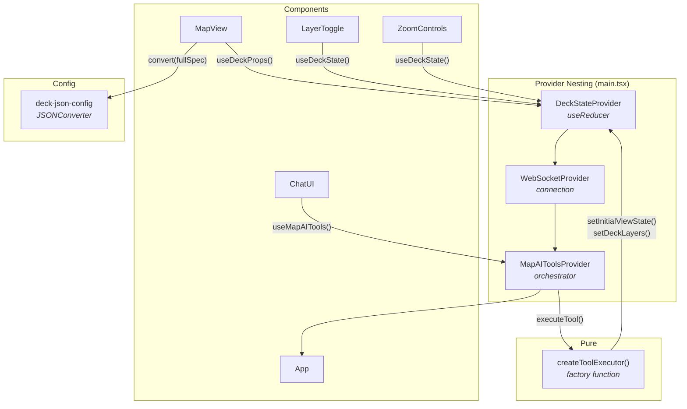

# React Frontend

> React 19 integration with deck.gl map controlled by AI-powered natural language chat.

## Architecture

The React integration uses **Context Providers** for dependency injection and **Hooks** for state access. Providers are nested in a specific order in `main.tsx` to ensure proper dependency resolution.



### Provider Nesting Order

```tsx
// main.tsx
createRoot(document.getElementById('root')!).render(
  <DeckStateProvider>          {/* 1. State (no dependencies) */}
    <WebSocketProvider>        {/* 2. Connection (no dependencies) */}
      <MapAIToolsProvider>     {/* 3. Orchestrator (needs state + ws) */}
        <App />
      </MapAIToolsProvider>
    </WebSocketProvider>
  </DeckStateProvider>
);
```

The nesting order matters: `MapAIToolsProvider` depends on both `DeckStateContext` and `WebSocketContext`, so it must be nested inside both.

## Key Patterns

### State Management

- **React Context + useReducer in DeckStateContext**: Predictable state transitions with reducer actions (`SET_VIEW_STATE`, `SET_LAYERS`, `SET_BASEMAP`, etc.)
- **Unified DeckSpec pattern**: State organized around deck.gl JSON spec structure (`initialViewState`, `layers`, `widgets`, `effects`)
- **Basemap separate**: MapLibre concern kept separate from deck.gl spec

### Orchestrator

- **MapAIToolsContext**: Manages WebSocket connection, routes messages, executes tool calls, tracks chat history and loader state

### Deck Map Renderer

- **useDeckProps hook**: Performs full-spec JSONConverter conversion following official deck.gl pattern (`jsonConverter.convert(fullSpec)`)
- **MapView component**: Spreads converted props into `<DeckGL>` React component with `{...deckProps}`

### useRef for View State

- **currentViewStateRef**: Tracks actual camera position from user drag interactions without triggering re-renders
- **Why ref instead of state**: Using state would cause excessive re-renders on every frame during user interactions
- **Read synchronously**: Ref is read when needed (e.g., capturing layer centers) without component updates

### Components

- **MapView**: deck.gl + MapLibre container (declarative `<DeckGL>` component)
- **ChatPanel**: Chat interface with markdown rendering and streaming
- **LayerToggle**: Layer visibility controls with legend
- **ZoomControls**: Zoom in/out buttons
- **Snackbar**: Toast notifications
- **ConfirmationDialog**: Modal confirmation dialogs

All components are **functional** and use hooks for state access. No class components.

## Shared Documentation

- [Getting Started](../../../docs/getting-started.md) — Prerequisites, installation, running
- [Environment Configuration](../../../docs/environment.md#vite-based-react-vue-vanilla) — Vite environment variables
- [Tool System](../../../docs/tools.md) — set-deck-state, set-marker, set-mask-layer
- [WebSocket Protocol](../../../docs/websocket-protocol.md) — Message types and flow
- [System Prompt](../../../docs/system-prompt.md) — Prompt architecture
- [Semantic Layer](../../../docs/semantic-layer.md) — Data catalog configuration
