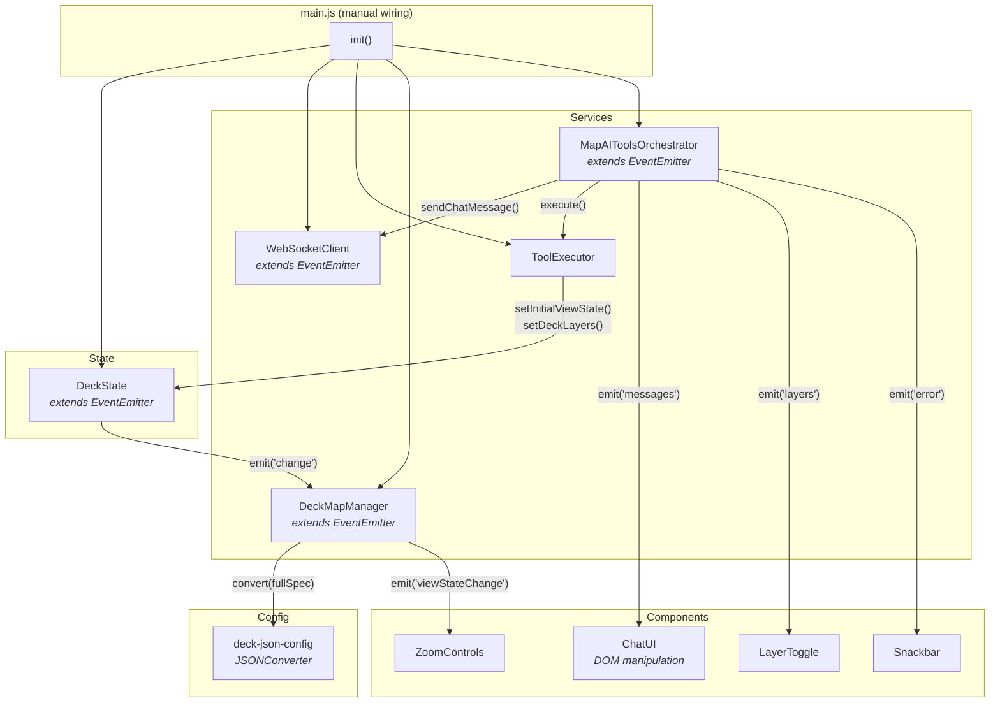

# @carto/agentic-deckgl — Vanilla JS Integration

> Zero-framework implementation of the AI-powered map application using plain ES6 classes, a custom EventEmitter, and Vite.

This guide covers the Vanilla JS-specific architecture, class hierarchy, and event-driven patterns. For shared concepts (tool schema, JSONConverter, communication protocol, layer types, color styling), see the [global integration guide](../README.md).

---

## Table of Contents

- [Getting Started](#getting-started)
- [Project Structure](#project-structure)
- [Architecture](#architecture)
- [State Management](#state-management)
- [Tool Executor](#tool-executor)
- [Orchestrator](#orchestrator)
- [Deck Map Renderer](#deck-map-renderer)
- [Components](#components)
- [Environment Configuration](#environment-configuration)

---

## Getting Started

### Prerequisites

- Node.js v18+
- npm
- Backend server running on `ws://localhost:3003/ws`

### Installation

```bash
npm install
```

### Environment Setup

Create a `.env` file in the project root:

```bash
VITE_API_BASE_URL=https://gcp-us-east1.api.carto.com
VITE_API_ACCESS_TOKEN=YOUR_CARTO_ACCESS_TOKEN
VITE_CONNECTION_NAME=carto_dw
VITE_WS_URL=ws://localhost:3003/ws
VITE_HTTP_API_URL=http://localhost:3003/api/chat
VITE_USE_HTTP=false
```

| Variable | Description |
| -------- | ----------- |
| `VITE_API_BASE_URL` | CARTO API endpoint URL |
| `VITE_API_ACCESS_TOKEN` | Your CARTO API access token |
| `VITE_CONNECTION_NAME` | CARTO data warehouse connection name |
| `VITE_WS_URL` | Backend WebSocket URL |
| `VITE_HTTP_API_URL` | Backend HTTP URL (fallback) |
| `VITE_USE_HTTP` | Use HTTP instead of WebSocket (`false` recommended) |

### Running

```bash
# 1. Build the core library (if not already built)
cd ../../.. && npm run build && cd -

# 2. Start the backend
cd ../../examples/backend/vercel-ai-sdk && npm run dev &

# 3. Start the Vanilla frontend
npm run dev
```

Open `http://localhost:5173` in your browser.

### Building

```bash
npm run build
```

Output is written to `dist/`.

---

## Project Structure

```
src/
├── main.js                         # Bootstrap: wires all services + components
│
├── components/
│   ├── chat-ui.js                  # DOM-based chat interface
│   ├── layer-toggle.js             # Layer visibility controls
│   ├── zoom-controls.js            # Zoom in/out buttons
│   ├── snackbar.js                 # Toast notifications
│   └── confirmation-dialog.js      # Modal confirmation
│
├── services/
│   ├── websocket.js                # WebSocket client (EventEmitter)
│   ├── agentic-deckgl.js           # Orchestrator (EventEmitter)
│   ├── deck-map.js                 # deck.gl + MapLibre manager (EventEmitter)
│   └── tool-executor.js            # Tool executor
│
├── state/
│   ├── deck-state.js               # Centralized state (EventEmitter)
│   └── event-emitter.js            # Custom EventEmitter implementation
│
├── config/
│   ├── deck-json-config.js         # JSONConverter setup (@@type, @@function, @@=, @@#)
│   ├── environment.js              # Vite env vars reader
│   └── semantic-config.js          # Welcome chips
│
├── utils/
│   ├── layer-merge.js              # Deep merge for layer updates
│   ├── legend.js                   # Legend extraction
│   └── tooltip.js                  # Tooltip formatting
│
└── styles/
    └── main.css                    # All application styles
```

---

## Architecture

The Vanilla implementation uses **plain ES6 classes** with a custom **EventEmitter** for inter-component communication. There is no framework — all wiring is done manually in `main.js`.



### Manual Bootstrap

The `main.js` file is the entry point. It creates all instances and wires them together explicitly:

```javascript
// main.js — Complete bootstrap sequence

// 1. Create state
const deckState = new DeckState();

// 2. Create services (constructor injection)
const wsClient = new WebSocketClient();
const toolExecutor = new ToolExecutor(deckState);
const deckMapManager = new DeckMapManager(deckState, environment);
const orchestrator = new MapAIToolsOrchestrator(wsClient, toolExecutor, deckState, environment);

// 3. Create UI components (DOM element + callbacks)
const chatUI = new ChatUI(document.getElementById('sidebar-column'), {
  onSendMessage: (content) => orchestrator.sendMessage(content),
  onClearChat: (clearLayers) => {
    orchestrator.clearMessages();
    if (clearLayers) deckState.clearChatGeneratedLayers();
  },
});

const layerToggle = new LayerToggle(document.getElementById('layer-toggle-wrapper'), {
  onToggle: (event) => { /* update layer visibility */ },
  onFlyTo: (event) => { /* fly to layer center */ },
});

const zoomControls = new ZoomControls(document.getElementById('zoom-controls-wrapper'), {
  onZoomIn: async () => { /* increment zoom via toolExecutor */ },
  onZoomOut: async () => { /* decrement zoom via toolExecutor */ },
});

// 4. Subscribe to events
orchestrator.on('messages', (messages) => chatUI.setMessages(messages));
orchestrator.on('loaderState', ({ state }) => chatUI.setLoaderState(state));
orchestrator.on('layers', (layers) => layerToggle.setLayers(layers));
orchestrator.on('error', (msg) => snackbar.show(msg, 'error'));
orchestrator.on('connected', (isConnected) => chatUI.setConnected(isConnected));
deckMapManager.on('viewStateChange', (vs) => zoomControls.setZoomLevel(vs.zoom));

// 5. Initialize
async function init() {
  await deckMapManager.initialize('map-container', 'map-container-canvas');
  orchestrator.connect();
}

init();
```

This is the most transparent view of the architecture — every connection between components is visible in one file.

---

## State Management

The `DeckState` class extends a custom `EventEmitter` and serves the same role as Angular's `DeckStateService` and React's `DeckStateContext`. State changes are broadcast via the `'change'` event.

State is organized around a unified `_deckSpec` object that mirrors the official deck.gl JSON spec pattern. Basemap is kept separate because it's a MapLibre concern.

### State Shape

```javascript
// Unified DeckSpec — one object for the entire deck.gl configuration
this._deckSpec = {
  initialViewState: { longitude, latitude, zoom, pitch, bearing, transitionDuration },
  layers: [],
  widgets: [],
  effects: [],
};

// Separate concerns
this._basemap = 'positron';        // MapLibre (map.setStyle())
this._activeLayerId = undefined;   // UI tracking
```

### EventEmitter Pattern

```javascript
export class DeckState extends EventEmitter {
  setInitialViewState(partial) {
    const { transitionDuration, ...viewStatePartial } = partial;
    this._deckSpec = {
      ...this._deckSpec,
      initialViewState: {
        ...this._deckSpec.initialViewState,
        ...viewStatePartial,
        transitionDuration: transitionDuration ?? 1000,
      },
    };
    this._notifyChange(['initialViewState']);
  }

  setDeckLayers(config) {
    // Capture center for new layers
    this._deckSpec = {
      ...this._deckSpec,
      layers: config.layers ?? [],
      widgets: config.widgets ?? [],
      effects: config.effects ?? [],
    };
    this._notifyChange(['layers']);
  }

  getDeckSpec() {
    return {
      initialViewState: { ...this._deckSpec.initialViewState },
      layers: [...this._deckSpec.layers],
      widgets: [...this._deckSpec.widgets],
      effects: [...this._deckSpec.effects],
    };
  }

  _notifyChange(changedKeys) {
    this.emit('change', { state: this.getState(), changedKeys });
  }
}
```

### Subscribing to Changes

```javascript
// In DeckMapManager
deckState.on('change', ({ state, changedKeys }) => {
  if (changedKeys.length > 0) {
    this.renderFromState(state, changedKeys);
  }
});
```

### Key Differences from Angular/React

- **No observables or reducers** — Simple getter/setter pattern with event emission
- **Synchronous reads** — `getViewState()`, `getDeckSpec()` return values immediately (no subscriptions needed)
- **Manual cleanup** — No lifecycle hooks; listeners must be removed manually if needed
- **Private by convention** — Properties prefixed with `_` (no TypeScript private modifiers)

---

## Tool Executor

The `ToolExecutor` receives the `DeckState` instance directly and calls its methods to update state. Uses a map-of-executors pattern for O(1) tool dispatch.

```javascript
export class ToolExecutor {
  constructor(deckState) {
    this._deckState = deckState;
    this._executors = this._createExecutors();
  }

  async execute(toolName, params) {
    const executor = this._executors[toolName];
    if (!executor) {
      return { success: false, message: `Unknown tool: ${toolName}` };
    }
    return await Promise.resolve(executor(params));
  }

  _createExecutors() {
    return {
      [TOOL_NAMES.SET_DECK_STATE]: (params) => {
        const updatedParts = [];

        // Phase 1: viewState
        if (params.initialViewState) {
          this._deckState.setInitialViewState({ ... });
          updatedParts.push('viewState');
        }

        // Phase 2: basemap
        if (params.mapStyle) {
          this._deckState.setBasemap(params.mapStyle);
        }

        // Phase 3: layers → getDeckSpec(), merge, remove, order, setDeckLayers()
        //          System layers (__ prefix) always render on top; active layer skips them
        // (Same pipeline as Angular and React)

        return { success: true, message: `Updated: ${updatedParts.join(', ')}` };
      },

      // set-marker: places an IconLayer (__location-marker__) at given coordinates
      [TOOL_NAMES.SET_MARKER]: (params) => {
        // Adds a pin to the marker layer, accumulating markers; skips duplicate coordinates
        return { success: true, message: `Marker placed at [...]` };
      },

      // set-mask-layer: manages the editable mask layer for spatial filtering
      [TOOL_NAMES.SET_MASK_LAYER]: (params) => {
        // Delegates to MaskLayerManager — set geometry or table name, enable draw mode, or clear
        // Produces GeoJsonLayer (mask) + EditableGeoJsonLayer (drawing)
        // MaskExtension is injected into all data layers when active
      },
    };
  }
}
```

### Usage in main.js

```javascript
// Zoom controls use the executor directly
const zoomControls = new ZoomControls(container, {
  onZoomIn: async () => {
    const currentView = deckState.getViewState();
    await toolExecutor.execute(TOOL_NAMES.SET_DECK_STATE, {
      initialViewState: {
        latitude: currentView.latitude,
        longitude: currentView.longitude,
        zoom: Math.min(22, currentView.zoom + 1),
      },
    });
  },
});
```

---

## Orchestrator

The `MapAIToolsOrchestrator` extends `EventEmitter` and coordinates WebSocket messages, tool execution, and UI state. It emits events that the UI components subscribe to in `main.js`.

### Events Emitted

| Event | Payload | Subscribers |
| ----- | ------- | ----------- |
| `'connected'` | `boolean` | ChatUI (enable/disable input) |
| `'messages'` | `Message[]` | ChatUI (render messages) |
| `'loaderState'` | `{ state, message }` | ChatUI (show/hide loader) |
| `'layers'` | `LayerConfig[]` | LayerToggle (update toggle list) |
| `'error'` | `string` | Snackbar (show error toast) |

### Message Routing

```javascript
handleMessage(data) {
  switch (data.type) {
    case 'stream_chunk':    this.handleStreamChunk(data);    break;
    case 'tool_call_start': this.handleToolCallStart(data);  break;
    case 'tool_call':       this.handleToolCall(data);       break;
    case 'mcp_tool_result': this.handleMcpToolResult(data);  break;
    case 'tool_result':     this.handleToolResult(data);     break;
    case 'error':           this.emit('error', data.content); break;
  }
}
```

### Sending Messages

```javascript
sendMessage(content) {
  if (!this.wsClient.isConnected()) return false;

  this.addMessage({ type: 'user', content, timestamp: Date.now() });
  this.setLoaderState('thinking', 'Thinking...');

  const initialState = this.createInitialState();
  this.wsClient.sendChatMessage(content, initialState);
  return true;
}
```

---

## Deck Map Renderer

The `DeckMapManager` extends `EventEmitter`, initializes both deck.gl and MapLibre, subscribes to `DeckState` changes, and renders layers via JSONConverter.

### Initialization

```javascript
async initialize(containerId, canvasId) {
  // 1. Create MapLibre map
  this.map = new maplibregl.Map({
    container: containerId,
    style: BASEMAP_URLS[this.deckState.getBasemap()],
    interactive: false,
  });

  // 2. Create deck.gl instance
  this.deck = new Deck({
    canvas: canvasId,
    initialViewState: this.deckState.getViewState(),
    controller: true,
    onViewStateChange: ({ viewState }) => {
      this.map.jumpTo({ center: [viewState.longitude, viewState.latitude], ... });
      this.emit('viewStateChange', viewState); // Notify ZoomControls
    },
    getTooltip: (info) => getTooltipContent(info),
  });

  // 3. Subscribe to state changes
  this.deckState.on('change', ({ state, changedKeys }) => {
    if (changedKeys.length > 0) {
      this.renderFromState(state, changedKeys);
    }
  });
}
```

### Rendering — Full-Spec Conversion

Uses the official deck.gl pattern: `jsonConverter.convert(fullSpec)` → `deck.setProps(result)`.

```javascript
_renderFromState(state, changedKeys) {
  const jsonConverter = getJsonConverter();

  // Full-spec conversion (viewState + layers unified)
  if (changedKeys.includes('initialViewState') || changedKeys.includes('layers')) {
    const spec = {
      initialViewState: state.deckSpec.initialViewState,
      layers: (state.deckSpec.layers || []).map((layer, i) => {
        const cloned = JSON.parse(JSON.stringify(layer));
        cloned.id = cloned.id || `layer-${i}`;
        return this._injectCartoCredentials(cloned);
      }),
    };

    const deckProps = jsonConverter.convert(spec);
    this._deck.setProps(deckProps);
    this._scheduleRedraws();
  }

  // Basemap is a MapLibre concern (separate)
  if (changedKeys.includes('basemap')) {
    this._map.setStyle(BASEMAP_URLS[state.basemap]);
  }
}
```

---

## Components

All components are **plain ES6 classes** that manipulate the DOM directly. They receive a container element and a callbacks object in their constructor.

| Component | File | Pattern |
| --------- | ---- | ------- |
| `ChatUI` | `chat-ui.js` | Renders chat messages as DOM nodes, handles input events |
| `LayerToggle` | `layer-toggle.js` | Creates toggle switches and legend panels dynamically |
| `ZoomControls` | `zoom-controls.js` | Button click handlers, zoom level display |
| `Snackbar` | `snackbar.js` | Animated toast with auto-dismiss timer |
| `ConfirmationDialog` | `confirmation-dialog.js` | Modal overlay with confirm/cancel buttons |

### Component Pattern

```javascript
export class ChatUI {
  constructor(container, callbacks) {
    this.container = container;
    this.callbacks = callbacks;
    this.messages = [];
    this.render();
  }

  setMessages(messages) {
    this.messages = messages;
    this.renderMessages();
  }

  setLoaderState(state) {
    // Show/hide loader animation
  }

  setConnected(isConnected) {
    // Enable/disable input field
  }

  render() {
    this.container.innerHTML = `
      <div class="chat-header">...</div>
      <div class="chat-messages"></div>
      <div class="chat-input">...</div>
    `;
    this.bindEvents();
  }

  bindEvents() {
    const input = this.container.querySelector('.chat-input input');
    input.addEventListener('keydown', (e) => {
      if (e.key === 'Enter') {
        this.callbacks.onSendMessage(input.value);
        input.value = '';
      }
    });
  }
}
```

---

## Environment Configuration

Environment variables are read from `.env` via Vite's `import.meta.env`:

```javascript
// config/environment.js
export const environment = {
  apiBaseUrl: import.meta.env.VITE_API_BASE_URL,
  accessToken: import.meta.env.VITE_API_ACCESS_TOKEN,
  connectionName: import.meta.env.VITE_CONNECTION_NAME,
  wsUrl: import.meta.env.VITE_WS_URL,
  httpApiUrl: import.meta.env.VITE_HTTP_API_URL,
  useHttp: import.meta.env.VITE_USE_HTTP === 'true',
};
```

| Variable | Type | Description |
| -------- | ---- | ----------- |
| `VITE_API_BASE_URL` | `string` | CARTO API endpoint |
| `VITE_API_ACCESS_TOKEN` | `string` | CARTO API access token |
| `VITE_CONNECTION_NAME` | `string` | Data warehouse connection name |
| `VITE_WS_URL` | `string` | Backend WebSocket URL |
| `VITE_HTTP_API_URL` | `string` | Backend HTTP URL (fallback) |
| `VITE_USE_HTTP` | `string` | `"true"` or `"false"` |
