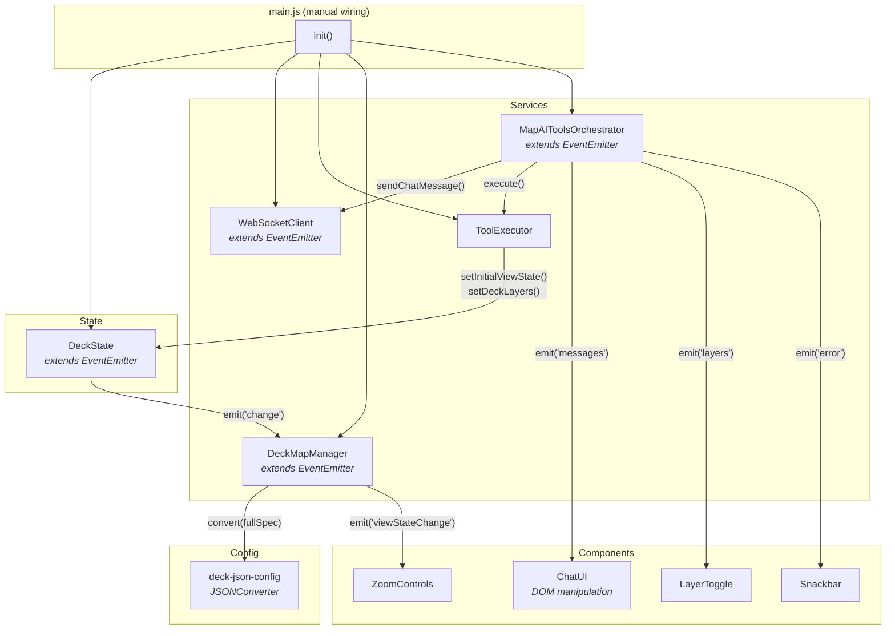

# Vanilla JS Frontend

> Pure JavaScript integration with deck.gl map controlled by AI-powered natural language chat — no framework required.

## Quick Start

```bash
pnpm install
cp .env.example .env
# Edit .env with your CARTO credentials
pnpm dev      # http://localhost:5173
```

## Architecture

The Vanilla implementation uses **plain ES6 classes** with a custom **EventEmitter** for inter-component communication. There is no framework — all wiring is done manually in `main.js`.



### Manual Bootstrap

The `main.js` file is the entry point. It creates all instances and wires them together explicitly:

```javascript
// main.js — Complete bootstrap sequence

// 1. Create state
const deckState = new DeckState();

// 2. Create services (constructor injection)
const wsClient = new WebSocketClient();
const toolExecutor = new ToolExecutor(deckState);
const deckMapManager = new DeckMapManager(deckState, environment);
const orchestrator = new MapAIToolsOrchestrator(wsClient, toolExecutor, deckState, environment);

// 3. Create UI components (DOM element + callbacks)
const chatUI = new ChatUI(document.getElementById('sidebar-column'), {
  onSendMessage: (content) => orchestrator.sendMessage(content),
  onClearChat: (clearLayers) => {
    orchestrator.clearMessages();
    if (clearLayers) deckState.clearChatGeneratedLayers();
  },
});

// 4. Subscribe to events
orchestrator.on('messages', (messages) => chatUI.setMessages(messages));
orchestrator.on('loaderState', ({ state }) => chatUI.setLoaderState(state));
orchestrator.on('layers', (layers) => layerToggle.setLayers(layers));

// 5. Initialize
async function init() {
  await deckMapManager.initialize('map-container', 'map-container-canvas');
  orchestrator.connect();
}

init();
```

This is the most transparent view of the architecture — every connection between components is visible in one file.

## Key Patterns

### State Management

- **EventEmitter pattern in DeckState class**: Custom event system with `on()`, `off()`, `emit()` methods — no framework reactivity
- **Unified DeckSpec pattern**: State organized around deck.gl JSON spec structure (`initialViewState`, `layers`, `widgets`, `effects`)
- **Basemap separate**: MapLibre concern kept separate from deck.gl spec
- **Change events**: State changes broadcast via `'change'` event to subscribers

### Bootstrap Pattern

- **Explicit initialization order in main.js**: Services created first, then components, then event wiring, then initialization
- **Constructor injection**: Services receive dependencies via constructor parameters
- **No auto-wiring**: All connections between components are manual and visible

### Orchestrator

- **MapAITools class**: Manages WebSocket connection and tool execution, extends EventEmitter to broadcast state changes

### Deck Map Renderer

- **DeckMap class**: Manual deck.gl + MapLibre initialization with explicit event subscriptions, performs full-spec conversion via JSONConverter

### Component Pattern

- **Plain JS classes with createElement()**: No virtual DOM, direct DOM manipulation
- **Callback-based communication**: Components receive callbacks in constructor options
- **Event-driven updates**: Components subscribe to EventEmitter events for state changes

### Components

- **MapView**: deck.gl + MapLibre container (imperative initialization)
- **ChatPanel**: Chat interface with markdown rendering and streaming
- **LayerToggle**: Layer visibility controls with legend
- **ZoomControls**: Zoom in/out buttons
- **Snackbar**: Toast notifications
- **ConfirmationDialog**: Modal confirmation dialogs

All components are plain JavaScript classes with manual DOM manipulation.

## Shared Documentation

- [Getting Started](../../../docs/GETTING_STARTED.md) — Prerequisites, installation, running
- [Environment Configuration](../../../docs/ENVIRONMENT.md#vite-based-frontends) — Vite environment variables
- [Tool System](../../../docs/TOOLS.md) — set-deck-state, set-marker, set-mask-layer
- [Communication Protocol](../../../docs/COMMUNICATION_PROTOCOL.md) — Message types and flow
- [System Prompt](../../../docs/SYSTEM_PROMPT.md) — Prompt architecture
- [Semantic Layer](../../../docs/SEMANTIC_LAYER_GUIDE.md) — Data catalog configuration
