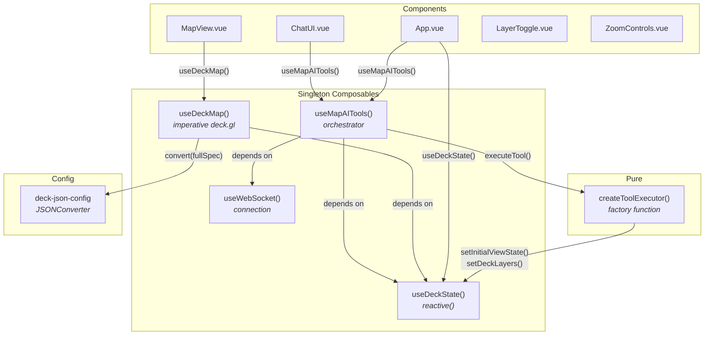

# Vue Frontend

> Vue 3 integration with deck.gl map controlled by AI-powered natural language chat.

## Architecture

The Vue integration uses **singleton composables** for dependency injection and shared state. Unlike React's nested Context Providers, Vue composables are module-scoped singletons created on first call and returned to all subsequent callers.



### Composable Dependency Graph

```
useDeckState()     (standalone — no dependencies)
useWebSocket()     (standalone — no dependencies)
useMapAITools()    (depends on useDeckState + useWebSocket)
useDeckMap()       (depends on useDeckState)
useIsMobile()      (standalone, NOT singleton — per-component lifecycle)
```

### Singleton Composable Pattern

All shared composables use a module-scoped singleton pattern:

```typescript
let _instance: ReturnType<typeof create> | null = null;

function create() {
  // reactive state, watchers, methods
  return { /* public API */ };
}

export function useXxx() {
  if (!_instance) _instance = create();
  return _instance;
}
```

This replaces React's Context Provider nesting. State is created once and shared across all components without prop drilling or provider wrappers.

## Key Patterns

### State Management

- **Vue composables with module-scoped reactive refs in useDeckState**: `shallowRef` for viewState (avoid deep reactivity), `ref` for layers/basemap
- **Singleton Composable Pattern**: Module-level variables ensure single instance across components (replaces React's Context pattern)
- **Unified DeckSpec pattern**: State organized around deck.gl JSON spec structure (`initialViewState`, `layers`, `widgets`, `effects`)
- **Basemap separate**: MapLibre concern kept separate from deck.gl spec

### Why Module-Scoped Variables

- **Singleton without provider nesting**: Module variables create shared state once, returned to all callers
- **No prop drilling**: Components call `useDeckState()` anywhere without parent-child wiring
- **Simpler than React useRef**: No ref indirection needed — variables are directly accessible

### Orchestrator

- **useMapAITools composable**: Manages WebSocket connection, routes messages, executes tool calls, tracks chat history and loader state

### Deck Map Renderer

- **useDeckMap composable**: Creates deck.gl + MapLibre instances with `watch()` for state changes
- **renderFromState central function**: Performs full-spec conversion via JSONConverter on state changes

### Components

- **MapView**: deck.gl + MapLibre container (imperative initialization)
- **ChatUI**: Chat interface with markdown rendering and streaming
- **LayerToggle**: Layer visibility controls with legend
- **ZoomControls**: Zoom in/out buttons
- **SnackbarNotification**: Toast notifications
- **ConfirmationDialog**: Modal confirmation dialogs

All components use Vue 3 Composition API with `<script setup>`.

## Shared Documentation

- [Getting Started](../../../docs/GETTING_STARTED.md) — Prerequisites, installation, running
- [Environment Configuration](../../../docs/ENVIRONMENT.md#vite-based-react-vue-vanilla) — Vite environment variables
- [Tool System](../../../docs/TOOLS.md) — set-deck-state, set-marker, set-mask-layer
- [WebSocket Protocol](../../../docs/WEBSOCKET_PROTOCOL.md) — Message types and flow
- [System Prompt](../../../docs/SYSTEM_PROMPT.md) — Prompt architecture
- [Semantic Layer](../../../docs/SEMANTIC_LAYER_GUIDE.md) — Data catalog configuration
