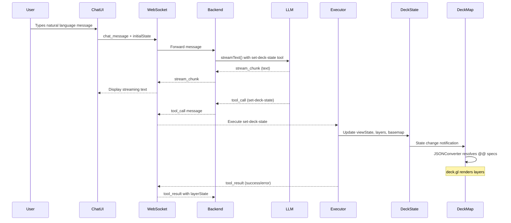
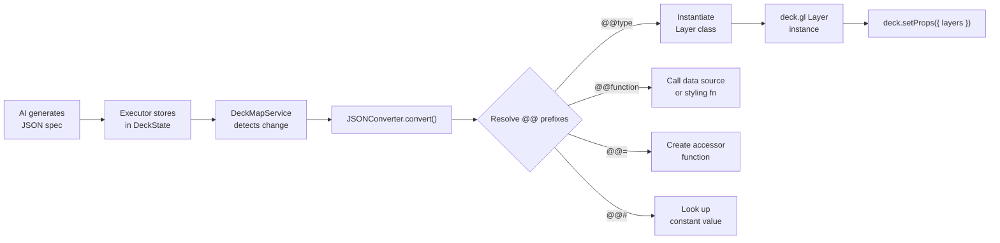

# @carto/maps-ai-tools — Frontend Integration Guide

> Build AI-powered map applications where natural language commands become deck.gl visualizations.

This directory contains three complete frontend implementations of the same AI-powered map application, each built with a different framework. All three share the same architecture, communication protocol, and tool execution model — they differ only in how each framework manages state, renders components, and wires services together.

| Framework | Directory | Language | State Management |
|-----------|-----------|----------|------------------|
| [Angular 20](./angular/) | `angular/` | TypeScript | RxJS BehaviorSubject + DI |
| [React 19](./react/) | `react/` | TypeScript | useReducer + Context API |
| [Vanilla JS](./vanilla/) | `vanilla/` | JavaScript (ES6) | EventEmitter classes |

---

## Table of Contents

- [Architecture Overview](#architecture-overview)
- [The set-deck-state Tool](#the-set-deck-state-tool)
- [JSONConverter and @@ Prefixes](#jsonconverter-and--prefixes)
- [Tool Execution Pipeline](#tool-execution-pipeline)
- [WebSocket Communication Protocol](#websocket-communication-protocol)
- [Layer Types and Data Sources](#layer-types-and-data-sources)
- [Color Styling](#color-styling)
- [Layer Merge Behavior](#layer-merge-behavior)
- [Shared Components](#shared-components)
- [Shared Utilities](#shared-utilities)
- [Framework Comparison](#framework-comparison)
- [Troubleshooting](#troubleshooting)

---

## Architecture Overview

Every frontend integration follows the same end-to-end flow. A user types a natural language message in the chat UI. That message is sent to the backend over WebSocket, where an LLM generates a response containing both text and `set-deck-state` tool calls. The frontend receives streamed text chunks for the chat display and tool call payloads that are executed locally against the map state.



### The Single-Tool Philosophy

Instead of exposing dozens of granular tools (one for navigation, one for adding layers, one for styling, etc.), this architecture uses a **single consolidated tool**: `set-deck-state`. This tool accepts a JSON object that can simultaneously update the camera position, change the basemap, add/update/remove layers, configure widgets, and apply effects — all in one call.

This approach reduces LLM confusion from tool selection, enables atomic multi-part updates, and simplifies the executor implementation.

---

## The set-deck-state Tool

The `set-deck-state` tool is the only frontend-executed tool. Its parameters are defined with Zod schemas in the core `@carto/maps-ai-tools` library and validated on the backend before being sent to the frontend.

### Parameter Structure

```typescript
interface SetDeckStateParams {
  // Camera navigation (fly-to animation)
  initialViewState?: {
    latitude: number;
    longitude: number;
    zoom: number;
    pitch?: number;       // Default: 0
    bearing?: number;     // Default: 0
    transitionDuration?: number; // ms, default: 1000
  };

  // Basemap style
  mapStyle?: 'dark-matter' | 'positron' | 'voyager';

  // Layer specifications (deck.gl JSON format)
  layers?: LayerSpec[];

  // Widget configurations
  widgets?: Record<string, unknown>[];

  // Visual effects (e.g., LightingEffect)
  effects?: Record<string, unknown>[];

  // Reorder layers by ID
  layerOrder?: string[];

  // Remove specific layers by ID
  removeLayerIds?: string[];
}
```

### Example: What the AI Generates

When a user says *"Show me airports in the US colored by passenger volume"*, the AI produces a tool call like this:

```json
{
  "initialViewState": {
    "latitude": 39.8283,
    "longitude": -98.5795,
    "zoom": 4,
    "transitionDuration": 2000
  },
  "layers": [
    {
      "@@type": "VectorTileLayer",
      "id": "us-airports",
      "data": {
        "@@function": "vectorTableSource",
        "tableName": "carto-demo-data.demo_tables.airports",
        "columns": ["name", "passengers"]
      },
      "getFillColor": {
        "@@function": "colorBins",
        "attr": "passengers",
        "domain": [100000, 500000, 1000000, 5000000],
        "colors": "Sunset"
      },
      "getPointRadius": 8,
      "pointRadiusMinPixels": 4,
      "pointRadiusMaxPixels": 24,
      "pickable": true,
      "updateTriggers": {
        "getFillColor": ["passengers"]
      }
    }
  ]
}
```

This single tool call navigates the camera to the US, adds a vector tile layer from a CARTO table, applies color binning by passenger count, and enables tooltips — all atomically.

---

## JSONConverter and @@ Prefixes

The AI generates layer specifications as plain JSON, but deck.gl needs JavaScript class instances, function references, and accessor callbacks. The bridge between these two worlds is `@deck.gl/json`'s **JSONConverter**, which resolves special `@@` prefixes into live JavaScript objects.

### The Four Prefix Types

| Prefix | Purpose | Example | Resolves To |
|--------|---------|---------|-------------|
| `@@type` | Instantiate a layer class | `"@@type": "VectorTileLayer"` | `new VectorTileLayer({...})` |
| `@@function` | Call a registered function | `"@@function": "vectorTableSource"` | `vectorTableSource({...})` |
| `@@=` | Create an accessor function | `"@@=properties.population"` | `(d) => d.properties.population` |
| `@@#` | Look up a named constant | `"@@#Red"` | `[255, 0, 0, 200]` |

### How It Works

Each frontend has a `deck-json-config` file that registers the available classes, functions, constants, and enumerations with the JSONConverter:

```typescript
const deckJsonConfiguration = {
  // @@type references → Layer class constructors
  classes: {
    VectorTileLayer, H3TileLayer, QuadbinTileLayer,
    GeoJsonLayer, ScatterplotLayer, ArcLayer, // ...
  },

  // @@# references → Named constant values
  constants: {
    FlyToInterpolator: new FlyToInterpolator(),
    Red: [255, 0, 0, 200],
    Blue: [0, 0, 255, 200],
    CartoPrimary: [3, 111, 226, 200],
    // ... 25+ color constants
  },

  // @@function references → Callable functions
  functions: {
    vectorTableSource,   // CARTO vector tile data source
    h3TableSource,       // H3 hexagonal grid data source
    quadbinTableSource,  // Quadbin spatial index data source
    colorBins,           // Discrete color binning
    colorCategories,     // Categorical color mapping
    colorContinuous,     // Continuous color interpolation
    // ...
  },

  // @@# enum references (e.g., @@#COORDINATE_SYSTEM.LNGLAT)
  enumerations: {
    COORDINATE_SYSTEM,
  },
};
```

### Resolution Flow



### @@= Expression Examples

The `@@=` prefix creates accessor functions that extract values from feature properties:

```json
// Simple property access
"getRadius": "@@=properties.population"
// → (d) => d.properties.population

// Conditional expression
"getFillColor": "@@=properties.type === 'airport' ? [0,0,255,200] : [128,128,128,180]"
// → (d) => d.properties.type === 'airport' ? [0,0,255,200] : [128,128,128,180]

// Array destructuring
"getText": "@@=[name,city]"
// → (d) => [d.properties.name, d.properties.city]
```

---

## Tool Execution Pipeline

The tool executor follows a strict three-phase process to handle each `set-deck-state` call. This process is identical across all three framework implementations.

### Phase 1: Update View State

If `initialViewState` is provided, the executor updates the camera position. The DeckMapService translates this into a `FlyToInterpolator` animation.

### Phase 2: Update Basemap

If `mapStyle` is provided, the basemap is changed (dark-matter, positron, or voyager). This updates the MapLibre background layer.

### Phase 3: Process Deck Configuration

This is the most complex phase and handles layers, widgets, and effects:

1. **Removals first** — If `removeLayerIds` is provided, those layers are removed from the current state before any additions.

2. **Layer merging** — New layers are deep-merged with existing layers by ID. Same ID = update existing layer. Different ID = add new layer. Empty array `[]` = clear all layers.

3. **Layer ordering** — If `layerOrder` is provided, layers are reordered to match the specified ID sequence.

4. **Widgets and effects** — These use replace semantics (not merge). If provided, they replace the current set entirely.

5. **Column validation** — Each layer's accessor expressions are checked to ensure referenced columns are included in the data source configuration.

```
┌─────────────────────────────────────────────┐
│              set-deck-state call             │
└──────────────────┬──────────────────────────┘
                   │
        ┌──────────▼──────────┐
        │  removeLayerIds?    │─── Yes ──→ Filter out by ID
        └──────────┬──────────┘
                   │
        ┌──────────▼──────────┐
        │  layers provided?   │─── Yes ──→ mergeLayerSpecs(existing, incoming)
        └──────────┬──────────┘
                   │
        ┌──────────▼──────────┐
        │  layerOrder?        │─── Yes ──→ Reorder by ID sequence
        └──────────┬──────────┘
                   │
        ┌──────────▼──────────┐
        │  validateColumns()  │
        └──────────┬──────────┘
                   │
        ┌──────────▼──────────┐
        │  setDeckConfig()    │──→ State updated, DeckMapService renders
        └─────────────────────┘
```

---

## WebSocket Communication Protocol

All three frontends use the same WebSocket message protocol to communicate with the backend.

### Connection

- **URL**: `ws://localhost:3003/ws` (configurable)
- **Auto-reconnect**: Exponential backoff with max 5 attempts
- **Message buffering**: Stream chunks are accumulated into complete messages

### Message Types

| Direction | Type | Purpose |
|-----------|------|---------|
| Client → Server | `chat_message` | User's natural language message + current map state |
| Client → Server | `tool_result` | Result of frontend tool execution (success/error + layer state) |
| Server → Client | `stream_chunk` | Streamed LLM text response (partial, accumulated by `messageId`) |
| Server → Client | `tool_call_start` | Notification that a tool is about to be called (for loader UI) |
| Server → Client | `tool_call` | Tool parameters to execute on the frontend |
| Server → Client | `mcp_tool_result` | Result of a backend-executed MCP tool |
| Server → Client | `error` | Error message |

### Initial State Context

When sending a `chat_message`, the frontend includes the current map state so the AI has context about what's already on the map:

```json
{
  "type": "chat_message",
  "content": "Color the airports by passenger volume",
  "timestamp": 1700000000000,
  "initialState": {
    "viewState": { "longitude": -98.5, "latitude": 39.8, "zoom": 4 },
    "layers": [
      {
        "id": "us-airports",
        "type": "VectorTileLayer",
        "visible": true,
        "styleContext": {
          "getFillColor": [200, 100, 50, 180]
        }
      }
    ],
    "activeLayerId": "us-airports",
    "cartoConfig": {
      "connectionName": "carto_dw",
      "hasCredentials": true
    }
  }
}
```

### Tool Message Queuing

Tool call results that arrive while text is still streaming are queued and flushed only after the stream completes. This ensures messages appear in the correct order in the chat UI.

---

## Layer Types and Data Sources

The JSONConverter supports six primary layer types, each paired with specific CARTO data source functions.

| Layer Type | Data Source Functions | Use Case |
|------------|---------------------|----------|
| `VectorTileLayer` | `vectorTableSource`, `vectorQuerySource`, `vectorTilesetSource` | Points, lines, and polygons from CARTO tables or SQL queries |
| `H3TileLayer` | `h3TableSource`, `h3QuerySource`, `h3TilesetSource` | Hexagonal grid aggregation (H3 spatial index) |
| `QuadbinTileLayer` | `quadbinTableSource`, `quadbinQuerySource`, `quadbinTilesetSource` | Square cell aggregation (Quadbin spatial index) |
| `RasterTileLayer` | `rasterSource` | Raster tile visualization |
| `GeoJsonLayer` | Direct GeoJSON data (URL or inline) | Small datasets, custom geometries |
| `ScatterplotLayer` | Direct data array | Point clouds, custom point data |

### VectorTileLayer Example

```json
{
  "@@type": "VectorTileLayer",
  "id": "stores-layer",
  "data": {
    "@@function": "vectorTableSource",
    "tableName": "project.dataset.retail_stores",
    "columns": ["name", "revenue", "category"],
    "filters": {
      "category": { "in": { "values": ["grocery", "pharmacy"] } }
    }
  },
  "getFillColor": {
    "@@function": "colorCategories",
    "attr": "category",
    "domain": ["grocery", "pharmacy"],
    "colors": "Bold"
  },
  "getPointRadius": 6,
  "pointRadiusMinPixels": 3,
  "pickable": true,
  "updateTriggers": {
    "getFillColor": ["category"]
  }
}
```

### H3TileLayer Example

```json
{
  "@@type": "H3TileLayer",
  "id": "population-hexagons",
  "data": {
    "@@function": "h3TableSource",
    "tableName": "project.dataset.population_h3",
    "aggregationExp": "SUM(population) as total_pop",
    "aggregationResLevel": 4
  },
  "getFillColor": {
    "@@function": "colorContinuous",
    "attr": "total_pop",
    "domain": [0, 50000, 100000, 500000],
    "colors": "Sunset"
  },
  "extruded": false,
  "pickable": true,
  "updateTriggers": {
    "getFillColor": ["total_pop"]
  }
}
```

---

## Color Styling

CARTO provides three color styling functions that map data attributes to colors. These are registered as `@@function` references in the JSONConverter.

### Color Functions

| Function | Use Case | Example |
|----------|----------|---------|
| `colorBins` | Discrete ranges (quantitative) | Revenue brackets: 0-100K, 100K-500K, 500K+ |
| `colorCategories` | Categorical values | Store types: grocery, pharmacy, electronics |
| `colorContinuous` | Smooth gradient (quantitative) | Temperature: cold (blue) to hot (red) |

### Available Palettes

`Sunset` · `Teal` · `BluYl` · `PurpOr` · `PinkYl` · `Bold` · `Temps` · `Emrld` · `Burg` · `OrYel` · `Peach` · `Mint` · `Magenta`

### updateTriggers Requirement

When using any color styling function (`colorBins`, `colorCategories`, `colorContinuous`), you **must** include an `updateTriggers` object that references the styled attribute. Without this, deck.gl may not re-evaluate the color function when data changes:

```json
{
  "getFillColor": {
    "@@function": "colorBins",
    "attr": "revenue",
    "domain": [100000, 500000, 1000000],
    "colors": "Sunset"
  },
  "updateTriggers": {
    "getFillColor": ["revenue"]
  }
}
```

---

## Layer Merge Behavior

Layers are managed incrementally through a deep merge strategy. This allows the AI to update specific properties of existing layers without re-specifying the entire layer configuration.

### Merge Rules

- **Same ID** → Deep merge: incoming properties override existing ones, unspecified properties are preserved
- **Different ID** → Add: the new layer is appended to the layer list
- **`removeLayerIds`** → Delete: specified layers are removed before merging
- **`layers: []`** (empty array) → Clear all: removes every layer

### Deep Merge Example

**Existing layer:**
```json
{
  "@@type": "VectorTileLayer",
  "id": "stores",
  "data": { "@@function": "vectorTableSource", "tableName": "..." },
  "getFillColor": [200, 100, 50, 180],
  "getPointRadius": 6,
  "pickable": true
}
```

**Incoming update** (AI changes only the color):
```json
{
  "id": "stores",
  "getFillColor": { "@@function": "colorBins", "attr": "revenue", "domain": [100000, 500000], "colors": "Sunset" },
  "updateTriggers": { "getFillColor": ["revenue"] }
}
```

**Result** (merged):
```json
{
  "@@type": "VectorTileLayer",
  "id": "stores",
  "data": { "@@function": "vectorTableSource", "tableName": "..." },
  "getFillColor": { "@@function": "colorBins", "attr": "revenue", "domain": [100000, 500000], "colors": "Sunset" },
  "getPointRadius": 6,
  "pickable": true,
  "updateTriggers": { "getFillColor": ["revenue"] }
}
```

The `@@type`, `data`, `getPointRadius`, and `pickable` properties are preserved from the original. Only `getFillColor` and `updateTriggers` are updated.

---

## Shared Components

All three framework implementations include the same set of UI components:

| Component | Purpose |
|-----------|---------|
| **MapView** | deck.gl + MapLibre rendering container. Initializes both map engines and manages the canvas overlay. |
| **ChatUI** | Chat interface with markdown rendering, streaming text display, welcome chips, and message history. |
| **LayerToggle** | Layer visibility controls with color indicator and expandable legend panel. |
| **ZoomControls** | Zoom in/out buttons displaying the current zoom level. |
| **Snackbar** | Toast notification for errors and status messages. |
| **ConfirmationDialog** | Modal dialog for destructive actions (e.g., clearing all layers). |

---

## Shared Utilities

### layer-merge

Deep merge utility for incremental layer updates. Merges layer specs by matching on the `id` property. Nested objects are merged recursively; arrays and primitives are replaced.

Also includes `validateLayerColumns()` which checks that columns referenced in `@@=` accessor expressions are included in the data source's `columns` configuration.

### legend

Extracts legend data from layer color styling configurations. Supports three legend types:

- **Discrete** — Parsed from `@@=` ternary expressions (e.g., `type === 'A' ? [255,0,0] : [0,0,255]`)
- **Bins/Continuous** — Extracted from `colorBins`/`colorContinuous` function configs with palette resolution via `cartocolor`
- **Categories** — Extracted from `colorCategories` function configs with domain labels and palette colors

### tooltip

Formats feature properties into tooltip HTML. Filters out technical columns (geometry, IDs, spatial indexes), prioritizes human-readable properties (name, category, population), and formats values with proper labels.

---

## Framework Comparison

| Aspect | Angular | React | Vanilla JS |
|--------|---------|-------|------------|
| **Language** | TypeScript | TypeScript | JavaScript (ES6) |
| **Build Tool** | Angular CLI | Vite | Vite |
| **Package Manager** | pnpm | npm | npm |
| **State Management** | `DeckStateService` with RxJS `BehaviorSubject` | `DeckStateContext` with `useReducer` + Context API | `DeckState` class extending `EventEmitter` |
| **Tool Executor** | `ConsolidatedExecutorsService` (Angular Injectable, DI) | `ToolExecutor` class (pure, no React deps) | `ToolExecutor` class (receives `deckState` instance) |
| **WebSocket** | `WebSocketService` (Injectable) | `WebSocketContext` (Provider + hook) | `WebSocketClient` class (EventEmitter) |
| **Orchestrator** | `MapAIToolsService` (Injectable) | `MapAIToolsContext` (Provider + hook) | `MapAIToolsOrchestrator` class (EventEmitter) |
| **Bootstrap** | Standalone components + `providedIn: 'root'` | Provider nesting in `main.tsx` | Manual wiring in `main.js` |
| **Environment Config** | `src/environments/environment.ts` (TS module) | `.env` file with `VITE_` prefix | `.env` file with `VITE_` prefix |
| **Change Detection** | `combineLatest` + `distinctUntilChanged` | `useReducer` dispatch triggers re-render | `EventEmitter.emit('change')` |
| **Dev Server Port** | `http://localhost:4200` | `http://localhost:5173` | `http://localhost:5173` |

---

## Troubleshooting

### WebSocket Connection Failed

- Verify the backend is running on `ws://localhost:3003/ws`
- Check that the WebSocket URL matches your environment configuration
- Look for CORS errors in the browser console
- The client auto-reconnects with exponential backoff (max 5 attempts)

### Layers Not Rendering

- Open the browser console and look for `[DeckMapService]` or `[CARTO Source]` error logs
- Verify your CARTO `accessToken` is valid and not expired
- Check that `columns` in the data source config includes all columns used in styling and accessors
- Ensure `updateTriggers` is set when using `colorBins`, `colorCategories`, or `colorContinuous`

### JSONConverter Errors

- `Unknown class: X` — The layer type is not registered in `deck-json-config`. Add it to the `classes` object.
- `Unknown function: X` — The function is not registered. Add it to the `functions` object.
- `Failed to parse @@= expression` — The accessor expression syntax is invalid. Check for typos in property names.

### CARTO Data Source Errors

- `401 Unauthorized` — Your `accessToken` is invalid or expired
- `Table not found` — Check the fully qualified table name format: `project.dataset.table_name`
- `Connection not found` — Verify `connectionName` matches your CARTO workspace configuration
