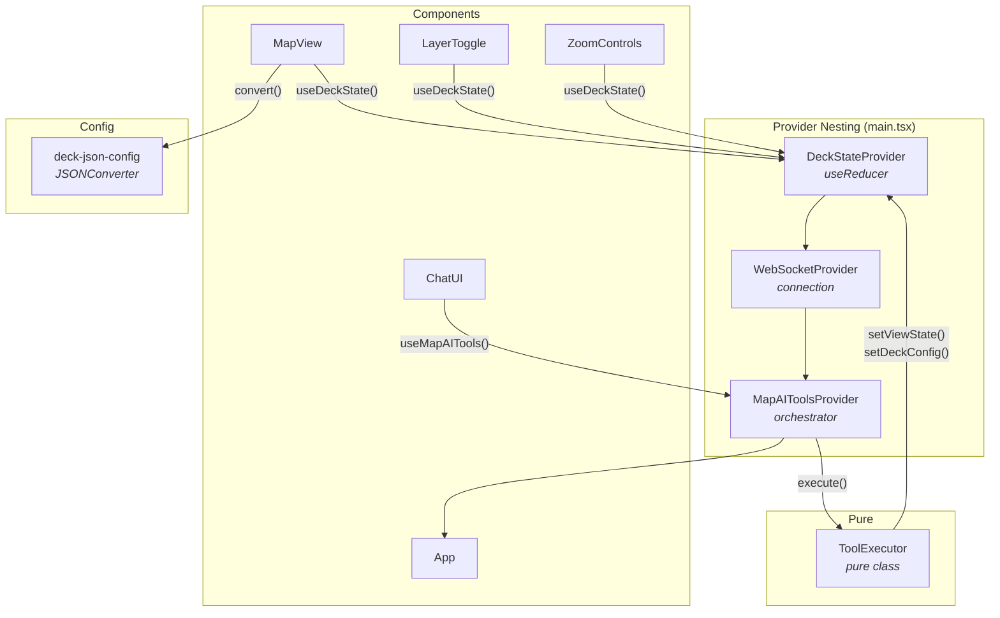

# @carto/maps-ai-tools — React Integration

> React 19 implementation of the AI-powered map application using Hooks, Context API, and Vite.

This guide covers the React-specific architecture, contexts, hooks, and patterns. For shared concepts (tool schema, JSONConverter, communication protocol, layer types, color styling), see the [global integration guide](../README.md).

---

## Table of Contents

- [Getting Started](#getting-started)
- [Project Structure](#project-structure)
- [Architecture](#architecture)
- [State Management](#state-management)
- [Tool Executor](#tool-executor)
- [Orchestrator Context](#orchestrator-context)
- [Deck Map Renderer](#deck-map-renderer)
- [Components](#components)
- [Environment Configuration](#environment-configuration)

---

## Getting Started

### Prerequisites

- Node.js v18+
- npm
- Backend server running on `ws://localhost:3003/ws`

### Installation

```bash
npm install
```

### Environment Setup

Create a `.env` file in the project root:

```bash
VITE_API_BASE_URL=https://gcp-us-east1.api.carto.com
VITE_API_ACCESS_TOKEN=YOUR_CARTO_ACCESS_TOKEN
VITE_CONNECTION_NAME=carto_dw
VITE_WS_URL=ws://localhost:3003/ws
VITE_HTTP_API_URL=http://localhost:3003/api/chat
VITE_USE_HTTP=false
```

| Variable | Description |
| -------- | ----------- |
| `VITE_API_BASE_URL` | CARTO API endpoint URL |
| `VITE_API_ACCESS_TOKEN` | Your CARTO API access token |
| `VITE_CONNECTION_NAME` | CARTO data warehouse connection name |
| `VITE_WS_URL` | Backend WebSocket URL |
| `VITE_HTTP_API_URL` | Backend HTTP URL (fallback) |
| `VITE_USE_HTTP` | Use HTTP instead of WebSocket (`false` recommended) |

### Running

```bash
# 1. Build the core library (if not already built)
cd ../../map-ai-tools && npm run build && cd -

# 2. Start the backend
cd ../../backend-integration/vercel-ai-sdk && npm run dev &

# 3. Start the React frontend
npm run dev
```

Open `http://localhost:5173` in your browser.

### Building

```bash
npm run build
```

Output is written to `dist/`.

---

## Project Structure

```
src/
├── App.tsx                         # Root component (layout, sidebar, mobile)
├── main.tsx                        # React root + Provider nesting
├── vite-env.d.ts                   # Vite type declarations
│
├── components/
│   ├── MapView.tsx                 # deck.gl + MapLibre (imperative init)
│   ├── ChatUI.tsx                  # Chat with markdown + streaming
│   ├── LayerToggle.tsx             # Layer visibility + legend
│   ├── ZoomControls.tsx            # Zoom in/out buttons
│   ├── Snackbar.tsx                # Toast notifications
│   ├── ConfirmationDialog.tsx      # Modal confirmation
│   └── *.css                       # Per-component styles
│
├── contexts/
│   ├── DeckStateContext.tsx         # State (useReducer + Context)
│   ├── WebSocketContext.tsx         # WebSocket connection
│   └── MapAIToolsContext.tsx        # Orchestrator (messages, tools, loader)
│
├── hooks/
│   ├── useDeckState.ts             # Access DeckStateContext
│   ├── useMapAITools.ts            # Access MapAIToolsContext
│   ├── useWebSocket.ts             # Access WebSocketContext
│   ├── useDeckLayers.ts            # Convert state layers for UI
│   └── useIsMobile.ts              # Viewport size detection
│
├── services/
│   └── tool-executor.ts            # Pure class (no React deps)
│
├── config/
│   ├── deck-json-config.ts         # JSONConverter setup (@@type, @@function, @@=, @@#)
│   ├── environment.ts              # Vite env vars reader
│   └── semantic-config.ts          # Welcome chips
│
├── utils/
│   ├── layer-merge.ts              # Deep merge for layer updates
│   ├── legend.ts                   # Legend extraction
│   └── tooltip.ts                  # Tooltip formatting
│
└── types/
    └── models.ts                   # Shared TypeScript interfaces
```

---

## Architecture

The React integration uses **Context Providers** for dependency injection and **Hooks** for state access. Providers are nested in a specific order in `main.tsx` to ensure proper dependency resolution.



### Provider Nesting Order

```tsx
// main.tsx
createRoot(document.getElementById('root')!).render(
  <DeckStateProvider>          {/* 1. State (no dependencies) */}
    <WebSocketProvider>        {/* 2. Connection (no dependencies) */}
      <MapAIToolsProvider>     {/* 3. Orchestrator (needs state + ws) */}
        <App />
      </MapAIToolsProvider>
    </WebSocketProvider>
  </DeckStateProvider>
);
```

The nesting order matters: `MapAIToolsProvider` depends on both `DeckStateContext` and `WebSocketContext`, so it must be nested inside both.

---

## State Management

The `DeckStateContext` uses React's `useReducer` for predictable state transitions and `useRef` for mutable data that doesn't trigger re-renders (layer centers, initial layer IDs, current view state from user drag).

### Reducer Actions

```typescript
type DeckStateAction =
  | { type: 'SET_VIEW_STATE'; payload: Partial<ViewState> & { transitionDuration?: number } }
  | { type: 'SET_DECK_CONFIG'; payload: DeckConfig }
  | { type: 'SET_LAYERS'; payload: LayerSpec[] }
  | { type: 'SET_BASEMAP'; payload: Basemap }
  | { type: 'SET_ACTIVE_LAYER_ID'; payload: string | undefined }
  | { type: 'CLEAR_CHAT_LAYERS'; payload: Set<string> };
```

### Provider Implementation

```typescript
export function DeckStateProvider({ children }: { children: ReactNode }) {
  const [state, dispatch] = useReducer(deckStateReducer, initialState);

  // Mutable refs for data that doesn't need re-renders
  const layerCentersRef = useRef(new Map<string, { longitude; latitude; zoom }>());
  const initialLayerIdsRef = useRef(new Set<string>());
  const currentViewStateRef = useRef<ViewState>({ ...DEFAULT_VIEW_STATE });
  const stateRef = useRef(state);
  stateRef.current = state;

  // Stable callbacks via useCallback
  const setViewState = useCallback(
    (partial: Partial<ViewState> & { transitionDuration?: number }) => {
      currentViewStateRef.current = { ...currentViewStateRef.current, ...partial };
      dispatch({ type: 'SET_VIEW_STATE', payload: partial });
    }, []
  );

  const setDeckConfig = useCallback(
    (config: DeckConfig) => {
      // Capture center for new layers using current position ref
      const existingLayerIds = new Set(
        stateRef.current.deckConfig.layers.map(l => l['id'] as string)
      );
      for (const layer of config.layers ?? []) {
        const layerId = layer['id'] as string;
        if (layerId && !existingLayerIds.has(layerId)) {
          layerCentersRef.current.set(layerId, {
            longitude: currentViewStateRef.current.longitude,
            latitude: currentViewStateRef.current.latitude,
            zoom: currentViewStateRef.current.zoom,
          });
        }
      }
      dispatch({ type: 'SET_DECK_CONFIG', payload: config });
    }, []
  );

  // updateCurrentViewState: updates ref only, no re-render
  // Used by MapView to track user drag position
  const updateCurrentViewState = useCallback(
    (vs: Partial<ViewState>) => {
      currentViewStateRef.current = { ...currentViewStateRef.current, ...vs };
    }, []
  );

  return (
    <DeckStateContext.Provider value={contextValue}>
      {children}
    </DeckStateContext.Provider>
  );
}
```

### Using the Hook

```typescript
// In any component
import { useDeckState } from '../hooks/useDeckState';

function MyComponent() {
  const { state, setViewState, setBasemap, getLayerCenter } = useDeckState();

  // state.viewState, state.deckConfig, state.basemap are reactive
  // setViewState, setBasemap are stable references (useCallback)
}
```

### Why useRef for View State?

The `currentViewStateRef` tracks the actual camera position from user drag interactions. Using state for this would cause excessive re-renders on every frame. Instead, the ref is read synchronously when needed (e.g., to capture layer centers) without triggering component updates.

---

## Tool Executor

The `ToolExecutor` is a **pure class with no React dependencies**. It receives a `DeckStateActions` interface and can be used in any context — React, tests, or standalone scripts.

```typescript
export interface DeckStateActions {
  setViewState: (vs: { latitude; longitude; zoom; pitch?; bearing?; transitionDuration? }) => void;
  setBasemap: (basemap: Basemap) => void;
  setDeckConfig: (config: DeckConfig) => void;
  setActiveLayerId: (id: string | undefined) => void;
  getDeckConfig: () => DeckConfig;
}

export class ToolExecutor {
  constructor(private actions: DeckStateActions) {}

  async execute(toolName: string, params: unknown): Promise<ToolResult> {
    if (toolName !== TOOL_NAMES.SET_DECK_STATE) {
      return { success: false, message: `Unknown tool: ${toolName}` };
    }
    return this.executeSetDeckState(params as SetDeckStateParams);
  }

  private executeSetDeckState(params: SetDeckStateParams): ToolResult {
    // Phase 1: viewState → this.actions.setViewState()
    // Phase 2: basemap   → this.actions.setBasemap()
    // Phase 3: deckConfig → remove, merge, order, validate, setDeckConfig()
    // (Same pipeline as Angular and Vanilla)
  }
}
```

### Instantiation in MapAIToolsContext

The `ToolExecutor` is instantiated inside the `MapAIToolsProvider` by passing the `DeckStateContext` callbacks:

```typescript
// Inside MapAIToolsProvider
const { setViewState, setBasemap, setDeckConfig, setActiveLayerId, getDeckConfig } = useDeckState();

const executorRef = useRef<ToolExecutor | null>(null);
if (!executorRef.current) {
  executorRef.current = new ToolExecutor({
    setViewState,
    setBasemap,
    setDeckConfig,
    setActiveLayerId,
    getDeckConfig,
  });
}
```

---

## Orchestrator Context

The `MapAIToolsContext` is the React equivalent of Angular's `MapAIToolsService`. It handles WebSocket messages, executes tools, manages chat history, and provides loader state.

### Context Value

```typescript
interface MapAIToolsContextValue {
  messages: Message[];
  loaderState: LoaderState;
  loaderMessage: string;
  layers: LayerConfig[];
  isConnected: boolean;
  sendMessage: (content: string) => boolean;
  clearMessages: (clearLayers?: boolean) => void;
}
```

### Message Handling

The provider subscribes to the WebSocket context and routes messages through a `handleMessage` function identical in structure to Angular's:

```typescript
const handleMessage = useCallback((data: WebSocketMessage) => {
  switch (data.type) {
    case 'stream_chunk':    handleStreamChunk(data);    break;
    case 'tool_call_start': handleToolCallStart(data);  break;
    case 'tool_call':       handleToolCall(data);       break;
    case 'mcp_tool_result': handleMcpToolResult(data);  break;
    case 'tool_result':     handleToolResult(data);     break;
    case 'error':           /* handle error */          break;
  }
}, [/* stable deps */]);
```

### Using the Hook

```typescript
import { useMapAITools } from '../hooks/useMapAITools';

function ChatUI() {
  const { messages, loaderState, sendMessage, clearMessages, isConnected } = useMapAITools();

  const handleSend = (text: string) => {
    sendMessage(text);
  };

  return (
    <div>
      {messages.map(msg => <MessageBubble key={msg.id} message={msg} />)}
      {loaderState && <Loader state={loaderState} />}
      <ChatInput onSend={handleSend} disabled={!isConnected} />
    </div>
  );
}
```

---

## Deck Map Renderer

The `MapView` component manages deck.gl and MapLibre instances imperatively. Unlike Angular's service-based approach, React uses `useRef` to hold the instances and `useEffect` for lifecycle management.

### Imperative Initialization

```tsx
function MapView() {
  const deckRef = useRef<Deck | null>(null);
  const mapRef = useRef<maplibregl.Map | null>(null);
  const { state, updateCurrentViewState } = useDeckState();

  useEffect(() => {
    // Create MapLibre map
    const map = new maplibregl.Map({
      container: 'map-container',
      style: BASEMAP_URLS[state.basemap],
      interactive: false,
    });

    // Create deck.gl instance
    const deck = new Deck({
      canvas: 'deck-canvas',
      initialViewState: state.viewState,
      controller: true,
      onViewStateChange: ({ viewState: vs }) => {
        map.jumpTo({ center: [vs.longitude, vs.latitude], zoom: vs.zoom });
        updateCurrentViewState(vs); // Update ref, no re-render
      },
      getTooltip: (info) => getTooltipContent(info),
    });

    deckRef.current = deck;
    mapRef.current = map;

    return () => {
      deck.finalize();
      map.remove();
    };
  }, []);

  // Re-render layers when state changes
  useEffect(() => {
    if (!deckRef.current) return;
    const jsonConverter = getJsonConverter();

    const convertedLayers = state.deckConfig.layers.map(spec => {
      const withCreds = injectCartoCredentials(spec);
      return jsonConverter.convert(withCreds);
    });

    deckRef.current.setProps({ layers: convertedLayers });
  }, [state.deckConfig.layers]);

  // Animate camera on viewState change
  useEffect(() => {
    if (!deckRef.current) return;
    deckRef.current.setProps({
      initialViewState: {
        ...state.viewState,
        transitionDuration: state.transitionDuration,
        transitionInterpolator: new FlyToInterpolator(),
      },
    });
  }, [state.viewState]);

  return (
    <div id="map-container" className="map-container">
      <canvas id="deck-canvas" />
    </div>
  );
}
```

### Key Differences from Angular

- **No DeckMapService** — The MapView component manages both deck.gl and MapLibre directly
- **useEffect for reactivity** — State changes trigger effects instead of RxJS subscriptions
- **useRef for instances** — deck.gl and MapLibre instances are held in refs, not service properties
- **updateCurrentViewState** — User drag updates a ref (not state) to avoid re-render loops

---

## Components

| Component | File | Key Hooks Used |
| --------- | ---- | -------------- |
| `MapView` | `MapView.tsx` | `useDeckState()`, `useRef`, `useEffect` |
| `ChatUI` | `ChatUI.tsx` | `useMapAITools()`, `useIsMobile()` |
| `LayerToggle` | `LayerToggle.tsx` | `useMapAITools()`, `useDeckState()` |
| `ZoomControls` | `ZoomControls.tsx` | `useDeckState()` |
| `Snackbar` | `Snackbar.tsx` | Props-driven (no context) |
| `ConfirmationDialog` | `ConfirmationDialog.tsx` | Props-driven (no context) |

All components are **functional** and use hooks for state access. No class components are used.

---

## Environment Configuration

Environment variables are read from `.env` via Vite's `import.meta.env`:

```typescript
// config/environment.ts
export const environment = {
  apiBaseUrl: import.meta.env.VITE_API_BASE_URL,
  accessToken: import.meta.env.VITE_API_ACCESS_TOKEN,
  connectionName: import.meta.env.VITE_CONNECTION_NAME,
  wsUrl: import.meta.env.VITE_WS_URL,
  httpApiUrl: import.meta.env.VITE_HTTP_API_URL,
  useHttp: import.meta.env.VITE_USE_HTTP === 'true',
};
```

| Variable | Type | Description |
| -------- | ---- | ----------- |
| `VITE_API_BASE_URL` | `string` | CARTO API endpoint |
| `VITE_API_ACCESS_TOKEN` | `string` | CARTO API access token |
| `VITE_CONNECTION_NAME` | `string` | Data warehouse connection name |
| `VITE_WS_URL` | `string` | Backend WebSocket URL |
| `VITE_HTTP_API_URL` | `string` | Backend HTTP URL (fallback) |
| `VITE_USE_HTTP` | `string` | `"true"` or `"false"` |
