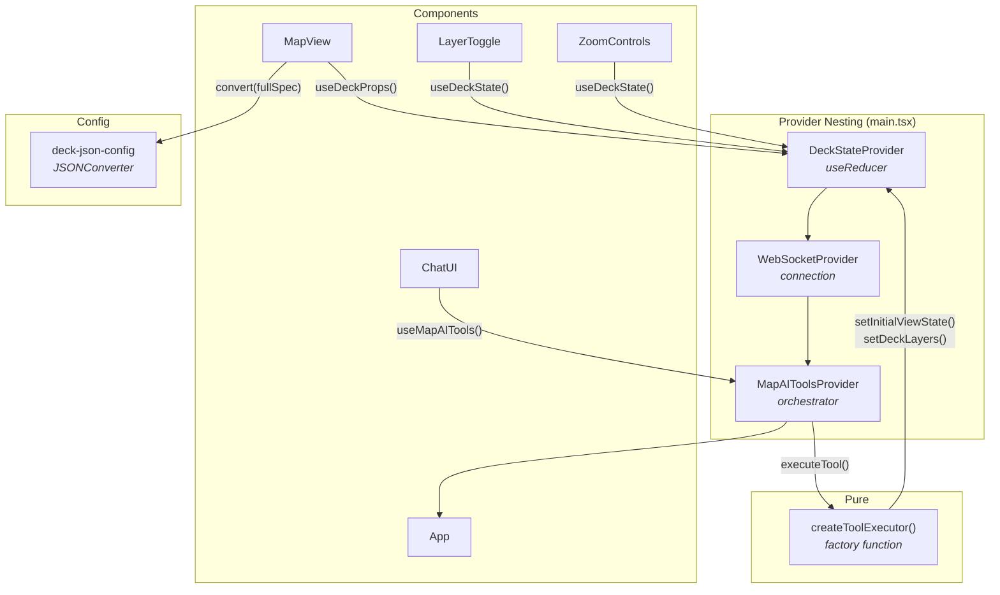

# @carto/map-ai-tools — React Integration

> React 19 implementation of the AI-powered map application using Hooks, Context API, and Vite.

This guide covers the React-specific architecture, contexts, hooks, and patterns. For shared concepts (tool schema, JSONConverter, communication protocol, layer types, color styling), see the [global integration guide](../README.md).

---

## Table of Contents

- [Getting Started](#getting-started)
- [Project Structure](#project-structure)
- [Architecture](#architecture)
- [State Management](#state-management)
- [Tool Executor](#tool-executor)
- [Orchestrator Context](#orchestrator-context)
- [Deck Map Renderer](#deck-map-renderer)
- [Components](#components)
- [Environment Configuration](#environment-configuration)

---

## Getting Started

### Prerequisites

- Node.js v18+
- npm
- Backend server running on `ws://localhost:3003/ws`

### Installation

```bash
npm install
```

### Environment Setup

Create a `.env` file in the project root:

```bash
VITE_API_BASE_URL=https://gcp-us-east1.api.carto.com
VITE_API_ACCESS_TOKEN=YOUR_CARTO_ACCESS_TOKEN
VITE_CONNECTION_NAME=carto_dw
VITE_WS_URL=ws://localhost:3003/ws
VITE_HTTP_API_URL=http://localhost:3003/api/chat
VITE_USE_HTTP=false
```

| Variable | Description |
| -------- | ----------- |
| `VITE_API_BASE_URL` | CARTO API endpoint URL |
| `VITE_API_ACCESS_TOKEN` | Your CARTO API access token |
| `VITE_CONNECTION_NAME` | CARTO data warehouse connection name |
| `VITE_WS_URL` | Backend WebSocket URL |
| `VITE_HTTP_API_URL` | Backend HTTP URL (fallback) |
| `VITE_USE_HTTP` | Use HTTP instead of WebSocket (`false` recommended) |

### Running

```bash
# 1. Build the core library (if not already built)
cd ../../map-ai-tools && npm run build && cd -

# 2. Start the backend
cd ../../backend-integration/vercel-ai-sdk && npm run dev &

# 3. Start the React frontend
npm run dev
```

Open `http://localhost:5173` in your browser.

### Building

```bash
npm run build
```

Output is written to `dist/`.

---

## Project Structure

```
src/
├── App.tsx                         # Root component (layout, sidebar, mobile)
├── main.tsx                        # React root + Provider nesting
├── vite-env.d.ts                   # Vite type declarations
│
├── components/
│   ├── MapView.tsx                 # deck.gl + MapLibre (imperative init)
│   ├── ChatUI.tsx                  # Chat with markdown + streaming
│   ├── LayerToggle.tsx             # Layer visibility + legend
│   ├── ZoomControls.tsx            # Zoom in/out buttons
│   ├── Snackbar.tsx                # Toast notifications
│   ├── ConfirmationDialog.tsx      # Modal confirmation
│   └── *.css                       # Per-component styles
│
├── contexts/
│   ├── DeckStateContext.tsx         # State (useReducer + Context)
│   ├── WebSocketContext.tsx         # WebSocket connection
│   └── MapAIToolsContext.tsx        # Orchestrator (messages, tools, loader)
│
├── hooks/
│   ├── useDeckState.ts             # Access DeckStateContext
│   ├── useMapAITools.ts            # Access MapAIToolsContext
│   ├── useWebSocket.ts             # Access WebSocketContext
│   ├── useDeckProps.ts              # Full-spec JSONConverter conversion
│   └── useIsMobile.ts              # Viewport size detection
│
├── services/
│   └── tool-executor.ts            # Pure function (no React deps)
│
├── config/
│   ├── deck-json-config.ts         # JSONConverter setup (@@type, @@function, @@=, @@#)
│   ├── environment.ts              # Vite env vars reader
│   └── semantic-config.ts          # Welcome chips
│
├── utils/
│   ├── layer-merge.ts              # Deep merge for layer updates
│   ├── legend.ts                   # Legend extraction
│   └── tooltip.ts                  # Tooltip formatting
│
└── types/
    └── models.ts                   # Shared TypeScript interfaces
```

---

## Architecture

The React integration uses **Context Providers** for dependency injection and **Hooks** for state access. Providers are nested in a specific order in `main.tsx` to ensure proper dependency resolution.



### Provider Nesting Order

```tsx
// main.tsx
createRoot(document.getElementById('root')!).render(
  <DeckStateProvider>          {/* 1. State (no dependencies) */}
    <WebSocketProvider>        {/* 2. Connection (no dependencies) */}
      <MapAIToolsProvider>     {/* 3. Orchestrator (needs state + ws) */}
        <App />
      </MapAIToolsProvider>
    </WebSocketProvider>
  </DeckStateProvider>
);
```

The nesting order matters: `MapAIToolsProvider` depends on both `DeckStateContext` and `WebSocketContext`, so it must be nested inside both.

---

## State Management

The `DeckStateContext` uses React's `useReducer` for predictable state transitions and `useRef` for mutable data that doesn't trigger re-renders (layer centers, initial layer IDs, current view state from user drag).

State is organized around a unified `DeckSpec` object that mirrors the official deck.gl JSON spec pattern. Basemap is kept separate because it's a MapLibre concern (`map.setStyle()`), not part of deck.gl.

### State Shape

```typescript
interface DeckSpec {
  initialViewState: ViewState & { transitionDuration?: number };
  layers: LayerSpec[];
  widgets: Record<string, unknown>[];
  effects: Record<string, unknown>[];
}

interface DeckStateData {
  deckSpec: DeckSpec;       // Unified deck.gl spec
  basemap: Basemap;         // MapLibre concern (separate)
  activeLayerId?: string;
}
```

### Reducer Actions

```typescript
type DeckStateAction =
  | { type: 'SET_INITIAL_VIEW_STATE'; payload: Partial<ViewState> & { transitionDuration?: number } }
  | { type: 'SET_DECK_LAYERS'; payload: { layers; widgets; effects } }
  | { type: 'SET_LAYERS'; payload: LayerSpec[] }
  | { type: 'SET_BASEMAP'; payload: Basemap }
  | { type: 'SET_ACTIVE_LAYER_ID'; payload: string | undefined }
  | { type: 'CLEAR_CHAT_LAYERS'; payload: Set<string> };
```

### Context Methods

```typescript
interface DeckStateContextValue {
  state: DeckStateData;
  setInitialViewState: (partial) => void;  // Updates deckSpec.initialViewState
  setDeckLayers: (config) => void;         // Updates deckSpec.layers/widgets/effects
  setLayers: (layers) => void;             // Updates deckSpec.layers only
  setBasemap: (basemap) => void;           // MapLibre basemap
  getDeckSpec: () => DeckSpec;             // Current full spec snapshot
  getViewState: () => ViewState;           // Current camera from ref
  // ...
}
```

### Using the Hook

```typescript
import { useDeckState } from '../hooks/useDeckState';

function MyComponent() {
  const { state, setInitialViewState, setBasemap, getLayerCenter } = useDeckState();

  // state.deckSpec.layers, state.deckSpec.initialViewState, state.basemap are reactive
  // setInitialViewState, setBasemap are stable references (useCallback)
}
```

### Why useRef for View State?

The `currentViewStateRef` tracks the actual camera position from user drag interactions. Using state for this would cause excessive re-renders on every frame. Instead, the ref is read synchronously when needed (e.g., to capture layer centers) without triggering component updates.

---

## Tool Executor

The tool executor is a **pure factory function with no React dependencies**. `createToolExecutor()` receives a `DeckStateActions` interface and returns an `ExecuteToolFn` closure. Uses a map-of-executors pattern for O(1) tool dispatch.

```typescript
export interface DeckStateActions {
  setInitialViewState: (vs: { latitude; longitude; zoom; pitch?; bearing?; transitionDuration? }) => void;
  setBasemap: (basemap: Basemap) => void;
  setDeckLayers: (config: DeckLayersConfig) => void;
  setActiveLayerId: (id: string | undefined) => void;
  getDeckSpec: () => DeckLayersConfig;
}

export function createToolExecutor(actions: DeckStateActions): ExecuteToolFn {
  const executors: Record<string, ToolExecutorFn> = {
    [TOOL_NAMES.SET_DECK_STATE]: (params) => executeSetDeckState(actions, params),
    [TOOL_NAMES.SET_MARKER]: (params) => executeSetMarker(actions, params),
  };

  return async (toolName, params) => {
    const executor = executors[toolName];
    if (!executor) return { success: false, message: `Unknown tool: ${toolName}` };
    return executor(params);
  };
}

// executeSetDeckState pipeline:
// Phase 1: viewState → actions.setInitialViewState()
// Phase 2: basemap   → actions.setBasemap()
// Phase 3: layers    → remove, merge, order, validate, actions.setDeckLayers()
//          System layers (__ prefix) always render on top; active layer skips them

// executeSetMarker:
// Adds a pin to the IconLayer (__location-marker__), accumulating markers; skips duplicate coordinates
```

### Instantiation in MapAIToolsContext

The executor is created inside the `MapAIToolsProvider` by passing `DeckStateContext` callbacks through refs:

```typescript
// Inside MapAIToolsProvider
const toolExecutorRef = useRef<ExecuteToolFn | null>(null);
if (!toolExecutorRef.current) {
  toolExecutorRef.current = createToolExecutor({
    setInitialViewState: (vs) => deckStateRef.current.setInitialViewState(vs),
    setBasemap: (b) => deckStateRef.current.setBasemap(b),
    setDeckLayers: (c) => deckStateRef.current.setDeckLayers(c),
    setActiveLayerId: (id) => deckStateRef.current.setActiveLayerId(id),
    getDeckSpec: () => deckStateRef.current.getDeckSpec(),
  });
}
```

---

## Orchestrator Context

The `MapAIToolsContext` is the React equivalent of Angular's `MapAIToolsService`. It handles WebSocket messages, executes tools, manages chat history, and provides loader state.

### Context Value

```typescript
interface MapAIToolsContextValue {
  messages: Message[];
  loaderState: LoaderState;
  loaderMessage: string;
  layers: LayerConfig[];
  isConnected: boolean;
  sendMessage: (content: string) => boolean;
  clearMessages: (clearLayers?: boolean) => void;
}
```

### Message Handling

The provider subscribes to the WebSocket context and routes messages through a `handleMessage` function identical in structure to Angular's:

```typescript
const handleMessage = useCallback((data: WebSocketMessage) => {
  switch (data.type) {
    case 'stream_chunk':    handleStreamChunk(data);    break;
    case 'tool_call_start': handleToolCallStart(data);  break;
    case 'tool_call':       handleToolCall(data);       break;
    case 'mcp_tool_result': handleMcpToolResult(data);  break;
    case 'tool_result':     handleToolResult(data);     break;
    case 'error':           /* handle error */          break;
  }
}, [/* stable deps */]);
```

### Using the Hook

```typescript
import { useMapAITools } from '../hooks/useMapAITools';

function ChatUI() {
  const { messages, loaderState, sendMessage, clearMessages, isConnected } = useMapAITools();

  const handleSend = (text: string) => {
    sendMessage(text);
  };

  return (
    <div>
      {messages.map(msg => <MessageBubble key={msg.id} message={msg} />)}
      {loaderState && <Loader state={loaderState} />}
      <ChatInput onSend={handleSend} disabled={!isConnected} />
    </div>
  );
}
```

---

## Deck Map Renderer

The React integration uses the `<DeckGL>` React component from `@deck.gl/react`, combined with a `useDeckProps()` hook that performs full-spec JSONConverter conversion following the official deck.gl pattern.

### useDeckProps Hook — Full-Spec Conversion

The `useDeckProps` hook converts the unified `DeckSpec` from state into deck.gl props using a single `jsonConverter.convert(fullSpec)` call:

```typescript
export function useDeckProps(): Record<string, unknown> {
  const { state } = useDeckState();

  return useMemo(() => {
    const jsonConverter = getJsonConverter();

    // Deep clone layers for credential injection (avoid mutating state)
    const layers = (state.deckSpec.layers || []).map((layerJson, i) => {
      const layer = JSON.parse(JSON.stringify(layerJson));
      layer.id = layer.id || `layer-${i}`;
      return injectCartoCredentials(layer);
    });

    // Build full spec (initialViewState is plain data, no class instances)
    const spec = {
      initialViewState: state.deckSpec.initialViewState,
      layers,
    };

    return jsonConverter.convert(spec) || {};
  }, [state.deckSpec]);
}
```

### MapView Component — Spread Props

The `MapView` component spreads the converted props directly into `<DeckGL>`:

```tsx
function MapView({ onViewStateChange }) {
  const deckState = useDeckState();
  const deckProps = useDeckProps();
  const { basemap } = deckState.state;

  return (
    <DeckGL
      {...deckProps}
      onViewStateChange={handleViewStateChange}
      controller
      getTooltip={getTooltip}
    >
      <Map mapStyle={BASEMAP_URLS[basemap]} />
    </DeckGL>
  );
}
```

### Key Differences from Angular/Vanilla

- **Declarative `<DeckGL>`** — Uses the `@deck.gl/react` component instead of imperative `new Deck()`
- **`useDeckProps` hook** — Single full-spec conversion replaces per-layer loops
- **Spread pattern** — `{...deckProps}` passes all converted props at once
- **updateCurrentViewState** — User drag updates a ref (not state) to avoid re-render loops

---

## Components

| Component | File | Key Hooks Used |
| --------- | ---- | -------------- |
| `MapView` | `MapView.tsx` | `useDeckState()`, `useRef`, `useEffect` |
| `ChatUI` | `ChatUI.tsx` | `useMapAITools()`, `useIsMobile()` |
| `LayerToggle` | `LayerToggle.tsx` | `useMapAITools()`, `useDeckState()` |
| `ZoomControls` | `ZoomControls.tsx` | `useDeckState()` |
| `Snackbar` | `Snackbar.tsx` | Props-driven (no context) |
| `ConfirmationDialog` | `ConfirmationDialog.tsx` | Props-driven (no context) |

All components are **functional** and use hooks for state access. No class components are used.

---

## Environment Configuration

Environment variables are read from `.env` via Vite's `import.meta.env`:

```typescript
// config/environment.ts
export const environment = {
  apiBaseUrl: import.meta.env.VITE_API_BASE_URL,
  accessToken: import.meta.env.VITE_API_ACCESS_TOKEN,
  connectionName: import.meta.env.VITE_CONNECTION_NAME,
  wsUrl: import.meta.env.VITE_WS_URL,
  httpApiUrl: import.meta.env.VITE_HTTP_API_URL,
  useHttp: import.meta.env.VITE_USE_HTTP === 'true',
};
```

| Variable | Type | Description |
| -------- | ---- | ----------- |
| `VITE_API_BASE_URL` | `string` | CARTO API endpoint |
| `VITE_API_ACCESS_TOKEN` | `string` | CARTO API access token |
| `VITE_CONNECTION_NAME` | `string` | Data warehouse connection name |
| `VITE_WS_URL` | `string` | Backend WebSocket URL |
| `VITE_HTTP_API_URL` | `string` | Backend HTTP URL (fallback) |
| `VITE_USE_HTTP` | `string` | `"true"` or `"false"` |
