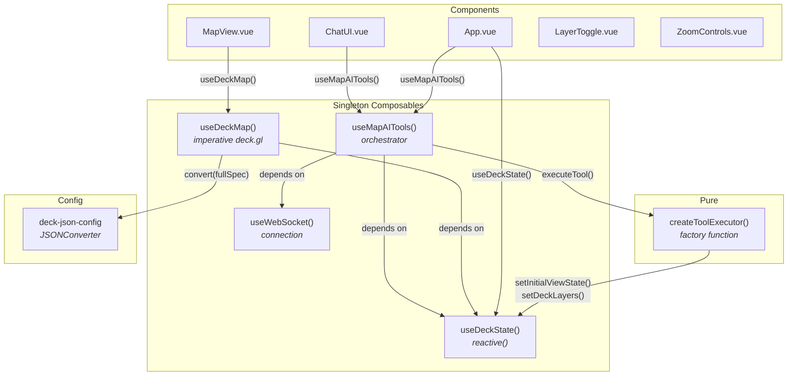

# @carto/map-ai-tools — Vue Integration

> Vue 3 implementation of the AI-powered map application using Composition API, singleton composables, and Vite.

This guide covers the Vue-specific architecture, composables, components, and patterns. For shared concepts (tool schema, JSONConverter, communication protocol, layer types, color styling), see the [global integration guide](../README.md).

---

## Table of Contents

- [Getting Started](#getting-started)
- [Project Structure](#project-structure)
- [Architecture](#architecture)
- [State Management](#state-management)
- [Tool Executor](#tool-executor)
- [Orchestrator Composable](#orchestrator-composable)
- [Deck Map Renderer](#deck-map-renderer)
- [Components](#components)
- [Environment Configuration](#environment-configuration)

---

## Getting Started

### Prerequisites

- Node.js v18+
- npm
- Backend server running on `ws://localhost:3003/ws`

### Installation

```bash
npm install
```

### Environment Setup

Create a `.env` file in the project root:

```bash
VITE_API_BASE_URL=https://gcp-us-east1.api.carto.com
VITE_API_ACCESS_TOKEN=YOUR_CARTO_ACCESS_TOKEN
VITE_CONNECTION_NAME=carto_dw
VITE_WS_URL=ws://localhost:3003/ws
VITE_HTTP_API_URL=http://localhost:3003/api/chat
VITE_USE_HTTP=false
```

| Variable | Description |
| -------- | ----------- |
| `VITE_API_BASE_URL` | CARTO API endpoint URL |
| `VITE_API_ACCESS_TOKEN` | Your CARTO API access token |
| `VITE_CONNECTION_NAME` | CARTO data warehouse connection name |
| `VITE_WS_URL` | Backend WebSocket URL |
| `VITE_HTTP_API_URL` | Backend HTTP URL (fallback) |
| `VITE_USE_HTTP` | Use HTTP instead of WebSocket (`false` recommended) |

### Running

```bash
# 1. Build the core library (if not already built)
cd ../../map-ai-tools && npm run build && cd -

# 2. Start the backend
cd ../../backend-integration/vercel-ai-sdk && npm run dev &

# 3. Start the Vue frontend
npm run dev
```

Open `http://localhost:5174` in your browser.

### Building

```bash
npm run build
```

Output is written to `dist/`.

---

## Project Structure

```
src/
├── App.vue                         # Root component (layout, sidebar, mobile)
├── main.ts                         # createApp + mount
├── vite-env.d.ts                   # Vite + Vue SFC type declarations
│
├── components/
│   ├── MapView.vue                 # Imperative deck.gl + MapLibre
│   ├── ChatUI.vue                  # Chat with markdown + streaming
│   ├── LayerToggle.vue             # Layer visibility + legend
│   ├── ZoomControls.vue            # Zoom in/out buttons
│   ├── Snackbar.vue                # Toast notifications
│   └── ConfirmationDialog.vue      # Modal confirmation
│
├── composables/
│   ├── useDeckState.ts             # Reactive state (reactive + readonly)
│   ├── useWebSocket.ts             # WebSocket connection
│   ├── useMapAITools.ts            # Orchestrator (messages, tools, loader)
│   ├── useDeckMap.ts               # Imperative Deck + MapLibre manager
│   └── useIsMobile.ts              # Viewport size detection
│
├── services/
│   └── tool-executor.ts            # Pure function (no Vue deps)
│
├── config/
│   ├── deck-json-config.ts         # JSONConverter setup (@@type, @@function, @@=, @@#)
│   ├── environment.ts              # Vite env vars reader
│   └── semantic-config.ts          # Welcome chips
│
├── utils/
│   ├── layer-merge.ts              # Deep merge for layer updates
│   ├── legend.ts                   # Legend extraction
│   └── tooltip.ts                  # Tooltip formatting
│
└── types/
    └── models.ts                   # Shared TypeScript interfaces
```

---

## Architecture

The Vue integration uses **singleton composables** for dependency injection and shared state. Unlike React's nested Context Providers, Vue composables are module-scoped singletons created on first call and returned to all subsequent callers.



### Composable Dependency Graph

```
useDeckState()     (standalone — no dependencies)
useWebSocket()     (standalone — no dependencies)
useMapAITools()    (depends on useDeckState + useWebSocket)
useDeckMap()       (depends on useDeckState)
useIsMobile()      (standalone, NOT singleton — per-component lifecycle)
```

### Singleton Composable Pattern

All shared composables use a module-scoped singleton pattern:

```typescript
let _instance: ReturnType<typeof create> | null = null;

function create() {
  // reactive state, watchers, methods
  return { /* public API */ };
}

export function useXxx() {
  if (!_instance) _instance = create();
  return _instance;
}
```

This replaces React's Context Provider nesting. State is created once and shared across all components without prop drilling or provider wrappers.

### Entry Point

```typescript
// main.ts — no provider nesting needed
import { createApp } from 'vue';
import App from './App.vue';
import 'maplibre-gl/dist/maplibre-gl.css';

createApp(App).mount('#app');
```

---

## State Management

The `useDeckState` composable uses Vue's `reactive()` for predictable state updates and plain module-scoped variables for mutable data that doesn't need reactivity (layer centers, initial layer IDs, current view state from user drag).

State is organized around a unified `DeckSpec` object that mirrors the official deck.gl JSON spec pattern. Basemap is kept separate because it's a MapLibre concern (`map.setStyle()`), not part of deck.gl.

### State Shape

```typescript
interface DeckSpec {
  initialViewState: ViewState & { transitionDuration?: number };
  layers: LayerSpec[];
  widgets: Record<string, unknown>[];
  effects: Record<string, unknown>[];
}

interface DeckStateData {
  deckSpec: DeckSpec;       // Unified deck.gl spec
  basemap: Basemap;         // MapLibre concern (separate)
  activeLayerId?: string;
}
```

### Composable Methods

```typescript
interface UseDeckState {
  state: DeepReadonly<DeckStateData>;      // Reactive, read-only proxy
  setInitialViewState: (partial) => void;  // Updates deckSpec.initialViewState
  setDeckLayers: (config) => void;         // Updates deckSpec.layers/widgets/effects
  setLayers: (layers) => void;             // Updates deckSpec.layers only
  setBasemap: (basemap) => void;           // MapLibre basemap
  getDeckSpec: () => DeckSpec;             // Current full spec snapshot (deep clone)
  getViewState: () => ViewState;           // Current camera position
  getLayerCenter: (id) => center;          // Saved center when layer was created
  clearChatGeneratedLayers: () => void;    // Remove non-initial layers
  // ...
}
```

### Using the Composable

```typescript
import { useDeckState } from '../composables/useDeckState';

// In <script setup>
const deckState = useDeckState();

// Reactive access (triggers re-render)
const layers = deckState.state.deckSpec.layers;
const basemap = deckState.state.basemap;

// Actions
deckState.setInitialViewState({ latitude: 40.7, longitude: -74.0, zoom: 12 });
deckState.setBasemap('dark-matter');
```

### Why Module-Scoped Variables for View State?

The `currentViewState` tracks the actual camera position from user drag interactions. Using reactive state for this would cause excessive watch triggers on every frame. Instead, it's read synchronously when needed (e.g., to capture layer centers) without triggering reactivity.

### React-to-Vue Translation

| React Pattern | Vue 3 Equivalent |
|---|---|
| `useReducer(reducer, init)` | `reactive(init)` + methods |
| `useState(val)` | `ref(val)` |
| `useRef(val)` | Module-scoped `let` variable |
| `useMemo(fn, deps)` | `computed(fn)` |
| `useCallback(fn, deps)` | Plain function |
| `useEffect(fn, deps)` | `watch()` / `onMounted()` |
| Context Provider nesting | Singleton composables |

---

## Tool Executor

The tool executor is a **pure factory function with no Vue dependencies**. `createToolExecutor()` receives a `DeckStateActions` interface and returns an `ExecuteToolFn` closure. This is the same file used by the React integration — it's framework-agnostic.

```typescript
export function createToolExecutor(actions: DeckStateActions): ExecuteToolFn {
  const executors: Record<string, ToolExecutorFn> = {
    [TOOL_NAMES.SET_DECK_STATE]: (params) => executeSetDeckState(actions, params),
    [TOOL_NAMES.SET_MARKER]: (params) => executeSetMarker(actions, params),
  };

  return async (toolName, params) => {
    const executor = executors[toolName];
    if (!executor) return { success: false, message: `Unknown tool: ${toolName}` };
    return executor(params);
  };
}

// executeSetDeckState pipeline:
// Phase 1: viewState → actions.setInitialViewState()
// Phase 2: basemap   → actions.setBasemap()
// Phase 3: layers    → remove, merge, order, validate, actions.setDeckLayers()
//          System layers (__ prefix) always render on top; active layer skips them

// executeSetMarker:
// Adds a pin to the IconLayer (__location-marker__), accumulating markers; skips duplicate coordinates
```

### Instantiation in useMapAITools

The executor is created inside `useMapAITools` by passing `useDeckState` methods:

```typescript
const toolExecutor = createToolExecutor({
  setInitialViewState: (vs) => deckState.setInitialViewState(vs),
  setBasemap: (b) => deckState.setBasemap(b),
  setDeckLayers: (c) => deckState.setDeckLayers(c),
  setActiveLayerId: (id) => deckState.setActiveLayerId(id),
  getDeckSpec: () => deckState.getDeckSpec(),
});
```

---

## Orchestrator Composable

The `useMapAITools` composable is the Vue equivalent of React's `MapAIToolsContext`. It handles WebSocket messages, executes tools, manages chat history, and provides loader state.

### Return Value

```typescript
interface MapAIToolsComposable {
  messages: Ref<Message[]>;
  loaderState: Ref<LoaderState>;
  loaderMessage: Ref<string>;
  layers: ComputedRef<LayerConfig[]>;      // Derived from deckSpec
  isConnected: ComputedRef<boolean>;       // From WebSocket
  sendMessage: (content: string) => boolean;
  clearMessages: () => void;
}
```

### Message Handling

The composable subscribes to WebSocket messages and routes them through a handler:

```typescript
ws.onMessage((data: WebSocketMessage) => {
  switch (data.type) {
    case 'stream_chunk':    handleStreamChunk(data);    break;
    case 'tool_call_start': handleToolCallStart(data);  break;
    case 'tool_call':       handleToolCall(data);       break;
    case 'mcp_tool_result': handleMcpToolResult(data);  break;
    case 'tool_result':     handleToolResult(data);     break;
    case 'error':           /* handle error */          break;
  }
});
```

### Using the Composable

```vue
<script setup lang="ts">
import { useMapAITools } from '../composables/useMapAITools';

const aiTools = useMapAITools();

function handleSend(text: string) {
  aiTools.sendMessage(text);
}
</script>

<template>
  <div>
    <div v-for="msg in aiTools.messages.value" :key="msg.id">
      {{ msg.content }}
    </div>
    <div v-if="aiTools.loaderState.value">Loading...</div>
    <input @keyup.enter="handleSend($event.target.value)" :disabled="!aiTools.isConnected.value" />
  </div>
</template>
```

---

## Deck Map Renderer

Since there is no `@deck.gl/vue` package, the Vue integration uses an **imperative approach** — creating `Deck` and `maplibregl.Map` instances directly, similar to the Angular integration's `DeckMapService`.

### useDeckMap Composable

The `useDeckMap` composable manages deck.gl and MapLibre instances imperatively:

```typescript
export function useDeckMap() {
  // Singleton instance
  return {
    initialize(containerId, canvasId),  // Creates Deck + MapLibre
    startWatching(),                     // Watches useDeckState for changes
    onViewStateChange(callback),         // View state change listener
    destroy(),                           // Cleanup
  };
}
```

### State Watching

The composable uses separate `watch()` calls with getter functions to detect state changes. This avoids a Vue pitfall where deep-watching a reactive object gives the same reference for `newValue` and `oldValue`:

```typescript
function startWatching() {
  // Separate watchers for each property — getter functions give correct old/new values
  watch(() => deckState.state.basemap, () => {
    renderFromState(state, ['basemap']);
  });

  watch(() => deckState.state.deckSpec.layers, () => {
    renderFromState(state, ['layers']);
  }, { deep: true });

  watch(() => deckState.state.deckSpec.initialViewState, () => {
    renderFromState(state, ['initialViewState']);
  }, { deep: true });
}
```

### renderFromState — Central Rendering Function

```typescript
function renderFromState(state: DeckStateData, changedKeys: string[]) {
  const jsonConverter = getJsonConverter();

  // 1. Basemap → map.setStyle()
  if (changedKeys.includes('basemap')) {
    map.setStyle(BASEMAP_URLS[state.basemap]);
  }

  // 2. Layers/ViewState → clone spec, inject credentials, convert, deck.setProps()
  if (changedKeys.includes('layers') || changedKeys.includes('initialViewState')) {
    const spec = JSON.parse(JSON.stringify(state.deckSpec));
    spec.layers = spec.layers.map(injectCartoCredentials);
    const deckProps = jsonConverter.convert(spec);
    deck.setProps(deckProps);
  }
}
```

### MapView Component

The `MapView` component initializes the imperative instances on mount:

```vue
<script setup lang="ts">
import { onMounted, onUnmounted } from 'vue';
import { useDeckMap } from '../composables/useDeckMap';

const emit = defineEmits<{ viewStateChange: [viewState: ViewState] }>();
const deckMap = useDeckMap();

onMounted(async () => {
  await deckMap.initialize('map-container', 'map-canvas');
  deckMap.onViewStateChange((vs) => emit('viewStateChange', vs));
  deckMap.startWatching();
});

onUnmounted(() => deckMap.destroy());
</script>

<template>
  <div class="map-view-container">
    <div id="map-container" />
    <canvas id="map-canvas" />
  </div>
</template>
```

### Key Differences from React

| Aspect | React | Vue |
|---|---|---|
| deck.gl integration | Declarative `<DeckGL>` from `@deck.gl/react` | Imperative `new Deck()` on a canvas |
| Map sync | `react-map-gl` `<Map>` child component | `maplibregl.Map` with `map.jumpTo()` |
| State-to-render | `useDeckProps()` hook + `useMemo` | `watch()` + `renderFromState()` |
| Prop passing | Spread `{...deckProps}` on `<DeckGL>` | `deck.setProps(deckProps)` |

---

## Components

| Component | File | Key Composables Used |
| --------- | ---- | -------------------- |
| `MapView` | `MapView.vue` | `useDeckMap()` |
| `ChatUI` | `ChatUI.vue` | `useMapAITools()`, `useIsMobile()` |
| `LayerToggle` | `LayerToggle.vue` | Props-driven (receives data from `App.vue`) |
| `ZoomControls` | `ZoomControls.vue` | Props-driven |
| `Snackbar` | `Snackbar.vue` | Props-driven |
| `ConfirmationDialog` | `ConfirmationDialog.vue` | Props-driven |

All components use `<script setup lang="ts">` with Vue 3 Composition API. Styles are scoped within each SFC using `<style scoped>`, except for deck.gl tooltip styles which are global in `App.vue`.

---

## Environment Configuration

Environment variables are read from `.env` via Vite's `import.meta.env`:

```typescript
// config/environment.ts
export const environment = {
  apiBaseUrl: import.meta.env.VITE_API_BASE_URL,
  accessToken: import.meta.env.VITE_API_ACCESS_TOKEN,
  connectionName: import.meta.env.VITE_CONNECTION_NAME,
  wsUrl: import.meta.env.VITE_WS_URL,
  httpApiUrl: import.meta.env.VITE_HTTP_API_URL,
  useHttp: import.meta.env.VITE_USE_HTTP === 'true',
};
```

| Variable | Type | Description |
| -------- | ---- | ----------- |
| `VITE_API_BASE_URL` | `string` | CARTO API endpoint |
| `VITE_API_ACCESS_TOKEN` | `string` | CARTO API access token |
| `VITE_CONNECTION_NAME` | `string` | Data warehouse connection name |
| `VITE_WS_URL` | `string` | Backend WebSocket URL |
| `VITE_HTTP_API_URL` | `string` | Backend HTTP URL (fallback) |
| `VITE_USE_HTTP` | `string` | `"true"` or `"false"` |
